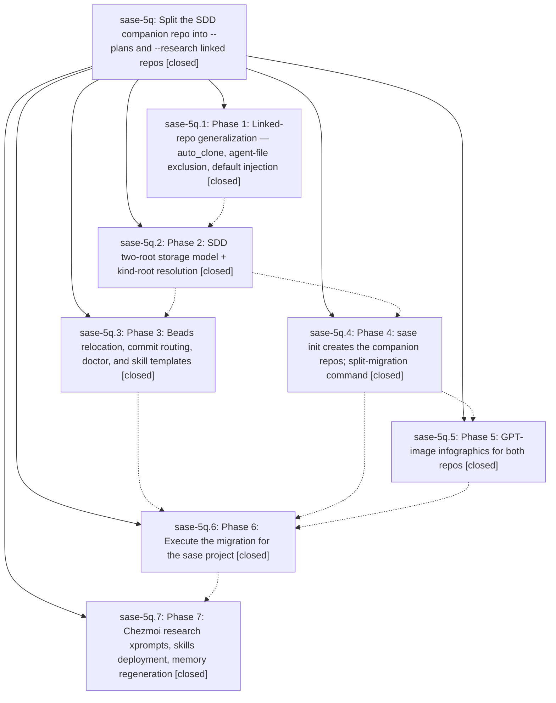

# Bead: sase-5q — Split the SDD companion repo into --plans and --research linked repos

[Bead Pages](../README.md) / sase-5q

**Status:** ✓ closed · **Resolution:** (unrecorded) · **Type:** plan · **Tier:** epic
**Owner:** `bryanbugyi34@gmail.com`
**Created:** 2026-07-11 23:07:51 UTC
**Plan:** [202607/sdd\_split\_into\_plans\_and\_research\_repos.md](https://github.com/sase-org/sase--plans/blob/main/202607/sdd_split_into_plans_and_research_repos.md)

## Phases

| Bead | Title | Status | Size | Agents | Commits |
|---|---|---|---|---:|---:|
| [sase-5q.1](sase-5q.1.md) | Phase 1: Linked-repo generalization — auto\_clone, agent-file exclusion, default injection | ✓ closed | small | 2 | 2 |
| [sase-5q.2](sase-5q.2.md) | Phase 2: SDD two-root storage model + kind-root resolution | ✓ closed | small | 1 | 1 |
| [sase-5q.3](sase-5q.3.md) | Phase 3: Beads relocation, commit routing, doctor, and skill templates | ✓ closed | small | 1 | 1 |
| [sase-5q.4](sase-5q.4.md) | Phase 4: sase init creates the companion repos; split-migration command | ✓ closed | small | 1 | 1 |
| [sase-5q.5](sase-5q.5.md) | Phase 5: GPT-image infographics for both repos | ✓ closed | small | 1 | 1 |
| [sase-5q.6](sase-5q.6.md) | Phase 6: Execute the migration for the sase project | ✓ closed | small | 1 | 0 |
| [sase-5q.7](sase-5q.7.md) | Phase 7: Chezmoi research xprompts, skills deployment, memory regeneration | ✓ closed | small | 0 | 0 |

## Lineage

## Agents

| Agent | Bead | Commits |
|---|---|---:|
| [bbugyi200.athena.sase-5q--code](https://github.com/sase-org/sase--agents/blob/main/families/bbugyi200.athena.sase-5q.md#member-code) | [sase-5q](README.md) | 0 |
| [bbugyi200.athena.sase-5q.1](https://github.com/sase-org/sase--agents/blob/main/agents/bbugyi200.athena.sase-5q.1/README.md) | [sase-5q.1](sase-5q.1.md) | 2 |
| [bbugyi200.athena.sase-5q.1--1](https://github.com/sase-org/sase--agents/blob/main/families/bbugyi200.athena.sase-5q.1.md#member-1) | [sase-5q.1](sase-5q.1.md) | 0 |
| [bbugyi200.athena.sase-5q.2](https://github.com/sase-org/sase--agents/blob/main/agents/bbugyi200.athena.sase-5q.2/README.md) | [sase-5q.2](sase-5q.2.md) | 1 |
| [bbugyi200.athena.sase-5q.3](https://github.com/sase-org/sase--agents/blob/main/agents/bbugyi200.athena.sase-5q.3/README.md) | [sase-5q.3](sase-5q.3.md) | 1 |
| [bbugyi200.athena.sase-5q.4](https://github.com/sase-org/sase--agents/blob/main/agents/bbugyi200.athena.sase-5q.4/README.md) | [sase-5q.4](sase-5q.4.md) | 1 |
| [bbugyi200.athena.sase-5q.5](https://github.com/sase-org/sase--agents/blob/main/agents/bbugyi200.athena.sase-5q.5/README.md) | [sase-5q.5](sase-5q.5.md) | 1 |
| [bbugyi200.athena.sase-5q.6--1](https://github.com/sase-org/sase--agents/blob/main/families/bbugyi200.athena.sase-5q.6.md#member-1) | [sase-5q.6](sase-5q.6.md) | 0 |

## Commits

| Commit | Subject | Bead | Committed (UTC) |
|---|---|---|---|
| [`c13664d`](https://github.com/sase-org/sase/commit/c13664dc6b1ce83bd6f4ea9f4755d71dad78cf61) | feat!: make linked repository materialization opt-in (sase-5q.1) | [sase-5q.1](sase-5q.1.md) | 2026-07-11 23:28:55 |
| [`5df88d7`](https://github.com/sase-org/sase/commit/5df88d7ca00e1cae07fd7033be28ed0a17f2fdb4) | fix(memory): finalize linked repository initialization (sase-5q.1) | [sase-5q.1](sase-5q.1.md) | 2026-07-11 23:47:14 |
| [`4c40d5a`](https://github.com/sase-org/sase/commit/4c40d5af8f3f6ecdb367891483a720b68b6cd3a0) | feat(sdd): support split companion repositories (sase-5q.2) | [sase-5q.2](sase-5q.2.md) | 2026-07-12 00:09:50 |
| [`0bbd3cb`](https://github.com/sase-org/sase/commit/0bbd3cb502d7be5e6f6bef9448d964c899ede46e) | feat(sdd): route split companion operations by repository (sase-5q.3) | [sase-5q.3](sase-5q.3.md) | 2026-07-12 00:33:52 |
| [`4976cdb`](https://github.com/sase-org/sase/commit/4976cdbd8972db717e65e01448d035a1de9d5db0) | feat(sdd): add split companion initialization and migration (sase-5q.4) | [sase-5q.4](sase-5q.4.md) | 2026-07-12 00:38:55 |
| [`75ee0fb`](https://github.com/sase-org/sase/commit/75ee0fb6a8ec7cc1dfa00214c05d704e8383507e) | docs(sdd): add companion repository infographics (sase-5q.5) | [sase-5q.5](sase-5q.5.md) | 2026-07-12 01:02:05 |
