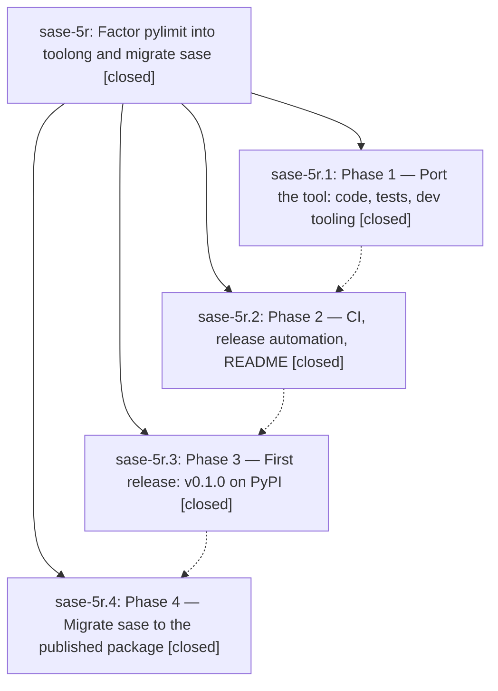

# Bead: sase-5r — Factor pylimit into toolong and migrate sase

[Bead Pages](../README.md) / sase-5r

**Status:** ✓ closed · **Resolution:** (unrecorded) · **Type:** plan · **Tier:** epic
**Owner:** `bryanbugyi34@gmail.com`
**Created:** 2026-07-12 00:02:30 UTC
**Plan:** [202607/toolong\_extraction.md](https://github.com/sase-org/sase--plans/blob/main/202607/toolong_extraction.md)

## Description

Repository/worktree requirement: perform all work for this bead in ~/projects/github/bbugyi200/toolong/. This directory is the existing local git repository whose remote points to bbugyi200/toolong; use it directly and do not create or use another checkout.

## Notes

Completed the pylimit extraction under the renamed toobig project: v0.1.0 is live on PyPI and SASE migration commit a66dc398a is pushed.

## Phases

| Bead | Title | Status | Size | Agents | Commits |
|---|---|---|---|---:|---:|
| [sase-5r.1](sase-5r.1.md) | Phase 1 — Port the tool: code, tests, dev tooling | ✓ closed | small | 0 | 0 |
| [sase-5r.2](sase-5r.2.md) | Phase 2 — CI, release automation, README | ✓ closed | small | 0 | 0 |
| [sase-5r.3](sase-5r.3.md) | Phase 3 — First release: v0.1.0 on PyPI | ✓ closed | small | 0 | 0 |
| [sase-5r.4](sase-5r.4.md) | Phase 4 — Migrate sase to the published package | ✓ closed | small | 1 | 0 |

## Lineage

## Agents

| Agent | Bead | Commits |
|---|---|---:|
| [bbugyi200.athena.sase-5r--code](https://github.com/sase-org/sase--agents/blob/main/families/bbugyi200.athena.sase-5r.md#member-code) | [sase-5r](README.md) | 0 |
| [bbugyi200.athena.sase-5r.4--1](https://github.com/sase-org/sase--agents/blob/main/families/bbugyi200.athena.sase-5r.4.md#member-1) | [sase-5r.4](sase-5r.4.md) | 0 |
