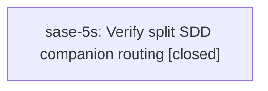

# Bead: sase-5s — Verify split SDD companion routing

[Bead Pages](../README.md) / sase-5s

**Status:** ✓ closed · **Resolution:** (unrecorded) · **Type:** plan · **Tier:** plan
**Owner:** `bryanbugyi34@gmail.com`
**Created:** 2026-07-12 15:09:03 UTC
**Plan:** [202607/sase\_5q\_record\_repair\_and\_closeout.md](https://github.com/sase-org/sase--plans/blob/main/202607/sase_5q_record_repair_and_closeout.md)

## Lineage

