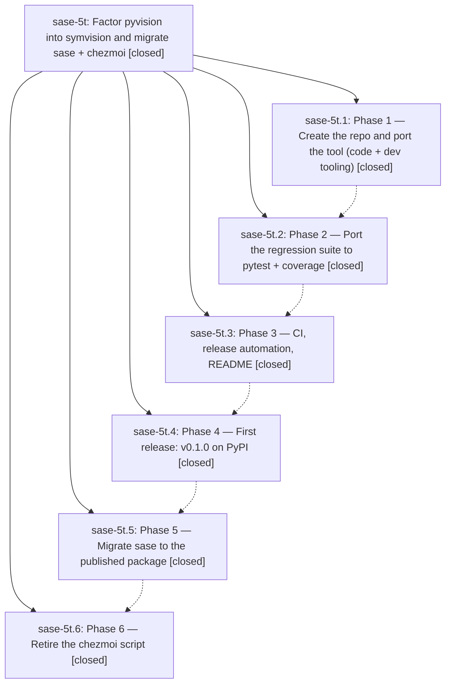

# Bead: sase-5t — Factor pyvision into symvision and migrate sase + chezmoi

[Bead Pages](../README.md) / sase-5t

**Status:** ✓ closed · **Resolution:** (unrecorded) · **Type:** plan · **Tier:** epic
**Owner:** `bryanbugyi34@gmail.com`
**Created:** 2026-07-12 21:43:37 UTC · **Closed:** 2026-07-14 10:36:11 UTC
**Plan:** [202607/symvision\_extraction\_1.md](https://github.com/sase-org/sase--plans/blob/main/202607/symvision_extraction_1.md)

## Notes

COMMIT: 2903fa9

Recovery reopened 2026-07-13: the prior epic closure cited only the companion-repository bookkeeping commit and had treated verification from an unlanded numbered-workspace migration as completion. The SASE consumer migration is durably present on origin/master as commit 039204fe2. The user-authorized protected memory/instruction recovery is now implemented and verified in the current workspace, with detailed results on sase-5t.5, but remains uncommitted and unlanded. Keep this epic open until the recovery changes have a durable SASE commit and ChangeSpec/PR reachable from origin/master.

## Phases

| Bead | Title | Status | Size | Agents | Commits |
|---|---|---|---|---:|---:|
| [sase-5t.1](sase-5t.1.md) | Phase 1 — Create the repo and port the tool (code + dev tooling) | ✓ closed | small | 0 | 0 |
| [sase-5t.2](sase-5t.2.md) | Phase 2 — Port the regression suite to pytest + coverage | ✓ closed | small | 0 | 0 |
| [sase-5t.3](sase-5t.3.md) | Phase 3 — CI, release automation, README | ✓ closed | small | 0 | 0 |
| [sase-5t.4](sase-5t.4.md) | Phase 4 — First release: v0.1.0 on PyPI | ✓ closed | small | 0 | 0 |
| [sase-5t.5](sase-5t.5.md) | Phase 5 — Migrate sase to the published package | ✓ closed | small | 1 | 2 |
| [sase-5t.6](sase-5t.6.md) | Phase 6 — Retire the chezmoi script | ✓ closed | small | 0 | 0 |

## Lineage

## Agents

| Agent | Bead | Commits |
|---|---|---:|
| [bbugyi200.athena.7e](https://github.com/sase-org/sase--agents/blob/main/agents/bbugyi200.athena.7e/README.md) | [sase-5t.5](sase-5t.5.md) | 1 |
| [bbugyi200.athena.sase-5t--code](https://github.com/sase-org/sase--agents/blob/main/families/bbugyi200.athena.sase-5t.md#member-code) | [sase-5t](README.md) | 0 |

## Commits

| Commit | Subject | Bead | Committed (UTC) |
|---|---|---|---|
| [`039204f`](https://github.com/sase-org/sase/commit/039204fe2e8d62d685f1e7d089ba077989ed128a) | feat: Migrate from pyvision to symvision (sase-5t.5) | [sase-5t.5](sase-5t.5.md) | 2026-07-13 10:50:19 |
| [`3d5fe9c`](https://github.com/sase-org/sase/commit/3d5fe9c50a8e3d68f04bf1a5a033247e65f79c0a) | fix: complete Symvision migration recovery (sase-5t.5) | [sase-5t.5](sase-5t.5.md) | 2026-07-13 11:04:43 |
