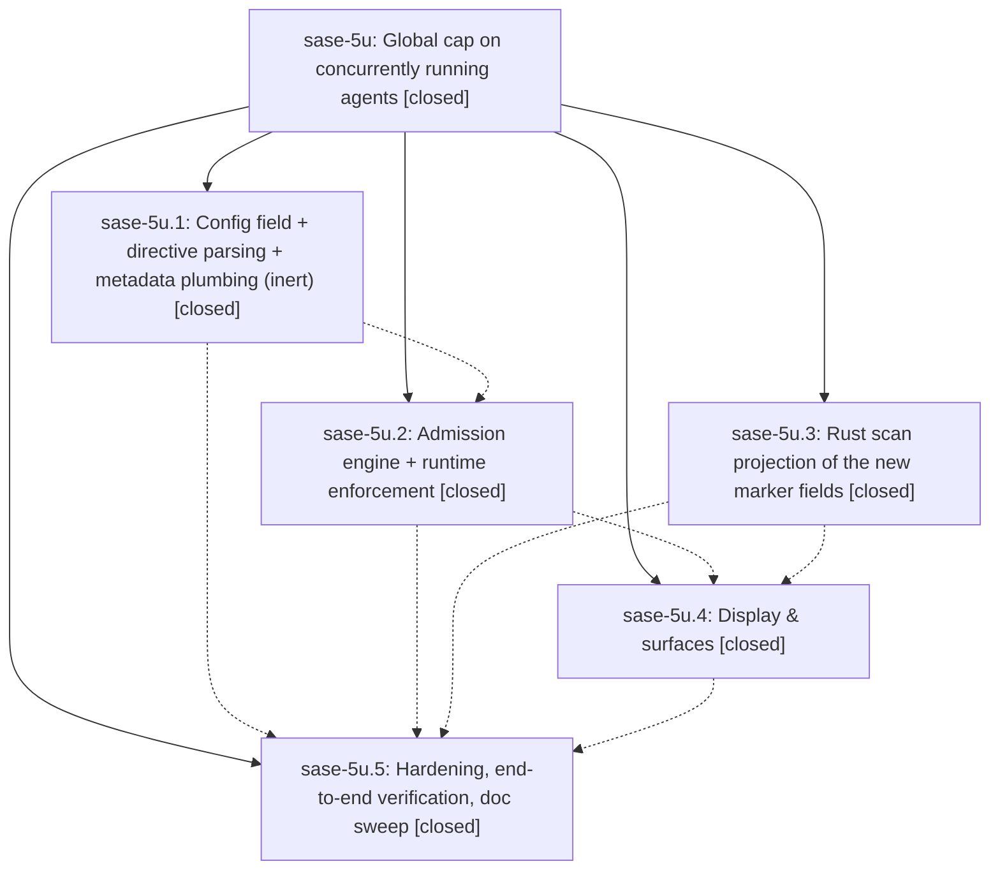

# Bead: sase-5u — Global cap on concurrently running agents

[Bead Pages](../README.md) / sase-5u

**Status:** ✓ closed · **Resolution:** (unrecorded) · **Type:** plan · **Tier:** epic
**Owner:** `bryanbugyi34@gmail.com`
**Created:** 2026-07-12 22:13:30 UTC · **Closed:** 2026-07-13 10:56:29 UTC
**Plan:** [202607/max\_running\_agents.md](https://github.com/sase-org/sase--plans/blob/main/202607/max_running_agents.md)

## Notes

COMMIT: 535082c

## Phases

| Bead | Title | Status | Size | Agents | Commits |
|---|---|---|---|---:|---:|
| [sase-5u.1](sase-5u.1.md) | Config field + directive parsing + metadata plumbing (inert) | ✓ closed | small | 1 | 1 |
| [sase-5u.2](sase-5u.2.md) | Admission engine + runtime enforcement | ✓ closed | small | 1 | 1 |
| [sase-5u.3](sase-5u.3.md) | Rust scan projection of the new marker fields | ✓ closed | small | 1 | 2 |
| [sase-5u.4](sase-5u.4.md) | Display & surfaces | ✓ closed | small | 1 | 1 |
| [sase-5u.5](sase-5u.5.md) | Hardening, end-to-end verification, doc sweep | ✓ closed | small | 1 | 1 |

## Lineage

## Agents

| Agent | Bead | Commits |
|---|---|---:|
| [bbugyi200.athena.sase-5u](https://github.com/sase-org/sase--agents/blob/main/agents/bbugyi200.athena.sase-5u/README.md) | [sase-5u](README.md) | 1 |
| [bbugyi200.athena.sase-5u.1](https://github.com/sase-org/sase--agents/blob/main/agents/bbugyi200.athena.sase-5u.1/README.md) | [sase-5u.1](sase-5u.1.md) | 1 |
| [bbugyi200.athena.sase-5u.2](https://github.com/sase-org/sase--agents/blob/main/agents/bbugyi200.athena.sase-5u.2/README.md) | [sase-5u.2](sase-5u.2.md) | 1 |
| [bbugyi200.athena.sase-5u.3](https://github.com/sase-org/sase--agents/blob/main/agents/bbugyi200.athena.sase-5u.3/README.md) | [sase-5u.3](sase-5u.3.md) | 2 |
| [bbugyi200.athena.sase-5u.4](https://github.com/sase-org/sase--agents/blob/main/agents/bbugyi200.athena.sase-5u.4/README.md) | [sase-5u.4](sase-5u.4.md) | 1 |
| [bbugyi200.athena.sase-5u.5](https://github.com/sase-org/sase--agents/blob/main/agents/bbugyi200.athena.sase-5u.5/README.md) | [sase-5u.5](sase-5u.5.md) | 1 |

## Commits

| Commit | Subject | Bead | Committed (UTC) |
|---|---|---|---|
| [`sase-core@77201dc`](https://github.com/sase-org/sase-core/commit/77201dc91f12c9c00c7e70fbffa87689f53d0feb) | feat(agent-scan): project runner slot waiting fields (sase-5u.3) | [sase-5u.3](sase-5u.3.md) | 2026-07-12 22:28:14 |
| [`6136c45`](https://github.com/sase-org/sase/commit/6136c452923dbcac9de867a0e932aaeca9c2ea0c) | feat(agent-scan): expose runner slot waiting fields (sase-5u.3) | [sase-5u.3](sase-5u.3.md) | 2026-07-12 22:29:18 |
| [`c321764`](https://github.com/sase-org/sase/commit/c321764e3379fcb71c96df83b9242a83c1d700fd) | feat: add concurrent agent limit directive plumbing (sase-5u.1) | [sase-5u.1](sase-5u.1.md) | 2026-07-12 22:31:58 |
| [`28f563f`](https://github.com/sase-org/sase/commit/28f563f3fa85e683b0d6dda4cf4526e37058d167) | feat: enforce global runner slot admission (sase-5u.2) | [sase-5u.2](sase-5u.2.md) | 2026-07-12 22:53:41 |
| [`82abd47`](https://github.com/sase-org/sase/commit/82abd478e5c4a6a29d2cfa101aca6d79441836b6) | feat(tui): expose runner slot wait state (sase-5u.4) | [sase-5u.4](sase-5u.4.md) | 2026-07-12 23:18:14 |
| [`b6ee8f7`](https://github.com/sase-org/sase/commit/b6ee8f76161d25914894566125bf99321828dcde) | test: harden runner slot lifecycle (sase-5u.5) | [sase-5u.5](sase-5u.5.md) | 2026-07-13 10:50:19 |
| [`sase--plans@5c7bd92`](https://github.com/sase-org/sase--plans/commit/5c7bd9269e4c935ef9443c33e0d119c19ab9e065) | chore(plans): mark max\_running\_agents epic plan done (sase-5u) | [sase-5u](README.md) | 2026-07-13 10:59:06 |
