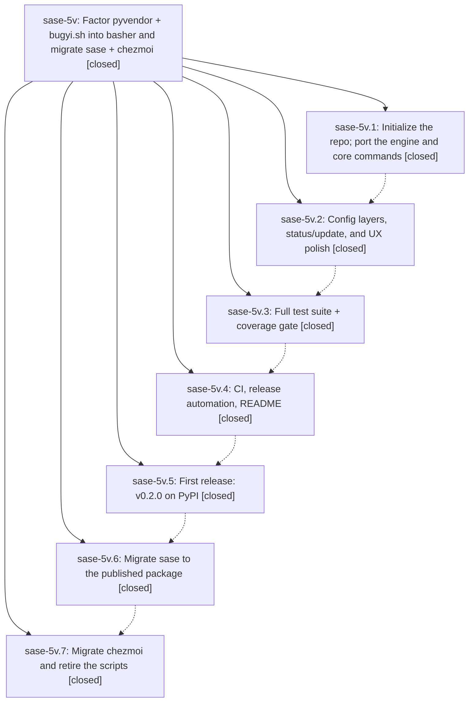

# Bead: sase-5v — Factor pyvendor + bugyi.sh into basher and migrate sase + chezmoi

[Bead Pages](../README.md) / sase-5v

**Status:** ✓ closed · **Resolution:** (unrecorded) · **Type:** plan · **Tier:** epic
**Owner:** `bryanbugyi34@gmail.com`
**Created:** 2026-07-12 23:20:31 UTC · **Closed:** 2026-07-13 11:13:15 UTC
**Plan:** [202607/basher\_extraction.md](https://github.com/sase-org/sase--plans/blob/main/202607/basher_extraction.md)

## Notes

COMMIT: 1de2d42

## Phases

| Bead | Title | Status | Size | Agents | Commits |
|---|---|---|---|---:|---:|
| [sase-5v.1](sase-5v.1.md) | Initialize the repo; port the engine and core commands | ✓ closed | small | 0 | 0 |
| [sase-5v.2](sase-5v.2.md) | Config layers, status/update, and UX polish | ✓ closed | small | 0 | 0 |
| [sase-5v.3](sase-5v.3.md) | Full test suite + coverage gate | ✓ closed | small | 0 | 0 |
| [sase-5v.4](sase-5v.4.md) | CI, release automation, README | ✓ closed | small | 0 | 0 |
| [sase-5v.5](sase-5v.5.md) | First release: v0.2.0 on PyPI | ✓ closed | small | 1 | 0 |
| [sase-5v.6](sase-5v.6.md) | Migrate sase to the published package | ✓ closed | small | 1 | 1 |
| [sase-5v.7](sase-5v.7.md) | Migrate chezmoi and retire the scripts | ✓ closed | small | 0 | 0 |

## Lineage

## Agents

| Agent | Bead | Commits |
|---|---|---:|
| [bbugyi200.athena.sase-5v](https://github.com/sase-org/sase--agents/blob/main/agents/bbugyi200.athena.sase-5v/README.md) | [sase-5v](README.md) | 2 |
| [bbugyi200.athena.sase-5v--code](https://github.com/sase-org/sase--agents/blob/main/families/bbugyi200.athena.sase-5v.md#member-code) | [sase-5v](README.md) | 0 |
| [bbugyi200.athena.sase-5v--code-0](https://github.com/sase-org/sase--agents/blob/main/families/bbugyi200.athena.sase-5v.md#member-code-0) | [sase-5v](README.md) | 0 |
| [bbugyi200.athena.sase-5v.5--1](https://github.com/sase-org/sase--agents/blob/main/families/bbugyi200.athena.sase-5v.5.md#member-1) | [sase-5v.5](sase-5v.5.md) | 0 |
| [bbugyi200.athena.sase-5v.6](https://github.com/sase-org/sase--agents/blob/main/agents/bbugyi200.athena.sase-5v.6/README.md) | [sase-5v.6](sase-5v.6.md) | 1 |

## Commits

| Commit | Subject | Bead | Committed (UTC) |
|---|---|---|---|
| [`d643af6`](https://github.com/sase-org/sase/commit/d643af684dd90f11099195b33b27200d4eb91df8) | chore: remove unused vendored bugyi shell library (sase-5v.6) | [sase-5v.6](sase-5v.6.md) | 2026-07-13 10:51:24 |
| [`d6b6ab7`](https://github.com/sase-org/sase/commit/d6b6ab73f53bb19b6f4f46b4bf275a1abacab753) | docs: document basher vendoring workflow (sase-5v) | [sase-5v](README.md) | 2026-07-13 11:16:11 |
| [`sase--plans@6cd1551`](https://github.com/sase-org/sase--plans/commit/6cd1551c990c985494d85abd3cad8e28db1ed48a) | docs: mark basher extraction plan done (sase-5v) | [sase-5v](README.md) | 2026-07-13 11:17:27 |
