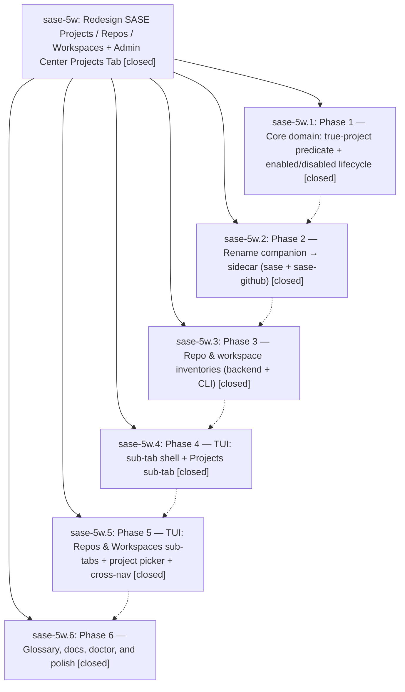

# Bead: sase-5w — Redesign SASE Projects / Repos / Workspaces + Admin Center Projects Tab

[Bead Pages](../README.md) / sase-5w

**Status:** ✓ closed · **Resolution:** (unrecorded) · **Type:** plan · **Tier:** epic
**Owner:** `bryanbugyi34@gmail.com`
**Created:** 2026-07-13 13:58:03 UTC · **Closed:** 2026-07-13 17:44:07 UTC
**Plan:** [202607/projects\_repos\_workspaces\_redesign.md](https://github.com/sase-org/sase--plans/blob/main/202607/projects_repos_workspaces_redesign.md)

## Phases

| Bead | Title | Status | Size | Agents | Commits |
|---|---|---|---|---:|---:|
| [sase-5w.1](sase-5w.1.md) | Phase 1 — Core domain: true-project predicate + enabled/disabled lifecycle | ✓ closed | small | 1 | 2 |
| [sase-5w.2](sase-5w.2.md) | Phase 2 — Rename companion → sidecar (sase + sase-github) | ✓ closed | small | 1 | 1 |
| [sase-5w.3](sase-5w.3.md) | Phase 3 — Repo & workspace inventories (backend + CLI) | ✓ closed | small | 0 | 0 |
| [sase-5w.4](sase-5w.4.md) | Phase 4 — TUI: sub-tab shell + Projects sub-tab | ✓ closed | small | 0 | 0 |
| [sase-5w.5](sase-5w.5.md) | Phase 5 — TUI: Repos & Workspaces sub-tabs + project picker + cross-nav | ✓ closed | small | 0 | 0 |
| [sase-5w.6](sase-5w.6.md) | Phase 6 — Glossary, docs, doctor, and polish | ✓ closed | small | 0 | 0 |

## Lineage

## Agents

| Agent | Bead | Commits |
|---|---|---:|
| [bbugyi200.athena.sase-5w.1](https://github.com/sase-org/sase--agents/blob/main/agents/bbugyi200.athena.sase-5w.1/README.md) | [sase-5w.1](sase-5w.1.md) | 2 |
| [bbugyi200.athena.sase-5w.2](https://github.com/sase-org/sase--agents/blob/main/agents/bbugyi200.athena.sase-5w.2/README.md) | [sase-5w.2](sase-5w.2.md) | 1 |

## Commits

| Commit | Subject | Bead | Committed (UTC) |
|---|---|---|---|
| [`sase-core@5adad45`](https://github.com/sase-org/sase-core/commit/5adad45853619465c56a2c2dfce061f266e5444f) | feat(projects): classify projects and canonicalize lifecycle (sase-5w.1) | [sase-5w.1](sase-5w.1.md) | 2026-07-13 14:57:15 |
| [`f47815d`](https://github.com/sase-org/sase/commit/f47815df3109bb7708303c230d63e09c33fb4239) | feat(projects): adopt enabled and disabled lifecycle states (sase-5w.1) | [sase-5w.1](sase-5w.1.md) | 2026-07-13 14:58:47 |
| [`3cf8ea2`](https://github.com/sase-org/sase/commit/3cf8ea2bfb4c50022141a93af8b1f327fb1d204e) | feat(sdd)!: rename companion repositories to sidecars (sase-5w.2) | [sase-5w.2](sase-5w.2.md) | 2026-07-13 15:24:14 |
