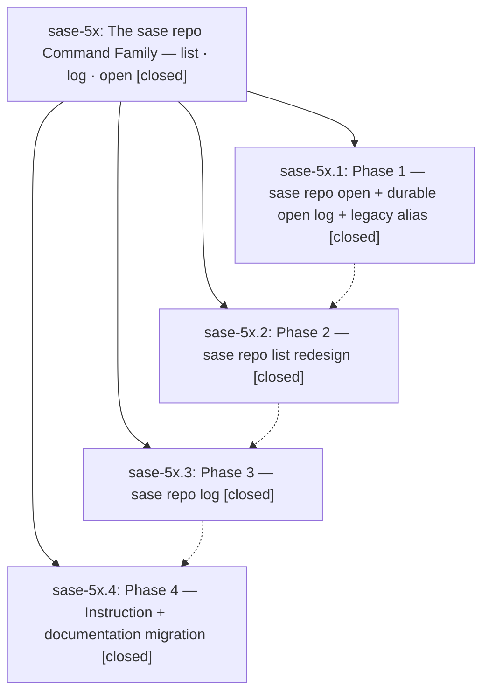

# Bead: sase-5x — The sase repo Command Family — list · log · open

[Bead Pages](../README.md) / sase-5x

**Status:** ✓ closed · **Resolution:** (unrecorded) · **Type:** plan · **Tier:** epic
**Owner:** `bryanbugyi34@gmail.com`
**Created:** 2026-07-13 18:11:50 UTC · **Closed:** 2026-07-13 19:59:02 UTC
**Plan:** [202607/repo\_command\_family.md](https://github.com/sase-org/sase--plans/blob/main/202607/repo_command_family.md)

## Notes

COMMIT: 0e13e6e

## Phases

| Bead | Title | Status | Size | Agents | Commits |
|---|---|---|---|---:|---:|
| [sase-5x.1](sase-5x.1.md) | Phase 1 — sase repo open + durable open log + legacy alias | ✓ closed | small | 1 | 1 |
| [sase-5x.2](sase-5x.2.md) | Phase 2 — sase repo list redesign | ✓ closed | small | 1 | 1 |
| [sase-5x.3](sase-5x.3.md) | Phase 3 — sase repo log | ✓ closed | small | 1 | 1 |
| [sase-5x.4](sase-5x.4.md) | Phase 4 — Instruction + documentation migration | ✓ closed | small | 1 | 1 |

## Lineage

## Agents

| Agent | Bead | Commits |
|---|---|---:|
| [bbugyi200.athena.sase-5x](https://github.com/sase-org/sase--agents/blob/main/agents/bbugyi200.athena.sase-5x/README.md) | [sase-5x](README.md) | 1 |
| [bbugyi200.athena.sase-5x.1](https://github.com/sase-org/sase--agents/blob/main/agents/bbugyi200.athena.sase-5x.1/README.md) | [sase-5x.1](sase-5x.1.md) | 1 |
| [bbugyi200.athena.sase-5x.2](https://github.com/sase-org/sase--agents/blob/main/agents/bbugyi200.athena.sase-5x.2/README.md) | [sase-5x.2](sase-5x.2.md) | 1 |
| [bbugyi200.athena.sase-5x.3](https://github.com/sase-org/sase--agents/blob/main/agents/bbugyi200.athena.sase-5x.3/README.md) | [sase-5x.3](sase-5x.3.md) | 1 |
| [bbugyi200.athena.sase-5x.4](https://github.com/sase-org/sase--agents/blob/main/agents/bbugyi200.athena.sase-5x.4/README.md) | [sase-5x.4](sase-5x.4.md) | 1 |

## Commits

| Commit | Subject | Bead | Committed (UTC) |
|---|---|---|---|
| [`3a8eea0`](https://github.com/sase-org/sase/commit/3a8eea0c28798a597b759cb3780a3044ecd26047) | feat(cli): add audited repository open command (sase-5x.1) | [sase-5x.1](sase-5x.1.md) | 2026-07-13 18:36:16 |
| [`ffcfae3`](https://github.com/sase-org/sase/commit/ffcfae364dd34df5ca2ddd5780c3a59d619caff6) | feat(cli)!: redesign repo list inventory (sase-5x.2) | [sase-5x.2](sase-5x.2.md) | 2026-07-13 18:55:56 |
| [`1ec31b8`](https://github.com/sase-org/sase/commit/1ec31b87d4535e9f298ea22d738a171b28232f79) | feat(repo): add repository open log dashboard (sase-5x.3) | [sase-5x.3](sase-5x.3.md) | 2026-07-13 19:16:07 |
| [`5afb9b3`](https://github.com/sase-org/sase/commit/5afb9b33c781cf27ed63789c2b18e7bcff96abd7) | docs: migrate linked repository guidance to repo commands (sase-5x.4) | [sase-5x.4](sase-5x.4.md) | 2026-07-13 19:38:22 |
| [`1f48a86`](https://github.com/sase-org/sase/commit/1f48a86f142343b6ea38121092df590eb07b0ec5) | refactor(repo): privatize repo-open log symbols and purify open stdout (sase-5x) | [sase-5x](README.md) | 2026-07-13 20:06:38 |
