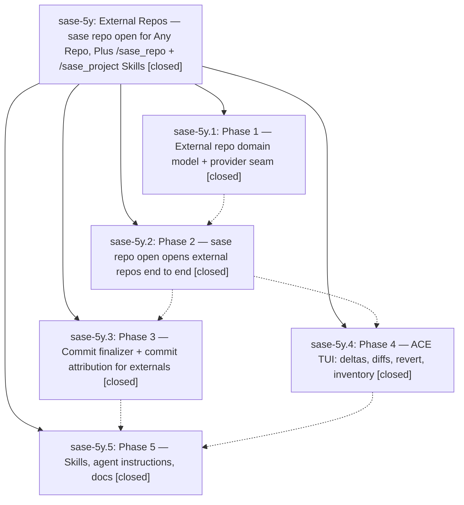

# Bead: sase-5y — External Repos — sase repo open for Any Repo, Plus /sase\_repo + /sase\_project Skills

[Bead Pages](../README.md) / sase-5y

**Status:** ✓ closed · **Resolution:** (unrecorded) · **Type:** plan · **Tier:** epic
**Owner:** `bryanbugyi34@gmail.com`
**Created:** 2026-07-13 20:56:02 UTC · **Closed:** 2026-07-14 10:45:43 UTC
**Plan:** [202607/external\_repos.md](https://github.com/sase-org/sase--plans/blob/main/202607/external_repos.md)

## Phases

| Bead | Title | Status | Size | Agents | Commits |
|---|---|---|---|---:|---:|
| [sase-5y.1](sase-5y.1.md) | Phase 1 — External repo domain model + provider seam | ✓ closed | small | 1 | 2 |
| [sase-5y.2](sase-5y.2.md) | Phase 2 — sase repo open opens external repos end to end | ✓ closed | small | 1 | 1 |
| [sase-5y.3](sase-5y.3.md) | Phase 3 — Commit finalizer + commit attribution for externals | ✓ closed | small | 1 | 1 |
| [sase-5y.4](sase-5y.4.md) | Phase 4 — ACE TUI: deltas, diffs, revert, inventory | ✓ closed | small | 1 | 1 |
| [sase-5y.5](sase-5y.5.md) | Phase 5 — Skills, agent instructions, docs | ✓ closed | small | 0 | 0 |

## Lineage

## Agents

| Agent | Bead | Commits |
|---|---|---:|
| [bbugyi200.athena.sase-5x.w0](https://github.com/sase-org/sase--agents/blob/main/agents/bbugyi200.athena.sase-5x.w0/README.md) | [sase-5y](README.md) | 1 |
| [bbugyi200.athena.sase-5y.1](https://github.com/sase-org/sase--agents/blob/main/agents/bbugyi200.athena.sase-5y.1/README.md) | [sase-5y.1](sase-5y.1.md) | 2 |
| [bbugyi200.athena.sase-5y.2](https://github.com/sase-org/sase--agents/blob/main/agents/bbugyi200.athena.sase-5y.2/README.md) | [sase-5y.2](sase-5y.2.md) | 1 |
| [bbugyi200.athena.sase-5y.3](https://github.com/sase-org/sase--agents/blob/main/agents/bbugyi200.athena.sase-5y.3/README.md) | [sase-5y.3](sase-5y.3.md) | 1 |
| [bbugyi200.athena.sase-5y.4](https://github.com/sase-org/sase--agents/blob/main/agents/bbugyi200.athena.sase-5y.4/README.md) | [sase-5y.4](sase-5y.4.md) | 1 |

## Commits

| Commit | Subject | Bead | Committed (UTC) |
|---|---|---|---|
| [`sase--plans@f4f4f40`](https://github.com/sase-org/sase--plans/commit/f4f4f409837601b498b3b70289142391e1354481) | docs(plans): link external repos epic bead (sase-5y) | [sase-5y](README.md) | 2026-07-13 20:58:15 |
| [`f324809`](https://github.com/sase-org/sase/commit/f324809f09d2e49852bd9430a3b57a0793a695aa) | feat(repo): add external repository domain model (sase-5y.1) | [sase-5y.1](sase-5y.1.md) | 2026-07-13 21:26:45 |
| [`sase--plans@7ac36b4`](https://github.com/sase-org/sase--plans/commit/7ac36b436a541fdf3a767bab2d47769951a04310) | docs(sdd): refresh generated SDD overview (sase-5y.1) | [sase-5y.1](sase-5y.1.md) | 2026-07-13 21:30:45 |
| [`61b29ff`](https://github.com/sase-org/sase/commit/61b29fff98f68f058e981b584d1ae8d4f9acdea8) | feat(cli): open registered and external repositories (sase-5y.2) | [sase-5y.2](sase-5y.2.md) | 2026-07-13 22:06:23 |
| [`b644bab`](https://github.com/sase-org/sase/commit/b644bab27cef696e4c112b27dd791b7adc2f19f7) | feat: finalize commits in external repositories (sase-5y.3) | [sase-5y.3](sase-5y.3.md) | 2026-07-13 22:27:03 |
| [`69e8b84`](https://github.com/sase-org/sase/commit/69e8b847f178bc398c47d5e362711b928d4ead46) | feat(ace): support external repository workflows (sase-5y.4) | [sase-5y.4](sase-5y.4.md) | 2026-07-13 22:50:21 |
