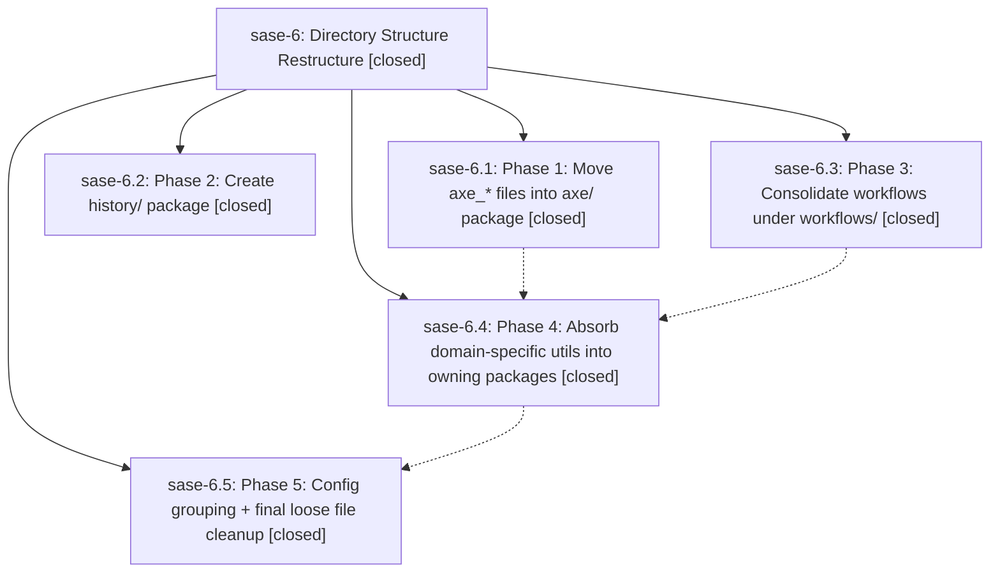

# Bead: sase-6 — Directory Structure Restructure

[Bead Pages](../README.md) / sase-6

**Status:** ✓ closed · **Resolution:** (unrecorded) · **Type:** plan · **Tier:** epic
**Owner:** `bryanbugyi34@gmail.com`
**Created:** 2026-03-21 00:27:11 UTC · **Closed:** 2026-03-21 01:31:06 UTC
**Plan:** [202603/directory\_restructure.md](https://github.com/sase-org/sase--plans/blob/main/202603/directory_restructure.md)

## Phases

| Bead | Title | Status | Size | Agents | Commits |
|---|---|---|---|---:|---:|
| [sase-6.1](sase-6.1.md) | Phase 1: Move axe\_\* files into axe/ package | ✓ closed | small | 0 | 1 |
| [sase-6.2](sase-6.2.md) | Phase 2: Create history/ package | ✓ closed | small | 0 | 1 |
| [sase-6.3](sase-6.3.md) | Phase 3: Consolidate workflows under workflows/ | ✓ closed | small | 0 | 1 |
| [sase-6.4](sase-6.4.md) | Phase 4: Absorb domain-specific utils into owning packages | ✓ closed | small | 0 | 1 |
| [sase-6.5](sase-6.5.md) | Phase 5: Config grouping + final loose file cleanup | ✓ closed | small | 0 | 1 |

## Lineage

## Commits

| Commit | Subject | Bead | Committed (UTC) |
|---|---|---|---|
| [`9ab1bda`](https://github.com/sase-org/sase/commit/9ab1bdab5ece1dac3b1e53a46da68a707ed8e8ad) | ref: Move 10 axe\_\* files into axe/ package, dropping the axe\_ prefix (sase-6.1) | [sase-6.1](sase-6.1.md) | 2026-03-21 00:37:52 |
| [`4030dd0`](https://github.com/sase-org/sase/commit/4030dd003b236bc1af32610f8003e46c223d94cd) | ref: Move 5 \*\_history files into history/ package, dropping the prefix (sase-6.2) | [sase-6.2](sase-6.2.md) | 2026-03-21 00:45:45 |
| [`5b6881f`](https://github.com/sase-org/sase/commit/5b6881f4f809d0487ff909af467ab1c0f10439cc) | ref: Move 10 workflow files/packages into workflows/ package, dropping prefixes (sase-6.3) (sase-6.3) | [sase-6.3](sase-6.3.md) | 2026-03-21 00:57:11 |
| [`c3a8c32`](https://github.com/sase-org/sase/commit/c3a8c3271f716ccab99281572e29c42ddc122759) | ref: Move 6 domain-specific utils into owning packages (sase-6.4) | [sase-6.4](sase-6.4.md) | 2026-03-21 01:09:58 |
| [`7f8ed0d`](https://github.com/sase-org/sase/commit/7f8ed0dfc0309dcc5ab08e0ed34fcc80f04724ff) | ref: Move 3 config files into config/ package, dropping prefixes (sase-6.5) | [sase-6.5](sase-6.5.md) | 2026-03-21 01:27:41 |
