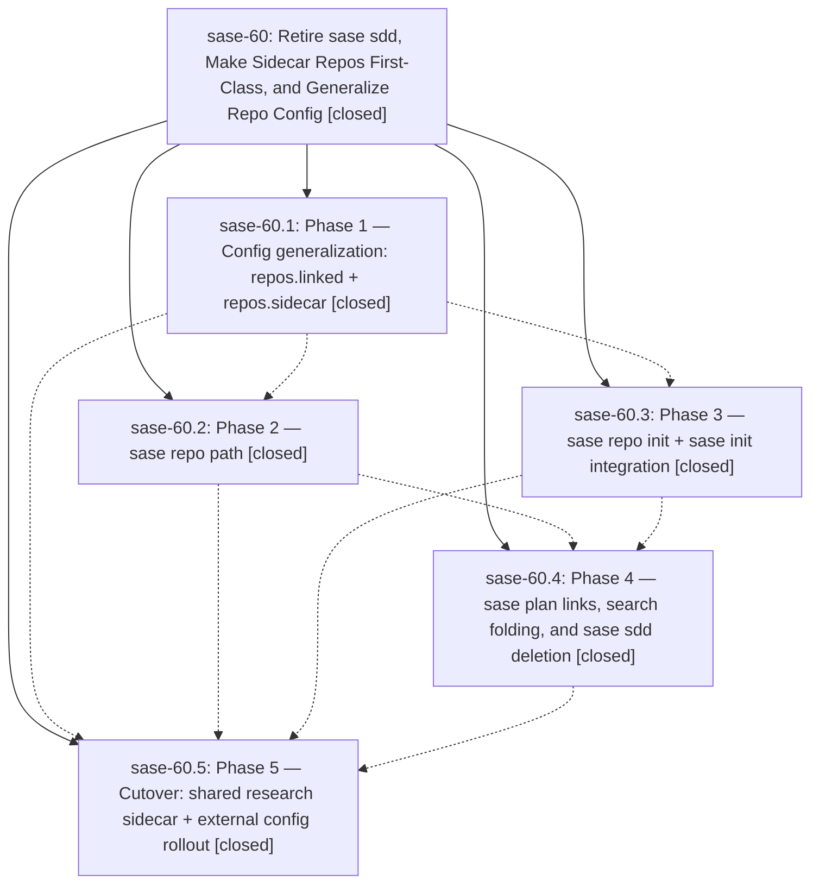

# Bead: sase-60 — Retire sase sdd, Make Sidecar Repos First-Class, and Generalize Repo Config

[Bead Pages](../README.md) / sase-60

**Status:** ✓ closed · **Resolution:** (unrecorded) · **Type:** plan · **Tier:** epic
**Owner:** `bryanbugyi34@gmail.com`
**Created:** 2026-07-14 13:31:31 UTC · **Closed:** 2026-07-14 17:11:13 UTC
**Plan:** [202607/sdd\_cli\_retirement\_and\_sidecar\_repos.md](https://github.com/sase-org/sase--plans/blob/main/202607/sdd_cli_retirement_and_sidecar_repos.md)

## Phases

| Bead | Title | Status | Size | Agents | Commits |
|---|---|---|---|---:|---:|
| [sase-60.1](sase-60.1.md) | Phase 1 — Config generalization: repos.linked + repos.sidecar | ✓ closed | small | 1 | 1 |
| [sase-60.2](sase-60.2.md) | Phase 2 — sase repo path | ✓ closed | small | 0 | 0 |
| [sase-60.3](sase-60.3.md) | Phase 3 — sase repo init + sase init integration | ✓ closed | small | 0 | 0 |
| [sase-60.4](sase-60.4.md) | Phase 4 — sase plan links, search folding, and sase sdd deletion | ✓ closed | small | 0 | 0 |
| [sase-60.5](sase-60.5.md) | Phase 5 — Cutover: shared research sidecar + external config rollout | ✓ closed | small | 0 | 0 |

## Lineage

## Agents

| Agent | Bead | Commits |
|---|---|---:|
| [bbugyi200.athena.sase-60--code](https://github.com/sase-org/sase--agents/blob/main/families/bbugyi200.athena.sase-60.md#member-code) | [sase-60](README.md) | 0 |
| [bbugyi200.athena.sase-60.1](https://github.com/sase-org/sase--agents/blob/main/agents/bbugyi200.athena.sase-60.1/README.md) | [sase-60.1](sase-60.1.md) | 1 |

## Commits

| Commit | Subject | Bead | Committed (UTC) |
|---|---|---|---|
| [`e7411b8`](https://github.com/sase-org/sase/commit/e7411b8a89e895931c1606f7c84fada9724623c4) | feat(config): generalize linked and sidecar repositories (sase-60.1) | [sase-60.1](sase-60.1.md) | 2026-07-14 14:51:46 |
