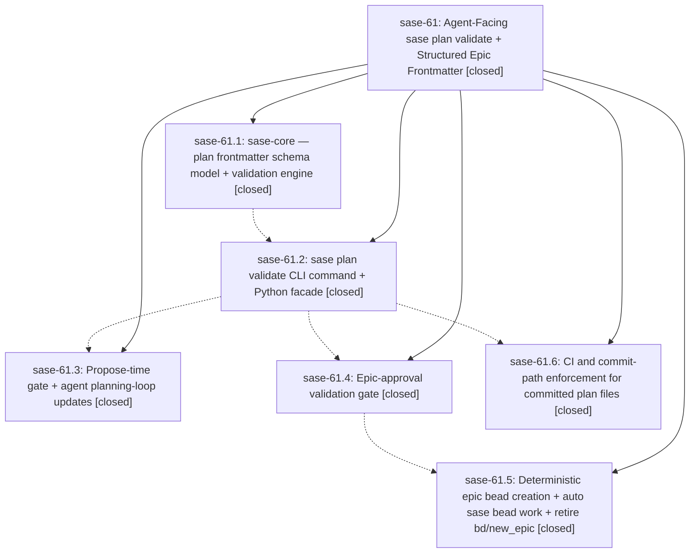

# Bead: sase-61 — Agent-Facing sase plan validate + Structured Epic Frontmatter

[Bead Pages](../README.md) / sase-61

**Status:** ✓ closed · **Resolution:** (unrecorded) · **Type:** plan · **Tier:** epic
**Owner:** `bryanbugyi34@gmail.com`
**Created:** 2026-07-14 16:45:08 UTC · **Closed:** 2026-07-14 19:09:22 UTC
**Plan:** [202607/plan\_validate\_command\_1.md](https://github.com/sase-org/sase--plans/blob/main/202607/plan_validate_command_1.md)

## Notes

COMMIT: beeefa6c2

## Phases

| Bead | Title | Status | Size | Agents | Commits |
|---|---|---|---|---:|---:|
| [sase-61.1](sase-61.1.md) | sase-core — plan frontmatter schema model + validation engine | ✓ closed | small | 0 | 0 |
| [sase-61.2](sase-61.2.md) | sase plan validate CLI command + Python facade | ✓ closed | small | 1 | 1 |
| [sase-61.3](sase-61.3.md) | Propose-time gate + agent planning-loop updates | ✓ closed | small | 1 | 1 |
| [sase-61.4](sase-61.4.md) | Epic-approval validation gate | ✓ closed | small | 1 | 1 |
| [sase-61.5](sase-61.5.md) | Deterministic epic bead creation + auto sase bead work + retire bd/new\_epic | ✓ closed | small | 1 | 1 |
| [sase-61.6](sase-61.6.md) | CI and commit-path enforcement for committed plan files | ✓ closed | small | 1 | 1 |

## Lineage

## Agents

| Agent | Bead | Commits |
|---|---|---:|
| [bbugyi200.athena.sase-61](https://github.com/sase-org/sase--agents/blob/main/agents/bbugyi200.athena.sase-61/README.md) | [sase-61](README.md) | 1 |
| [bbugyi200.athena.sase-61--code](https://github.com/sase-org/sase--agents/blob/main/families/bbugyi200.athena.sase-61.md#member-code) | [sase-61](README.md) | 0 |
| [bbugyi200.athena.sase-61.2](https://github.com/sase-org/sase--agents/blob/main/agents/bbugyi200.athena.sase-61.2/README.md) | [sase-61.2](sase-61.2.md) | 1 |
| [bbugyi200.athena.sase-61.3](https://github.com/sase-org/sase--agents/blob/main/agents/bbugyi200.athena.sase-61.3/README.md) | [sase-61.3](sase-61.3.md) | 1 |
| [bbugyi200.athena.sase-61.4](https://github.com/sase-org/sase--agents/blob/main/agents/bbugyi200.athena.sase-61.4/README.md) | [sase-61.4](sase-61.4.md) | 1 |
| [bbugyi200.athena.sase-61.5](https://github.com/sase-org/sase--agents/blob/main/agents/bbugyi200.athena.sase-61.5/README.md) | [sase-61.5](sase-61.5.md) | 1 |
| [bbugyi200.athena.sase-61.6](https://github.com/sase-org/sase--agents/blob/main/agents/bbugyi200.athena.sase-61.6/README.md) | [sase-61.6](sase-61.6.md) | 1 |

## Commits

| Commit | Subject | Bead | Committed (UTC) |
|---|---|---|---|
| [`4881a04`](https://github.com/sase-org/sase/commit/4881a04bfa1ede8580925fe14bae6935ca1eb620) | feat(plan): add strict plan validation command (sase-61.2) | [sase-61.2](sase-61.2.md) | 2026-07-14 17:25:09 |
| [`d2e9613`](https://github.com/sase-org/sase/commit/d2e9613a8ad23368037fcb1c0161e4e1a6480273) | feat(plan): validate plans before proposal (sase-61.3) | [sase-61.3](sase-61.3.md) | 2026-07-14 17:41:47 |
| [`b33ef20`](https://github.com/sase-org/sase/commit/b33ef206cfa69408823d1b681b2b82f2eb20fe2d) | feat(sdd): enforce committed plan schema cutover (sase-61.6) | [sase-61.6](sase-61.6.md) | 2026-07-14 17:49:51 |
| [`bc32fb8`](https://github.com/sase-org/sase/commit/bc32fb844cdc36181f824c2bfa78fcda7e9c6548) | feat: validate tiered plans before approval (sase-61.4) | [sase-61.4](sase-61.4.md) | 2026-07-14 17:54:36 |
| [`9ef9688`](https://github.com/sase-org/sase/commit/9ef9688c8bc2856466c2d57d0daa3ac132271ebd) | feat!: launch approved epics from structured plans (sase-61.5) | [sase-61.5](sase-61.5.md) | 2026-07-14 18:34:35 |
| [`beeefa6`](https://github.com/sase-org/sase/commit/beeefa6c2b358bf36a79f172d2274e13275d9afe) | fix: require plan validation core bindings (sase-61) | [sase-61](README.md) | 2026-07-14 19:12:17 |
