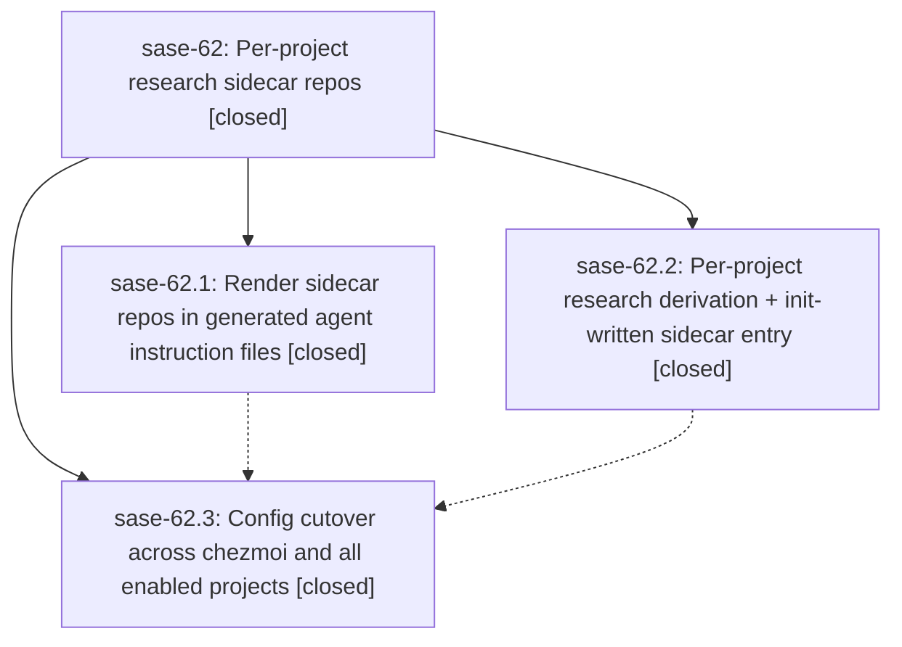

# Bead: sase-62 — Per-project research sidecar repos

[Bead Pages](../README.md) / sase-62

**Status:** ✓ closed · **Resolution:** (unrecorded) · **Type:** plan · **Tier:** epic
**Owner:** `bryanbugyi34@gmail.com`
**Created:** 2026-07-15 12:28:08 UTC · **Closed:** 2026-07-15 13:49:42 UTC
**Plan:** [202607/per\_project\_research\_sidecars.md](https://github.com/sase-org/sase--plans/blob/main/202607/per_project_research_sidecars.md)

## Description

Every enabled SASE project declares, resolves, and documents its own <project>--research sidecar repo: generated agent instruction files list non-auto-cloned sidecar repos again, sase init writes (and can create) the per-project research entry in each project's sase.yml, and the shared sase-org/sase--research pin is removed from the global chezmoi-managed config.

## Phases

| Bead | Title | Status | Size | Agents | Commits |
|---|---|---|---|---:|---:|
| [sase-62.1](sase-62.1.md) | Render sidecar repos in generated agent instruction files | ✓ closed | small | 1 | 1 |
| [sase-62.2](sase-62.2.md) | Per-project research derivation + init-written sidecar entry | ✓ closed | small | 1 | 1 |
| [sase-62.3](sase-62.3.md) | Config cutover across chezmoi and all enabled projects | ✓ closed | small | 0 | 0 |

## Lineage

## Agents

| Agent | Bead | Commits |
|---|---|---:|
| [bbugyi200.athena.sase-62](https://github.com/sase-org/sase--agents/blob/main/agents/bbugyi200.athena.sase-62/README.md) | [sase-62](README.md) | 1 |
| [bbugyi200.athena.sase-62.1](https://github.com/sase-org/sase--agents/blob/main/agents/bbugyi200.athena.sase-62.1/README.md) | [sase-62.1](sase-62.1.md) | 1 |
| [bbugyi200.athena.sase-62.2](https://github.com/sase-org/sase--agents/blob/main/agents/bbugyi200.athena.sase-62.2/README.md) | [sase-62.2](sase-62.2.md) | 1 |

## Commits

| Commit | Subject | Bead | Committed (UTC) |
|---|---|---|---|
| [`776f69e`](https://github.com/sase-org/sase/commit/776f69eb4b9b0e996378968716682b070a8feb8b) | feat(memory): render lazy sidecar repositories (sase-62.1) | [sase-62.1](sase-62.1.md) | 2026-07-15 12:47:45 |
| [`47514b7`](https://github.com/sase-org/sase/commit/47514b77a887b7a518a7df1013c1021d9d73e498) | fix: initialize project-specific research sidecars (sase-62.2) | [sase-62.2](sase-62.2.md) | 2026-07-15 12:49:36 |
| [`7a03b9c`](https://github.com/sase-org/sase/commit/7a03b9c8a4ae8e89cf9761948e26590ee8471bac) | docs: align SDD docs with per-project research sidecars (sase-62) | [sase-62](README.md) | 2026-07-15 13:56:26 |
