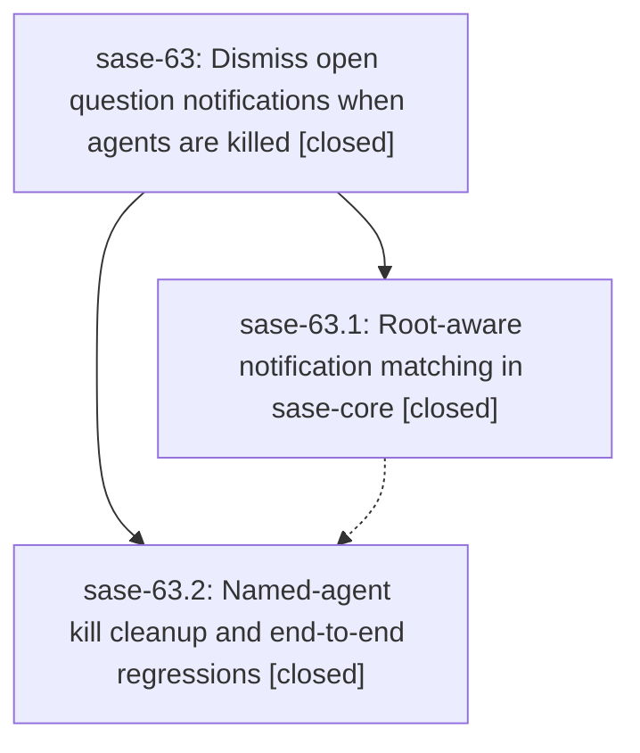

# Bead: sase-63 — Dismiss open question notifications when agents are killed

[Bead Pages](../README.md) / sase-63

**Status:** ✓ closed · **Resolution:** (unrecorded) · **Type:** plan · **Tier:** epic
**Owner:** `bryanbugyi34@gmail.com`
**Created:** 2026-07-15 13:47:55 UTC · **Closed:** 2026-07-15 14:38:17 UTC
**Plan:** [202607/question\_notification\_kill\_cleanup.md](https://github.com/sase-org/sase--plans/blob/main/202607/question_notification_kill_cleanup.md)

## Description

Every successful agent-kill surface dismisses notifications associated with the killed agent, including open UserQuestion notifications routed through a child phase and its visible root agent, without broadening matches to unrelated agents or allowing notification cleanup failures to invalidate a successful kill.

## Phases

| Bead | Title | Status | Size | Agents | Commits |
|---|---|---|---|---:|---:|
| [sase-63.1](sase-63.1.md) | Root-aware notification matching in sase-core | ✓ closed | small | 0 | 0 |
| [sase-63.2](sase-63.2.md) | Named-agent kill cleanup and end-to-end regressions | ✓ closed | small | 1 | 1 |

## Lineage

## Agents

| Agent | Bead | Commits |
|---|---|---:|
| [bbugyi200.athena.sase-63--code](https://github.com/sase-org/sase--agents/blob/main/families/bbugyi200.athena.sase-63.md#member-code) | [sase-63](README.md) | 0 |
| [bbugyi200.athena.sase-63.2](https://github.com/sase-org/sase--agents/blob/main/agents/bbugyi200.athena.sase-63.2/README.md) | [sase-63.2](sase-63.2.md) | 1 |

## Commits

| Commit | Subject | Bead | Committed (UTC) |
|---|---|---|---|
| [`6047ada`](https://github.com/sase-org/sase/commit/6047ada2e930aaaba56a5b93b09d9cd94747f087) | fix: dismiss notifications after named-agent kills (sase-63.2) | [sase-63.2](sase-63.2.md) | 2026-07-15 14:27:03 |
