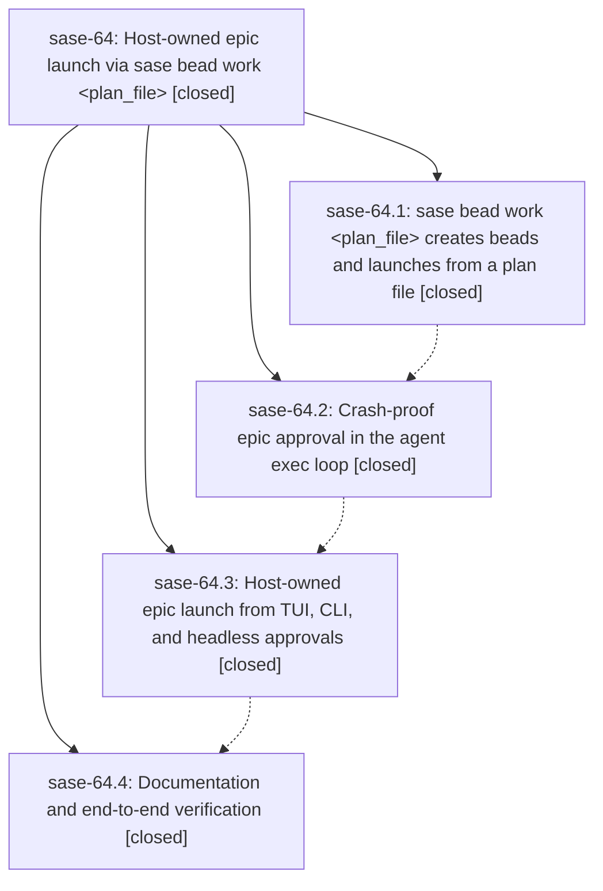

# Bead: sase-64 — Host-owned epic launch via sase bead work \<plan\_file\>

[Bead Pages](../README.md) / sase-64

**Status:** ✓ closed · **Resolution:** (unrecorded) · **Type:** plan · **Tier:** epic
**Owner:** `bryanbugyi34@gmail.com`
**Created:** 2026-07-15 14:30:33 UTC · **Closed:** 2026-07-15 16:30:01 UTC
**Plan:** [202607/bead\_work\_from\_plan\_file.md](https://github.com/sase-org/sase--plans/blob/main/202607/bead_work_from_plan_file.md)

## Description

Approving an epic plan no longer runs bead creation and agent launch inside the dying planner agent. `sase bead work` accepts an epic plan file, creates the epic and phase beads with their dependencies, and launches the epic with excellent CLI output; approval surfaces run that command host-side (a visible background task in the TUI), and the planner agent finishes cleanly instead of crashing.

## Phases

| Bead | Title | Status | Size | Agents | Commits |
|---|---|---|---|---:|---:|
| [sase-64.1](sase-64.1.md) | sase bead work \<plan\_file\> creates beads and launches from a plan file | ✓ closed | small | 1 | 1 |
| [sase-64.2](sase-64.2.md) | Crash-proof epic approval in the agent exec loop | ✓ closed | small | 1 | 1 |
| [sase-64.3](sase-64.3.md) | Host-owned epic launch from TUI, CLI, and headless approvals | ✓ closed | small | 1 | 1 |
| [sase-64.4](sase-64.4.md) | Documentation and end-to-end verification | ✓ closed | small | 0 | 0 |

## Lineage

## Agents

| Agent | Bead | Commits |
|---|---|---:|
| [bbugyi200.athena.sase-64.1](https://github.com/sase-org/sase--agents/blob/main/agents/bbugyi200.athena.sase-64.1/README.md) | [sase-64.1](sase-64.1.md) | 1 |
| [bbugyi200.athena.sase-64.2](https://github.com/sase-org/sase--agents/blob/main/agents/bbugyi200.athena.sase-64.2/README.md) | [sase-64.2](sase-64.2.md) | 1 |
| [bbugyi200.athena.sase-64.3](https://github.com/sase-org/sase--agents/blob/main/agents/bbugyi200.athena.sase-64.3/README.md) | [sase-64.3](sase-64.3.md) | 1 |

## Commits

| Commit | Subject | Bead | Committed (UTC) |
|---|---|---|---|
| [`a6c5c69`](https://github.com/sase-org/sase/commit/a6c5c69a649387b820fbdb52c02478c6ea05aaf6) | feat(cli): launch epic work from plan files (sase-64.1) | [sase-64.1](sase-64.1.md) | 2026-07-15 15:05:12 |
| [`3c0b0ea`](https://github.com/sase-org/sase/commit/3c0b0ea24a1085a7d719f37d644f663b1e0c469e) | feat: harden epic approval handoff (sase-64.2) | [sase-64.2](sase-64.2.md) | 2026-07-15 15:34:21 |
| [`33d30ba`](https://github.com/sase-org/sase/commit/33d30ba0f4ce450bb7e56e22228dcf6b246883e2) | feat: make epic approval launches host-owned (sase-64.3) | [sase-64.3](sase-64.3.md) | 2026-07-15 16:00:23 |
