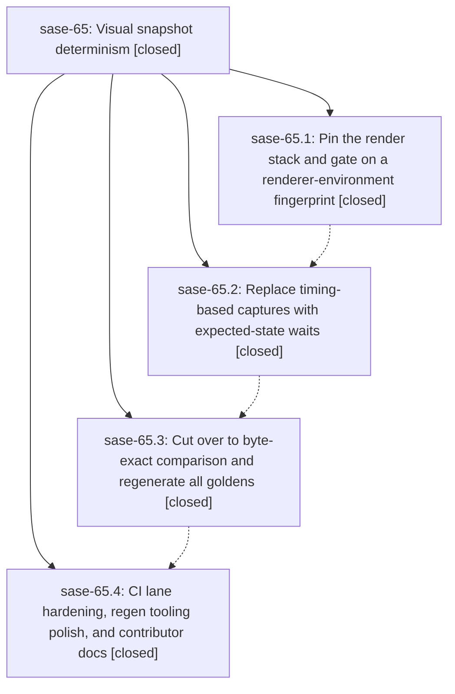

# Bead: sase-65 — Visual snapshot determinism

[Bead Pages](../README.md) / sase-65

**Status:** ✓ closed · **Resolution:** (unrecorded) · **Type:** plan · **Tier:** epic
**Owner:** `bryanbugyi34@gmail.com`
**Created:** 2026-07-15 22:02:40 UTC · **Closed:** 2026-07-16 01:56:57 UTC
**Plan:** [202607/visual\_snapshot\_determinism.md](https://github.com/sase-org/sase--plans/blob/main/202607/visual_snapshot_determinism.md)

## Description

Master CI is green again and the ACE PNG visual snapshot suite is deterministic across machines: when the suite passes on any properly-installed machine, it passes in CI, because every environment renders byte-identical PNGs from a pinned render stack and every capture waits for the expected UI state instead of racing it.

## Notes

COMMIT: 26682ba37

## Phases

| Bead | Title | Status | Size | Agents | Commits |
|---|---|---|---|---:|---:|
| [sase-65.1](sase-65.1.md) | Pin the render stack and gate on a renderer-environment fingerprint | ✓ closed | small | 1 | 1 |
| [sase-65.2](sase-65.2.md) | Replace timing-based captures with expected-state waits | ✓ closed | small | 0 | 0 |
| [sase-65.3](sase-65.3.md) | Cut over to byte-exact comparison and regenerate all goldens | ✓ closed | small | 0 | 0 |
| [sase-65.4](sase-65.4.md) | CI lane hardening, regen tooling polish, and contributor docs | ✓ closed | small | 1 | 1 |

## Lineage

## Agents

| Agent | Bead | Commits |
|---|---|---:|
| [bbugyi200.athena.sase-65](https://github.com/sase-org/sase--agents/blob/main/agents/bbugyi200.athena.sase-65/README.md) | [sase-65](README.md) | 1 |
| [bbugyi200.athena.sase-65--code](https://github.com/sase-org/sase--agents/blob/main/families/bbugyi200.athena.sase-65.md#member-code) | [sase-65](README.md) | 0 |
| [bbugyi200.athena.sase-65.1](https://github.com/sase-org/sase--agents/blob/main/agents/bbugyi200.athena.sase-65.1/README.md) | [sase-65.1](sase-65.1.md) | 1 |
| [bbugyi200.athena.sase-65.4](https://github.com/sase-org/sase--agents/blob/main/agents/bbugyi200.athena.sase-65.4/README.md) | [sase-65.4](sase-65.4.md) | 1 |

## Commits

| Commit | Subject | Bead | Committed (UTC) |
|---|---|---|---|
| [`0233d57`](https://github.com/sase-org/sase/commit/0233d57c0ec07c67834ce50d9d29780d9f764761) | test(visual): pin renderer environment (sase-65.1) | [sase-65.1](sase-65.1.md) | 2026-07-15 22:17:29 |
| [`9b29ec4`](https://github.com/sase-org/sase/commit/9b29ec4115f08107100597d9473c2dfd33bf18e4) | ci: harden visual snapshot lanes (sase-65.4) | [sase-65.4](sase-65.4.md) | 2026-07-16 01:05:13 |
| [`26682ba`](https://github.com/sase-org/sase/commit/26682ba376d8eaaf426e532ef6a895815da25824) | test: pin visual snapshot rendering environment (sase-65) | [sase-65](README.md) | 2026-07-16 01:58:06 |
