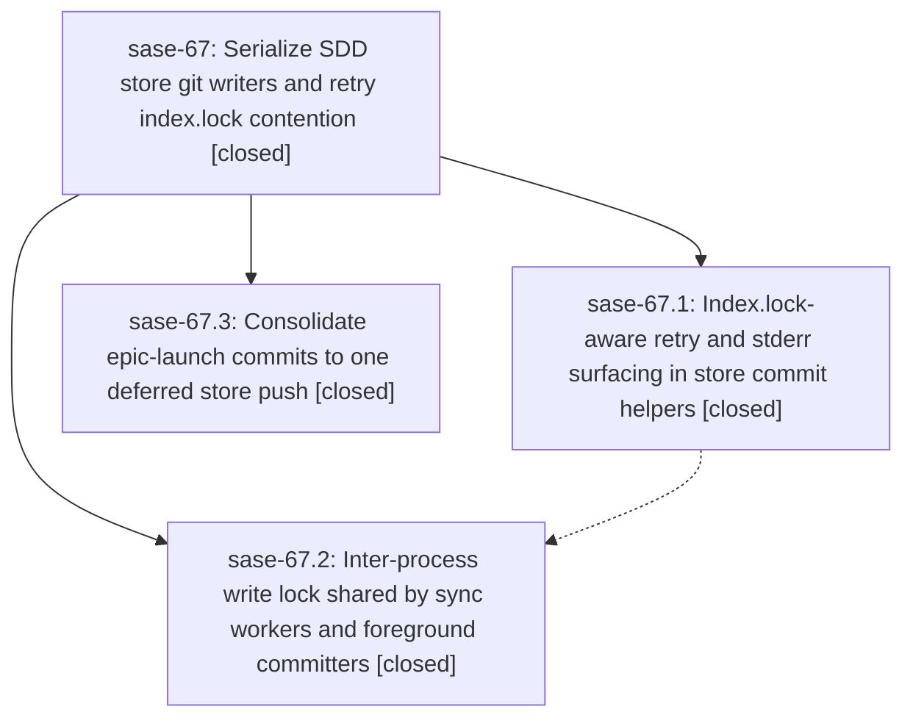

# Bead: sase-67 — Serialize SDD store git writers and retry index.lock contention

[Bead Pages](../README.md) / sase-67

**Status:** ✓ closed · **Resolution:** (unrecorded) · **Type:** plan · **Tier:** epic
**Owner:** `bryanbugyi34@gmail.com`
**Created:** 2026-07-15 22:51:25 UTC · **Closed:** 2026-07-16 00:34:00 UTC
**Plan:** [202607/store\_git\_write\_contention.md](https://github.com/sase-org/sase--plans/blob/main/202607/store_git_write_contention.md)

## Description

Epic launches and bead-store commits no longer fail on transient git index.lock contention in shared SDD sidecar store repos: SASE-managed git writers are serialized against each other, transient lock collisions are retried instead of aborting the launch, and any residual git failure surfaces git's stderr so it is diagnosable from the task output.

## Phases

| Bead | Title | Status | Size | Agents | Commits |
|---|---|---|---|---:|---:|
| [sase-67.1](sase-67.1.md) | Index.lock-aware retry and stderr surfacing in store commit helpers | ✓ closed | small | 1 | 1 |
| [sase-67.2](sase-67.2.md) | Inter-process write lock shared by sync workers and foreground committers | ✓ closed | small | 0 | 0 |
| [sase-67.3](sase-67.3.md) | Consolidate epic-launch commits to one deferred store push | ✓ closed | small | 1 | 1 |

## Lineage

## Agents

| Agent | Bead | Commits |
|---|---|---:|
| [bbugyi200.athena.sase-67.1](https://github.com/sase-org/sase--agents/blob/main/agents/bbugyi200.athena.sase-67.1/README.md) | [sase-67.1](sase-67.1.md) | 1 |
| [bbugyi200.athena.sase-67.3](https://github.com/sase-org/sase--agents/blob/main/agents/bbugyi200.athena.sase-67.3/README.md) | [sase-67.3](sase-67.3.md) | 1 |

## Commits

| Commit | Subject | Bead | Committed (UTC) |
|---|---|---|---|
| [`63d3b01`](https://github.com/sase-org/sase/commit/63d3b01de476ca79ab8d7c0d9156fb1b52b6a519) | fix(sdd): retry git writes on lock contention (sase-67.1) | [sase-67.1](sase-67.1.md) | 2026-07-15 23:07:02 |
| [`35edd9b`](https://github.com/sase-org/sase/commit/35edd9bafe9f119f9b6cac2ec10d9b1899cf904a) | fix(beads): defer epic launch store pushes (sase-67.3) | [sase-67.3](sase-67.3.md) | 2026-07-15 23:11:34 |
