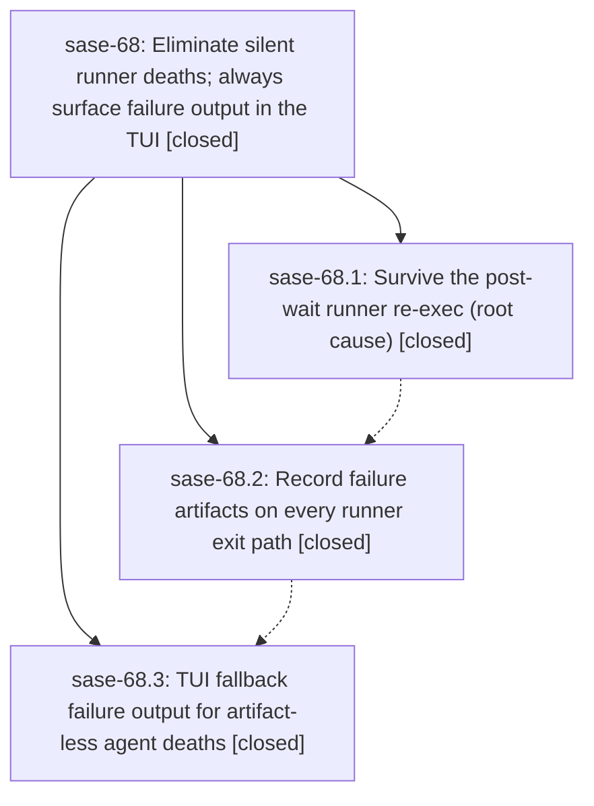

# Bead: sase-68 — Eliminate silent runner deaths; always surface failure output in the TUI

[Bead Pages](../README.md) / sase-68

**Status:** ✓ closed · **Resolution:** (unrecorded) · **Type:** plan · **Tier:** epic
**Owner:** `bryanbugyi34@gmail.com`
**Created:** 2026-07-15 22:54:34 UTC · **Closed:** 2026-07-16 01:17:50 UTC
**Plan:** [202607/runner\_silent\_failure\_visibility.md](https://github.com/sase-org/sase--plans/blob/main/202607/runner_silent_failure_visibility.md)

## Description

Agents that die for any reason always surface actionable failure output in the ace TUI, and the post-wait runner code refresh no longer kills agents by replaying argv that references an already-deleted temp prompt file.

## Phases

| Bead | Title | Status | Size | Agents | Commits |
|---|---|---|---|---:|---:|
| [sase-68.1](sase-68.1.md) | Survive the post-wait runner re-exec (root cause) | ✓ closed | small | 1 | 1 |
| [sase-68.2](sase-68.2.md) | Record failure artifacts on every runner exit path | ✓ closed | small | 0 | 0 |
| [sase-68.3](sase-68.3.md) | TUI fallback failure output for artifact-less agent deaths | ✓ closed | small | 0 | 0 |

## Lineage

## Agents

| Agent | Bead | Commits |
|---|---|---:|
| [bbugyi200.athena.sase-68.1](https://github.com/sase-org/sase--agents/blob/main/agents/bbugyi200.athena.sase-68.1/README.md) | [sase-68.1](sase-68.1.md) | 1 |

## Commits

| Commit | Subject | Bead | Committed (UTC) |
|---|---|---|---|
| [`2b96521`](https://github.com/sase-org/sase/commit/2b96521f53a4aa44a0aa9d494331d44362c93413) | fix(runner): preserve prompt across code refresh (sase-68.1) | [sase-68.1](sase-68.1.md) | 2026-07-15 23:11:13 |
