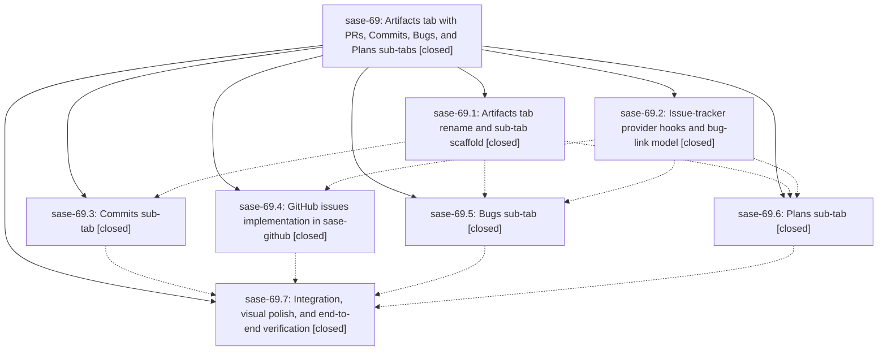

# Bead: sase-69 — Artifacts tab with PRs, Commits, Bugs, and Plans sub-tabs

[Bead Pages](../README.md) / sase-69

**Status:** ✓ closed · **Resolution:** (unrecorded) · **Type:** plan · **Tier:** epic
**Owner:** `bryanbugyi34@gmail.com`
**Created:** 2026-07-16 00:26:51 UTC · **Closed:** 2026-07-16 03:34:33 UTC
**Plan:** [202607/artifacts\_tab.md](https://github.com/sase-org/sase--plans/blob/main/202607/artifacts_tab.md)

## Description

The ACE TUI's "PRs" tab becomes an "Artifacts" tab hosting four sub-tabs: PRs (functionally unchanged), Commits (a rich cross-repo commit timeline with first-class message and diff viewing), Bugs (external-tracker bug triage backed by GitHub issues, with create/view/modify), and Plans (browse and manage the plan pipeline and bead DAG per project). Every sub-tab is intuitive, responsive under the TUI performance budget, and visually consistent with the existing ACE aesthetic.

## Notes

COMMIT: af8f3ba

## Phases

| Bead | Title | Status | Size | Agents | Commits |
|---|---|---|---|---:|---:|
| [sase-69.1](sase-69.1.md) | Artifacts tab rename and sub-tab scaffold | ✓ closed | small | 1 | 1 |
| [sase-69.2](sase-69.2.md) | Issue-tracker provider hooks and bug-link model | ✓ closed | small | 1 | 1 |
| [sase-69.3](sase-69.3.md) | Commits sub-tab | ✓ closed | small | 1 | 1 |
| [sase-69.4](sase-69.4.md) | GitHub issues implementation in sase-github | ✓ closed | small | 0 | 0 |
| [sase-69.5](sase-69.5.md) | Bugs sub-tab | ✓ closed | small | 1 | 2 |
| [sase-69.6](sase-69.6.md) | Plans sub-tab | ✓ closed | small | 1 | 1 |
| [sase-69.7](sase-69.7.md) | Integration, visual polish, and end-to-end verification | ✓ closed | small | 1 | 1 |

## Lineage

## Agents

| Agent | Bead | Commits |
|---|---|---:|
| [bbugyi200.athena.sase-69](https://github.com/sase-org/sase--agents/blob/main/agents/bbugyi200.athena.sase-69/README.md) | [sase-69](README.md) | 1 |
| [bbugyi200.athena.sase-69--code](https://github.com/sase-org/sase--agents/blob/main/families/bbugyi200.athena.sase-69.md#member-code) | [sase-69](README.md) | 0 |
| [bbugyi200.athena.sase-69.1](https://github.com/sase-org/sase--agents/blob/main/agents/bbugyi200.athena.sase-69.1/README.md) | [sase-69.1](sase-69.1.md) | 1 |
| [bbugyi200.athena.sase-69.2](https://github.com/sase-org/sase--agents/blob/main/agents/bbugyi200.athena.sase-69.2/README.md) | [sase-69.2](sase-69.2.md) | 1 |
| [bbugyi200.athena.sase-69.3](https://github.com/sase-org/sase--agents/blob/main/agents/bbugyi200.athena.sase-69.3/README.md) | [sase-69.3](sase-69.3.md) | 1 |
| [bbugyi200.athena.sase-69.5](https://github.com/sase-org/sase--agents/blob/main/agents/bbugyi200.athena.sase-69.5/README.md) | [sase-69.5](sase-69.5.md) | 2 |
| [bbugyi200.athena.sase-69.6](https://github.com/sase-org/sase--agents/blob/main/agents/bbugyi200.athena.sase-69.6/README.md) | [sase-69.6](sase-69.6.md) | 1 |
| [bbugyi200.athena.sase-69.7](https://github.com/sase-org/sase--agents/blob/main/agents/bbugyi200.athena.sase-69.7/README.md) | [sase-69.7](sase-69.7.md) | 1 |

## Commits

| Commit | Subject | Bead | Committed (UTC) |
|---|---|---|---|
| [`e5d2995`](https://github.com/sase-org/sase/commit/e5d29958205915ef9fb218fd12785861800804ad) | feat(vcs): add issue-tracker provider seam (sase-69.2) | [sase-69.2](sase-69.2.md) | 2026-07-16 00:50:20 |
| [`a626470`](https://github.com/sase-org/sase/commit/a62647069c6787b1fb9a7d65c5c8fb8ed55c5ac1) | feat(ace): scaffold the Artifacts tab (sase-69.1) | [sase-69.1](sase-69.1.md) | 2026-07-16 01:19:45 |
| [`72142d7`](https://github.com/sase-org/sase/commit/72142d75a3ca12be2339e2ab9df3941c82c89182) | feat(tui): add commits artifact pane (sase-69.3) | [sase-69.3](sase-69.3.md) | 2026-07-16 01:59:39 |
| [`69fe487`](https://github.com/sase-org/sase/commit/69fe487c618a7427f5c4b4913ce641479fd1ec34) | feat(ace): add interactive Plans artifacts pane (sase-69.6) | [sase-69.6](sase-69.6.md) | 2026-07-16 02:02:29 |
| [`2511b71`](https://github.com/sase-org/sase/commit/2511b71875900273b78c42af9ca43b586e7cabb8) | feat(ace): add Bugs artifact pane (sase-69.5) | [sase-69.5](sase-69.5.md) | 2026-07-16 02:26:58 |
| [`ad730f6`](https://github.com/sase-org/sase/commit/ad730f6447a3bc4bd3705125b9d4ce317b2aacd8) | chore(lint): remove fulfilled artifact epic symbols (sase-69.5) | [sase-69.5](sase-69.5.md) | 2026-07-16 02:33:21 |
| [`6bc7613`](https://github.com/sase-org/sase/commit/6bc7613fae64f1f0040d8200dcfe8773e116ce7c) | feat(ace): polish artifacts tab integration (sase-69.7) | [sase-69.7](sase-69.7.md) | 2026-07-16 03:02:41 |
| [`54f75ab`](https://github.com/sase-org/sase/commit/54f75ab41f768e8223b80d778169e1aea8513c88) | feat(ace): make commits actions configurable (sase-69) | [sase-69](README.md) | 2026-07-16 03:41:19 |
