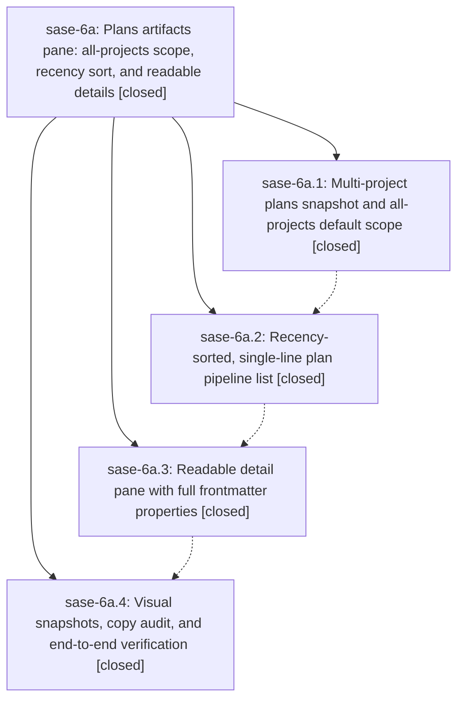

# Bead: sase-6a — Plans artifacts pane: all-projects scope, recency sort, and readable details

[Bead Pages](../README.md) / sase-6a

**Status:** ✓ closed · **Resolution:** (unrecorded) · **Type:** plan · **Tier:** epic
**Owner:** `bryanbugyi34@gmail.com`
**Created:** 2026-07-16 12:43:21 UTC · **Closed:** 2026-07-16 15:10:58 UTC
**Plan:** [202607/plans\_pane\_all\_projects\_upgrade.md](https://github.com/sase-org/sase--plans/blob/main/202607/plans_pane_all_projects_upgrade.md)

## Description

The ACE Artifacts → Plans sub-tab is useful the moment it opens: it aggregates plan proposals, epic beads, and archived plans across every enabled project by default, lists them newest-first on single non-wrapping rows, and renders a readable, beautiful detail pane that shows every property from the plan file's frontmatter.

## Phases

| Bead | Title | Status | Size | Agents | Commits |
|---|---|---|---|---:|---:|
| [sase-6a.1](sase-6a.1.md) | Multi-project plans snapshot and all-projects default scope | ✓ closed | small | 1 | 1 |
| [sase-6a.2](sase-6a.2.md) | Recency-sorted, single-line plan pipeline list | ✓ closed | small | 1 | 1 |
| [sase-6a.3](sase-6a.3.md) | Readable detail pane with full frontmatter properties | ✓ closed | small | 1 | 1 |
| [sase-6a.4](sase-6a.4.md) | Visual snapshots, copy audit, and end-to-end verification | ✓ closed | small | 1 | 1 |

## Lineage

## Agents

| Agent | Bead | Commits |
|---|---|---:|
| [bbugyi200.athena.sase-6a.1](https://github.com/sase-org/sase--agents/blob/main/agents/bbugyi200.athena.sase-6a.1/README.md) | [sase-6a.1](sase-6a.1.md) | 1 |
| [bbugyi200.athena.sase-6a.2](https://github.com/sase-org/sase--agents/blob/main/agents/bbugyi200.athena.sase-6a.2/README.md) | [sase-6a.2](sase-6a.2.md) | 1 |
| [bbugyi200.athena.sase-6a.3](https://github.com/sase-org/sase--agents/blob/main/agents/bbugyi200.athena.sase-6a.3/README.md) | [sase-6a.3](sase-6a.3.md) | 1 |
| [bbugyi200.athena.sase-6a.4](https://github.com/sase-org/sase--agents/blob/main/agents/bbugyi200.athena.sase-6a.4/README.md) | [sase-6a.4](sase-6a.4.md) | 1 |

## Commits

| Commit | Subject | Bead | Committed (UTC) |
|---|---|---|---|
| [`0a910c5`](https://github.com/sase-org/sase/commit/0a910c51803d3a556d1e2d2fb9746a94cd243930) | feat(plans): aggregate enabled projects by default (sase-6a.1) | [sase-6a.1](sase-6a.1.md) | 2026-07-16 13:13:22 |
| [`ec1a006`](https://github.com/sase-org/sase/commit/ec1a006f53282265330668704a416bb0d03562df) | feat(plans): redesign plan pipeline list (sase-6a.2) | [sase-6a.2](sase-6a.2.md) | 2026-07-16 13:35:12 |
| [`1d9b5d0`](https://github.com/sase-org/sase/commit/1d9b5d0a9ae6ef86b610258fbcdb931b89ed1e82) | feat(tui): redesign plans detail pane (sase-6a.3) | [sase-6a.3](sase-6a.3.md) | 2026-07-16 14:09:25 |
| [`721b64c`](https://github.com/sase-org/sase/commit/721b64ce6ec37b138767a53108182b8615cee772) | fix(ace): polish plans pane visual coverage (sase-6a.4) | [sase-6a.4](sase-6a.4.md) | 2026-07-16 14:59:52 |
