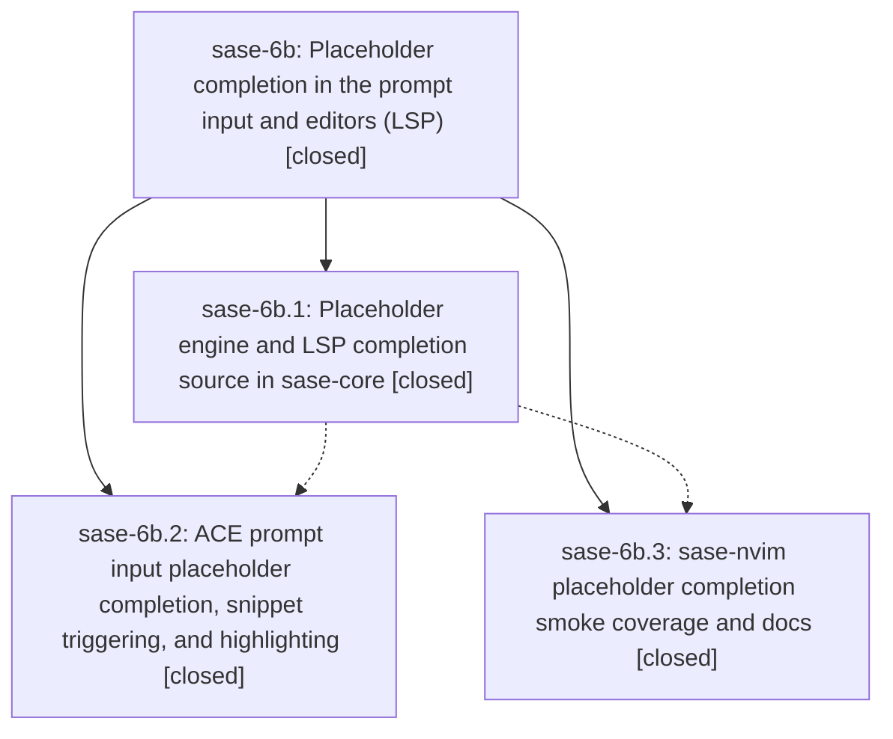

# Bead: sase-6b — Placeholder completion in the prompt input and editors (LSP)

[Bead Pages](../README.md) / sase-6b

**Status:** ✓ closed · **Resolution:** (unrecorded) · **Type:** plan · **Tier:** epic
**Owner:** `bryanbugyi34@gmail.com`
**Created:** 2026-07-16 12:49:16 UTC · **Closed:** 2026-07-16 14:05:00 UTC
**Plan:** [202607/placeholder\_completion.md](https://github.com/sase-org/sase--plans/blob/main/202607/placeholder_completion.md)

## Description

Typing inside <> brackets in the ACE prompt input or in any LSP-attached editor (e.g. Neovim via sase-nvim) offers completion of placeholder texts already used elsewhere in the current prompt, including immediately after snippet expansions like cbi that park the cursor inside brackets. Placeholders are also highlighted so reused terms read consistently and beautifully.

## Notes

COMMIT: f52122b

## Phases

| Bead | Title | Status | Size | Agents | Commits |
|---|---|---|---|---:|---:|
| [sase-6b.1](sase-6b.1.md) | Placeholder engine and LSP completion source in sase-core | ✓ closed | small | 1 | 1 |
| [sase-6b.2](sase-6b.2.md) | ACE prompt input placeholder completion, snippet triggering, and highlighting | ✓ closed | small | 1 | 1 |
| [sase-6b.3](sase-6b.3.md) | sase-nvim placeholder completion smoke coverage and docs | ✓ closed | small | 0 | 0 |

## Lineage

## Agents

| Agent | Bead | Commits |
|---|---|---:|
| [bbugyi200.athena.sase-6b](https://github.com/sase-org/sase--agents/blob/main/agents/bbugyi200.athena.sase-6b/README.md) | [sase-6b](README.md) | 2 |
| [bbugyi200.athena.sase-6b--code](https://github.com/sase-org/sase--agents/blob/main/families/bbugyi200.athena.sase-6b.md#member-code) | [sase-6b](README.md) | 0 |
| [bbugyi200.athena.sase-6b.1](https://github.com/sase-org/sase--agents/blob/main/agents/bbugyi200.athena.sase-6b.1/README.md) | [sase-6b.1](sase-6b.1.md) | 1 |
| [bbugyi200.athena.sase-6b.2](https://github.com/sase-org/sase--agents/blob/main/agents/bbugyi200.athena.sase-6b.2/README.md) | [sase-6b.2](sase-6b.2.md) | 1 |

## Commits

| Commit | Subject | Bead | Committed (UTC) |
|---|---|---|---|
| [`sase-core@b90ffdc`](https://github.com/sase-org/sase-core/commit/b90ffdc479287215a18ae1aac50e0dfe2f6e5772) | feat(editor): add placeholder completion support (sase-6b.1) | [sase-6b.1](sase-6b.1.md) | 2026-07-16 13:07:54 |
| [`b74adbf`](https://github.com/sase-org/sase/commit/b74adbf4cad66da4435017a41df074965d53a694) | feat(tui): add prompt placeholder completion (sase-6b.2) | [sase-6b.2](sase-6b.2.md) | 2026-07-16 13:35:57 |
| [`9292e5b`](https://github.com/sase-org/sase/commit/9292e5bf38eb93e9b7d2ae80316400d04bf52bae) | build(deps): require sase-core-rs 0.5.0 (sase-6b) | [sase-6b](README.md) | 2026-07-16 14:16:56 |
| [`sase--plans@f52122b`](https://github.com/sase-org/sase--plans/commit/f52122babcb505bb469f0a145fcb492e78f430c6) | docs: mark placeholder completion plan done (sase-6b) | [sase-6b](README.md) | 2026-07-16 14:17:48 |
