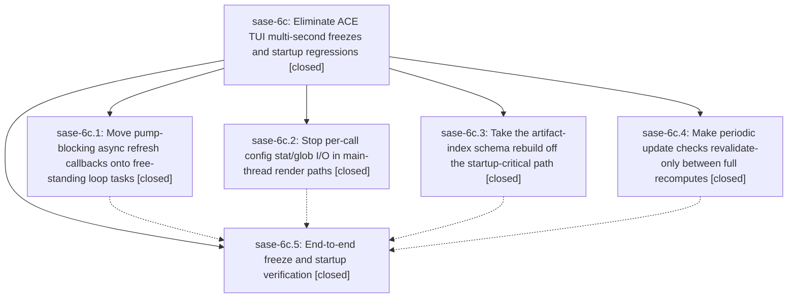

# Bead: sase-6c — Eliminate ACE TUI multi-second freezes and startup regressions

[Bead Pages](../README.md) / sase-6c

**Status:** ✓ closed · **Resolution:** (unrecorded) · **Type:** plan · **Tier:** epic
**Owner:** `bryanbugyi34@gmail.com`
**Created:** 2026-07-16 15:13:13 UTC · **Closed:** 2026-07-16 16:19:16 UTC
**Plan:** [202607/tui\_pump\_stalls\_and\_startup.md](https://github.com/sase-org/sase--plans/blob/main/202607/tui_pump_stalls_and_startup.md)

## Description

Typing and navigation in the ACE TUI never freeze behind background refresh work (message-pump stalls drop to zero in normal operation), and TUI startup no longer pays for artifact-index schema rebuilds or redundant per-call config disk I/O before first interactive paint.

## Notes

COMMIT: 3cf1b3d

## Phases

| Bead | Title | Status | Size | Agents | Commits |
|---|---|---|---|---:|---:|
| [sase-6c.1](sase-6c.1.md) | Move pump-blocking async refresh callbacks onto free-standing loop tasks | ✓ closed | small | 1 | 1 |
| [sase-6c.2](sase-6c.2.md) | Stop per-call config stat/glob I/O in main-thread render paths | ✓ closed | small | 1 | 1 |
| [sase-6c.3](sase-6c.3.md) | Take the artifact-index schema rebuild off the startup-critical path | ✓ closed | small | 1 | 1 |
| [sase-6c.4](sase-6c.4.md) | Make periodic update checks revalidate-only between full recomputes | ✓ closed | small | 1 | 1 |
| [sase-6c.5](sase-6c.5.md) | End-to-end freeze and startup verification | ✓ closed | small | 0 | 0 |

## Lineage

## Agents

| Agent | Bead | Commits |
|---|---|---:|
| [bbugyi200.athena.sase-6c](https://github.com/sase-org/sase--agents/blob/main/agents/bbugyi200.athena.sase-6c/README.md) | [sase-6c](README.md) | 1 |
| [bbugyi200.athena.sase-6c--code](https://github.com/sase-org/sase--agents/blob/main/families/bbugyi200.athena.sase-6c.md#member-code) | [sase-6c](README.md) | 0 |
| [bbugyi200.athena.sase-6c.1](https://github.com/sase-org/sase--agents/blob/main/agents/bbugyi200.athena.sase-6c.1/README.md) | [sase-6c.1](sase-6c.1.md) | 1 |
| [bbugyi200.athena.sase-6c.2](https://github.com/sase-org/sase--agents/blob/main/agents/bbugyi200.athena.sase-6c.2/README.md) | [sase-6c.2](sase-6c.2.md) | 1 |
| [bbugyi200.athena.sase-6c.3](https://github.com/sase-org/sase--agents/blob/main/agents/bbugyi200.athena.sase-6c.3/README.md) | [sase-6c.3](sase-6c.3.md) | 1 |
| [bbugyi200.athena.sase-6c.4](https://github.com/sase-org/sase--agents/blob/main/agents/bbugyi200.athena.sase-6c.4/README.md) | [sase-6c.4](sase-6c.4.md) | 1 |

## Commits

| Commit | Subject | Bead | Committed (UTC) |
|---|---|---|---|
| [`578dad2`](https://github.com/sase-org/sase/commit/578dad292b6d603478179eeb8eed070ffe9364ea) | perf(ace): avoid redundant periodic update recomputes (sase-6c.4) | [sase-6c.4](sase-6c.4.md) | 2026-07-16 15:27:55 |
| [`4309efb`](https://github.com/sase-org/sase/commit/4309efbf19bad8b26f33ef4e0fbb7ee6aa8c87dd) | perf(config): throttle freshness scans in render paths (sase-6c.2) | [sase-6c.2](sase-6c.2.md) | 2026-07-16 15:29:56 |
| [`f463941`](https://github.com/sase-org/sase/commit/f4639414a457e969e369078eedd71970f5402f98) | perf(tui): move stale index rebuild off startup path (sase-6c.3) | [sase-6c.3](sase-6c.3.md) | 2026-07-16 15:37:49 |
| [`0d33d2a`](https://github.com/sase-org/sase/commit/0d33d2a8c71f0a175afb7fbc1163f7499c1ad93e) | perf(tui): move slow refresh work off the message pump (sase-6c.1) | [sase-6c.1](sase-6c.1.md) | 2026-07-16 15:49:02 |
| [`b8b7d65`](https://github.com/sase-org/sase/commit/b8b7d65e1a0bb39a59ec2385416b9c8cbf5400f6) | perf(tui): keep remaining maintenance off the message pump (sase-6c) | [sase-6c](README.md) | 2026-07-16 16:22:59 |
