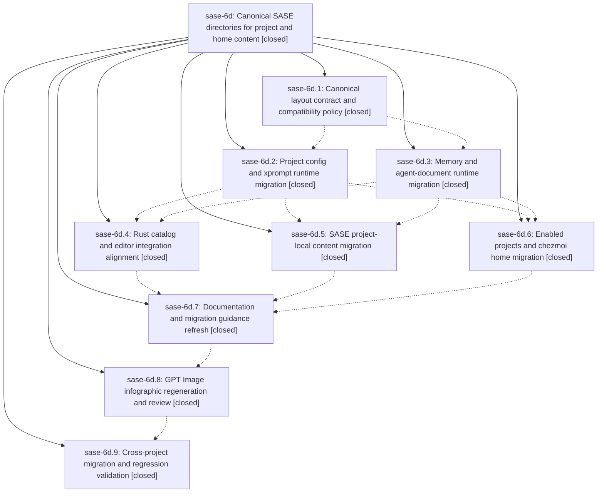

# Bead: sase-6d — Canonical SASE directories for project and home content

[Bead Pages](../README.md) / sase-6d

**Status:** ✓ closed · **Resolution:** (unrecorded) · **Type:** plan · **Tier:** epic
**Owner:** `bryanbugyi34@gmail.com`
**Created:** 2026-07-16 16:37:40 UTC · **Closed:** 2026-07-16 20:59:33 UTC
**Plan:** [202607/canonical\_sase\_directories.md](https://github.com/sase-org/sase--plans/blob/main/202607/canonical_sase_directories.md)

## Description

Project-local configuration, xprompts, and memory, plus home-managed xprompts and memory, live under one canonical sase/ tree without breaking unmigrated projects, and every enabled project, integration, document, and infographic reflects the new layout.

## Notes

COMMIT: 5bd5d2b

## Phases

| Bead | Title | Status | Size | Agents | Commits |
|---|---|---|---|---:|---:|
| [sase-6d.1](sase-6d.1.md) | Canonical layout contract and compatibility policy | ✓ closed | small | 1 | 2 |
| [sase-6d.2](sase-6d.2.md) | Project config and xprompt runtime migration | ✓ closed | small | 1 | 2 |
| [sase-6d.3](sase-6d.3.md) | Memory and agent-document runtime migration | ✓ closed | small | 1 | 1 |
| [sase-6d.4](sase-6d.4.md) | Rust catalog and editor integration alignment | ✓ closed | small | 1 | 1 |
| [sase-6d.5](sase-6d.5.md) | SASE project-local content migration | ✓ closed | small | 1 | 1 |
| [sase-6d.6](sase-6d.6.md) | Enabled projects and chezmoi home migration | ✓ closed | small | 1 | 1 |
| [sase-6d.7](sase-6d.7.md) | Documentation and migration guidance refresh | ✓ closed | small | 2 | 1 |
| [sase-6d.8](sase-6d.8.md) | GPT Image infographic regeneration and review | ✓ closed | small | 1 | 1 |
| [sase-6d.9](sase-6d.9.md) | Cross-project migration and regression validation | ✓ closed | small | 1 | 1 |

## Lineage

## Agents

| Agent | Bead | Commits |
|---|---|---:|
| [bbugyi200.athena.sase-6d](https://github.com/sase-org/sase--agents/blob/main/agents/bbugyi200.athena.sase-6d/README.md) | [sase-6d](README.md) | 3 |
| [bbugyi200.athena.sase-6d--code](https://github.com/sase-org/sase--agents/blob/main/families/bbugyi200.athena.sase-6d.md#member-code) | [sase-6d](README.md) | 0 |
| [bbugyi200.athena.sase-6d.1](https://github.com/sase-org/sase--agents/blob/main/agents/bbugyi200.athena.sase-6d.1/README.md) | [sase-6d.1](sase-6d.1.md) | 2 |
| [bbugyi200.athena.sase-6d.2](https://github.com/sase-org/sase--agents/blob/main/agents/bbugyi200.athena.sase-6d.2/README.md) | [sase-6d.2](sase-6d.2.md) | 2 |
| [bbugyi200.athena.sase-6d.3](https://github.com/sase-org/sase--agents/blob/main/agents/bbugyi200.athena.sase-6d.3/README.md) | [sase-6d.3](sase-6d.3.md) | 1 |
| [bbugyi200.athena.sase-6d.4](https://github.com/sase-org/sase--agents/blob/main/agents/bbugyi200.athena.sase-6d.4/README.md) | [sase-6d.4](sase-6d.4.md) | 1 |
| [bbugyi200.athena.sase-6d.5](https://github.com/sase-org/sase--agents/blob/main/agents/bbugyi200.athena.sase-6d.5/README.md) | [sase-6d.5](sase-6d.5.md) | 1 |
| [bbugyi200.athena.sase-6d.6](https://github.com/sase-org/sase--agents/blob/main/agents/bbugyi200.athena.sase-6d.6/README.md) | [sase-6d.6](sase-6d.6.md) | 1 |
| [bbugyi200.athena.sase-6d.7](https://github.com/sase-org/sase--agents/blob/main/agents/bbugyi200.athena.sase-6d.7/README.md) | [sase-6d.7](sase-6d.7.md) | 1 |
| [bbugyi200.athena.sase-6d.7--1](https://github.com/sase-org/sase--agents/blob/main/families/bbugyi200.athena.sase-6d.7.md#member-1) | [sase-6d.7](sase-6d.7.md) | 0 |
| [bbugyi200.athena.sase-6d.8](https://github.com/sase-org/sase--agents/blob/main/agents/bbugyi200.athena.sase-6d.8/README.md) | [sase-6d.8](sase-6d.8.md) | 1 |
| [bbugyi200.athena.sase-6d.9](https://github.com/sase-org/sase--agents/blob/main/agents/bbugyi200.athena.sase-6d.9/README.md) | [sase-6d.9](sase-6d.9.md) | 1 |

## Commits

| Commit | Subject | Bead | Committed (UTC) |
|---|---|---|---|
| [`sase-core@106a2f3`](https://github.com/sase-org/sase-core/commit/106a2f3f17178ddf52783f1c0ea2ba9f69fd0f08) | feat: define canonical SASE content layout contract (sase-6d.1) | [sase-6d.1](sase-6d.1.md) | 2026-07-16 17:04:55 |
| [`f4365f3`](https://github.com/sase-org/sase/commit/f4365f30968d627dd114a1e37ad8534ec5192b89) | feat: expose canonical SASE content layout (sase-6d.1) | [sase-6d.1](sase-6d.1.md) | 2026-07-16 17:05:52 |
| [`21dfb11`](https://github.com/sase-org/sase/commit/21dfb110a47f7e45cbff8199d58b3e9e32c3745a) | feat(memory): migrate runtime to canonical sase paths (sase-6d.3) | [sase-6d.3](sase-6d.3.md) | 2026-07-16 17:44:50 |
| [`01a1adb`](https://github.com/sase-org/sase/commit/01a1adbe73866475de7c068fa3637d2a0009e0c8) | feat: migrate project config and xprompt runtime paths (sase-6d.2) | [sase-6d.2](sase-6d.2.md) | 2026-07-16 17:47:19 |
| [`6dbd568`](https://github.com/sase-org/sase/commit/6dbd5688ef77df23640164328b26f794e304244e) | fix: reconcile memory init config path API (sase-6d.2) | [sase-6d.2](sase-6d.2.md) | 2026-07-16 17:51:09 |
| [`sase-core@287fc8a`](https://github.com/sase-org/sase-core/commit/287fc8a64d09fc67376210dd18c8e5dfcfb6dfba) | feat: align catalog with canonical SASE paths (sase-6d.4) | [sase-6d.4](sase-6d.4.md) | 2026-07-16 18:14:49 |
| [`5894a48`](https://github.com/sase-org/sase/commit/5894a487f32be50e247db0819b0f9429ecaf1731) | feat: migrate project content to canonical sase tree (sase-6d.5) | [sase-6d.5](sase-6d.5.md) | 2026-07-16 18:23:13 |
| [`8985b05`](https://github.com/sase-org/sase/commit/8985b05247d25a5994685c956868e28d12468271) | fix: isolate nested external repository identity (sase-6d.6) | [sase-6d.6](sase-6d.6.md) | 2026-07-16 18:23:46 |
| [`0bf8eb0`](https://github.com/sase-org/sase/commit/0bf8eb0d90f85f1ae98f9216766587c88ee6541a) | docs: document canonical SASE content layout (sase-6d.7) | [sase-6d.7](sase-6d.7.md) | 2026-07-16 19:12:46 |
| [`e4ed0cb`](https://github.com/sase-org/sase/commit/e4ed0cbc80fd14524a8b2895fed2c6547317f393) | chore: refresh SASE architecture diagrams (sase-6d.8) | [sase-6d.8](sase-6d.8.md) | 2026-07-16 19:50:46 |
| [`1a39e38`](https://github.com/sase-org/sase/commit/1a39e3872aa5e2aae02105453b7016d97d4c98f0) | docs: finish canonical SASE path cleanup (sase-6d.9) | [sase-6d.9](sase-6d.9.md) | 2026-07-16 20:33:07 |
| [`aa38ebf`](https://github.com/sase-org/sase/commit/aa38ebf34fc2be9484d5b06f2c79c05a4e062725) | refactor!: remove unused content layout entry points (sase-6d) | [sase-6d](README.md) | 2026-07-16 21:11:11 |
| [`50809bd`](https://github.com/sase-org/sase/commit/50809bdb85382fe20e9e502e2f14b15c37490728) | test: stabilize xprompt save visual snapshots (sase-6d) | [sase-6d](README.md) | 2026-07-16 21:11:46 |
| [`sase--plans@b087692`](https://github.com/sase-org/sase--plans/commit/b087692add39745c968ce8087cc4165425a54300) | docs: mark canonical directories plan done (sase-6d) | [sase-6d](README.md) | 2026-07-16 21:12:28 |
