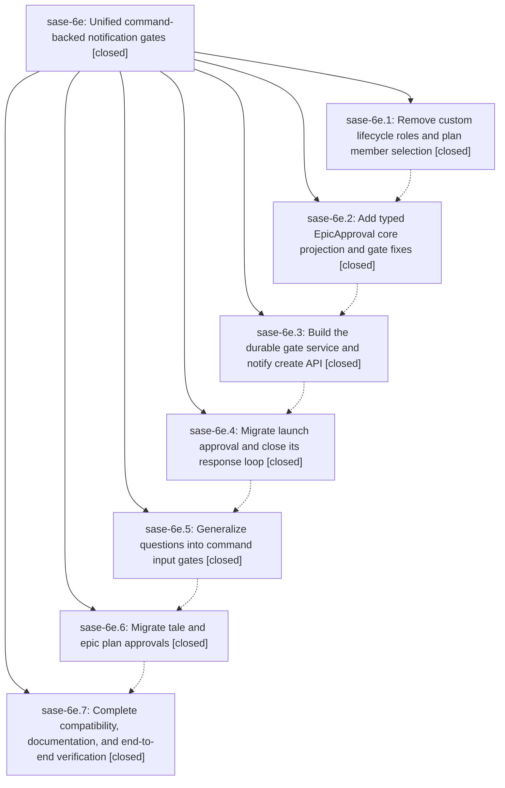

# Bead: sase-6e — Unified command-backed notification gates

[Bead Pages](../README.md) / sase-6e

**Status:** ✓ closed · **Resolution:** (unrecorded) · **Type:** plan · **Tier:** epic
**Owner:** `bryanbugyi34@gmail.com`
**Created:** 2026-07-16 19:05:20 UTC · **Closed:** 2026-07-17 00:12:23 UTC
**Plan:** [202607/unified\_notification\_gates.md](https://github.com/sase-org/sase--plans/blob/main/202607/unified_notification_gates.md)

## Description

Plan, epic-plan, question, and launch approvals use one durable, trusted request-envelope constructor behind sase notify create, with command-backed responses, shared waiting, typed transport projections, and no custom lifecycle-role subsystem.

## Notes

COMMIT: c70b065

## Phases

| Bead | Title | Status | Size | Agents | Commits |
|---|---|---|---|---:|---:|
| [sase-6e.1](sase-6e.1.md) | Remove custom lifecycle roles and plan member selection | ✓ closed | small | 1 | 1 |
| [sase-6e.2](sase-6e.2.md) | Add typed EpicApproval core projection and gate fixes | ✓ closed | small | 0 | 0 |
| [sase-6e.3](sase-6e.3.md) | Build the durable gate service and notify create API | ✓ closed | small | 1 | 1 |
| [sase-6e.4](sase-6e.4.md) | Migrate launch approval and close its response loop | ✓ closed | small | 1 | 1 |
| [sase-6e.5](sase-6e.5.md) | Generalize questions into command input gates | ✓ closed | small | 1 | 1 |
| [sase-6e.6](sase-6e.6.md) | Migrate tale and epic plan approvals | ✓ closed | small | 1 | 1 |
| [sase-6e.7](sase-6e.7.md) | Complete compatibility, documentation, and end-to-end verification | ✓ closed | small | 1 | 1 |

## Lineage

## Agents

| Agent | Bead | Commits |
|---|---|---:|
| [bbugyi200.athena.sase-6e](https://github.com/sase-org/sase--agents/blob/main/agents/bbugyi200.athena.sase-6e/README.md) | [sase-6e](README.md) | 1 |
| [bbugyi200.athena.sase-6e--code](https://github.com/sase-org/sase--agents/blob/main/families/bbugyi200.athena.sase-6e.md#member-code) | [sase-6e](README.md) | 0 |
| [bbugyi200.athena.sase-6e.1](https://github.com/sase-org/sase--agents/blob/main/agents/bbugyi200.athena.sase-6e.1/README.md) | [sase-6e.1](sase-6e.1.md) | 1 |
| [bbugyi200.athena.sase-6e.3](https://github.com/sase-org/sase--agents/blob/main/agents/bbugyi200.athena.sase-6e.3/README.md) | [sase-6e.3](sase-6e.3.md) | 1 |
| [bbugyi200.athena.sase-6e.4](https://github.com/sase-org/sase--agents/blob/main/agents/bbugyi200.athena.sase-6e.4/README.md) | [sase-6e.4](sase-6e.4.md) | 1 |
| [bbugyi200.athena.sase-6e.5](https://github.com/sase-org/sase--agents/blob/main/agents/bbugyi200.athena.sase-6e.5/README.md) | [sase-6e.5](sase-6e.5.md) | 1 |
| [bbugyi200.athena.sase-6e.6](https://github.com/sase-org/sase--agents/blob/main/agents/bbugyi200.athena.sase-6e.6/README.md) | [sase-6e.6](sase-6e.6.md) | 1 |
| [bbugyi200.athena.sase-6e.7](https://github.com/sase-org/sase--agents/blob/main/agents/bbugyi200.athena.sase-6e.7/README.md) | [sase-6e.7](sase-6e.7.md) | 1 |

## Commits

| Commit | Subject | Bead | Committed (UTC) |
|---|---|---|---|
| [`023aadf`](https://github.com/sase-org/sase/commit/023aadf1d11595e98c11387f7e0990e575f4ce57) | feat(agent-family)!: remove custom lifecycle roles (sase-6e.1) | [sase-6e.1](sase-6e.1.md) | 2026-07-16 19:57:40 |
| [`7294db9`](https://github.com/sase-org/sase/commit/7294db9bb5c60ab2935ee059e4af528026b7323d) | feat(notifications): add durable command-backed gates (sase-6e.3) | [sase-6e.3](sase-6e.3.md) | 2026-07-16 20:56:01 |
| [`5c8cd12`](https://github.com/sase-org/sase/commit/5c8cd1276b472ccd65cbcfadd3dcf7ff6d3eacbe) | feat(notifications): migrate launch approvals to durable gates (sase-6e.4) | [sase-6e.4](sase-6e.4.md) | 2026-07-16 21:30:54 |
| [`3b0c4ad`](https://github.com/sase-org/sase/commit/3b0c4adc6fb2a1ee139e5dc91825e86390111038) | feat: generalize user questions into command gates (sase-6e.5) | [sase-6e.5](sase-6e.5.md) | 2026-07-16 22:16:59 |
| [`763bf73`](https://github.com/sase-org/sase/commit/763bf73edceb0d0604058f48848fe7484107c650) | feat: migrate plan approvals to notification gates (sase-6e.6) | [sase-6e.6](sase-6e.6.md) | 2026-07-16 23:14:47 |
| [`5e234c0`](https://github.com/sase-org/sase/commit/5e234c07d7d3fc1b53e146cb2d4710be5df62fbc) | feat: complete notification gate compatibility rollout (sase-6e.7) | [sase-6e.7](sase-6e.7.md) | 2026-07-16 23:40:15 |
| [`a0dc62d`](https://github.com/sase-org/sase/commit/a0dc62d2fa5788eb06a5e60a7be14976c2f09eb5) | feat(notification-gates): finalize adapter-owned auto resolution (sase-6e) | [sase-6e](README.md) | 2026-07-17 00:25:16 |
