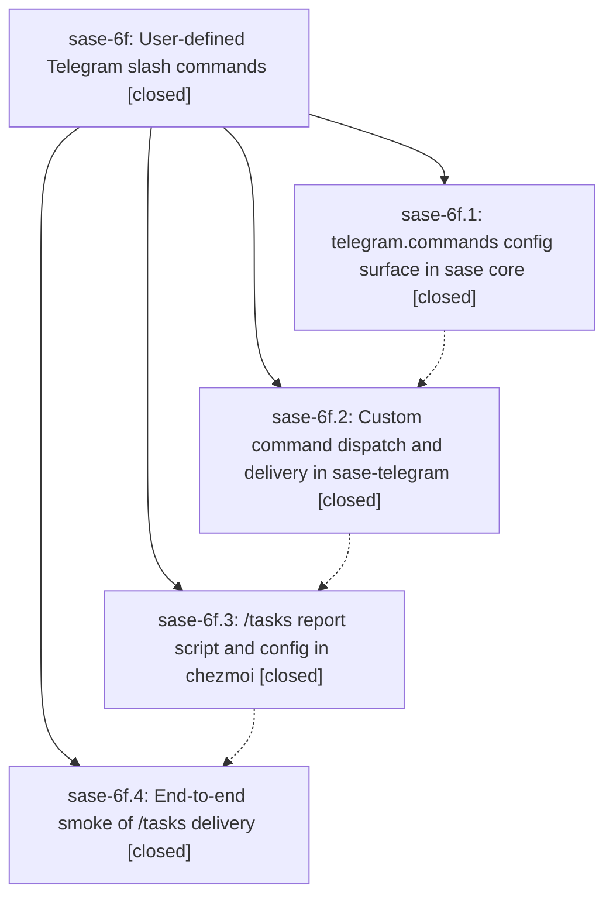

# Bead: sase-6f — User-defined Telegram slash commands

[Bead Pages](../README.md) / sase-6f

**Status:** ✓ closed · **Resolution:** (unrecorded) · **Type:** plan · **Tier:** epic
**Owner:** `bryanbugyi34@gmail.com`
**Created:** 2026-07-16 19:30:09 UTC · **Closed:** 2026-07-16 21:01:48 UTC
**Plan:** [202607/telegram\_custom\_commands.md](https://github.com/sase-org/sase--plans/blob/main/202607/telegram_custom_commands.md)

## Description

Custom Telegram slash commands can be declared in sase's config and executed by the sase-telegram inbound chop, and a new /tasks command sends a polished PDF of the ~/bob/dash.md task queries with a descriptive caption message.

## Phases

| Bead | Title | Status | Size | Agents | Commits |
|---|---|---|---|---:|---:|
| [sase-6f.1](sase-6f.1.md) | telegram.commands config surface in sase core | ✓ closed | small | 1 | 1 |
| [sase-6f.2](sase-6f.2.md) | Custom command dispatch and delivery in sase-telegram | ✓ closed | small | 0 | 0 |
| [sase-6f.3](sase-6f.3.md) | /tasks report script and config in chezmoi | ✓ closed | small | 0 | 0 |
| [sase-6f.4](sase-6f.4.md) | End-to-end smoke of /tasks delivery | ✓ closed | small | 0 | 0 |

## Lineage

## Agents

| Agent | Bead | Commits |
|---|---|---:|
| [bbugyi200.athena.sase-6f--code](https://github.com/sase-org/sase--agents/blob/main/families/bbugyi200.athena.sase-6f.md#member-code) | [sase-6f](README.md) | 0 |
| [bbugyi200.athena.sase-6f.1](https://github.com/sase-org/sase--agents/blob/main/agents/bbugyi200.athena.sase-6f.1/README.md) | [sase-6f.1](sase-6f.1.md) | 1 |

## Commits

| Commit | Subject | Bead | Committed (UTC) |
|---|---|---|---|
| [`0333dcf`](https://github.com/sase-org/sase/commit/0333dcf68aff95efb7f090b7e3d3cecb7f8092ea) | feat(config): add Telegram command configuration (sase-6f.1) | [sase-6f.1](sase-6f.1.md) | 2026-07-16 19:43:28 |
