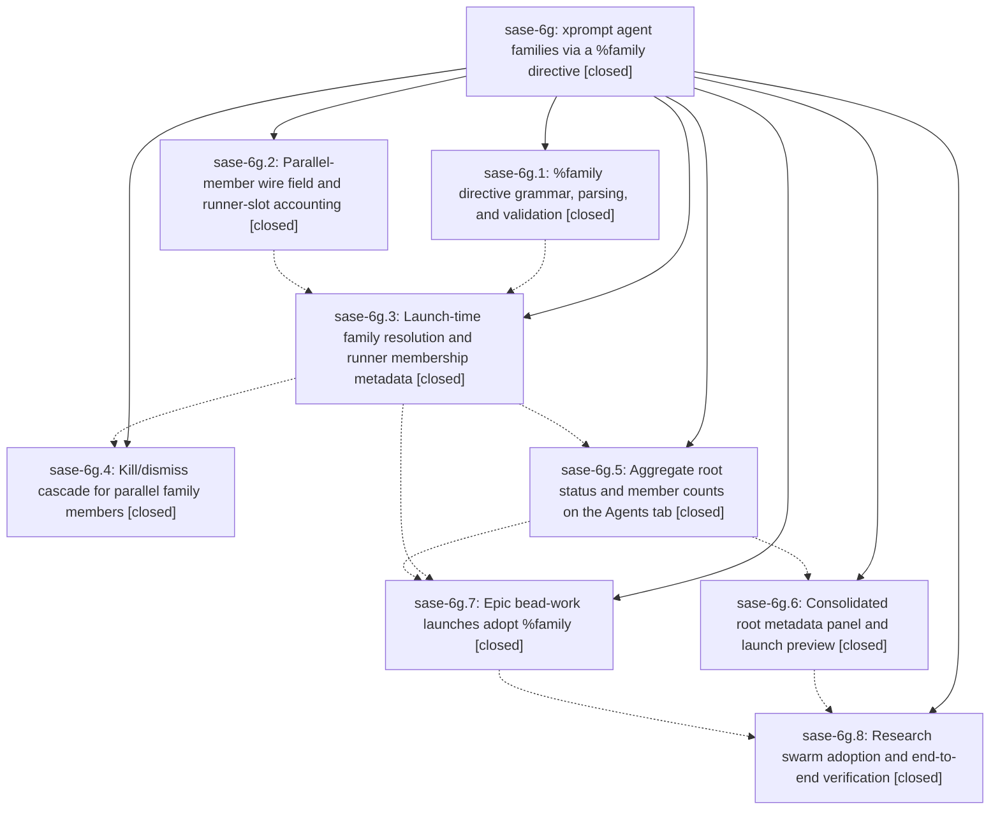

# Bead: sase-6g — xprompt agent families via a %family directive

[Bead Pages](../README.md) / sase-6g

**Status:** ✓ closed · **Resolution:** (unrecorded) · **Type:** plan · **Tier:** epic
**Owner:** `bryanbugyi34@gmail.com`
**Created:** 2026-07-16 22:56:27 UTC · **Closed:** 2026-07-17 01:26:29 UTC
**Plan:** [202607/xprompt\_agent\_families.md](https://github.com/sase-org/sase--plans/blob/main/202607/xprompt_agent_families.md)

## Description

Any launch can group parallel agents into one agent family purely through xprompt syntax: a new %family directive gives members execution-neutral family membership, members fold under a real root row whose status and metadata aggregate every member, and slot accounting, kill cascade, and wait/fork semantics are made safe for parallel members. Epic bead-work launches and the chezmoi research swarm both ship on the new directive.

## Notes

COMMIT: cf28c96

## Phases

| Bead | Title | Status | Size | Agents | Commits |
|---|---|---|---|---:|---:|
| [sase-6g.1](sase-6g.1.md) | %family directive grammar, parsing, and validation | ✓ closed | small | 1 | 1 |
| [sase-6g.2](sase-6g.2.md) | Parallel-member wire field and runner-slot accounting | ✓ closed | small | 1 | 2 |
| [sase-6g.3](sase-6g.3.md) | Launch-time family resolution and runner membership metadata | ✓ closed | small | 1 | 1 |
| [sase-6g.4](sase-6g.4.md) | Kill/dismiss cascade for parallel family members | ✓ closed | small | 1 | 2 |
| [sase-6g.5](sase-6g.5.md) | Aggregate root status and member counts on the Agents tab | ✓ closed | small | 1 | 1 |
| [sase-6g.6](sase-6g.6.md) | Consolidated root metadata panel and launch preview | ✓ closed | small | 1 | 1 |
| [sase-6g.7](sase-6g.7.md) | Epic bead-work launches adopt %family | ✓ closed | small | 1 | 1 |
| [sase-6g.8](sase-6g.8.md) | Research swarm adoption and end-to-end verification | ✓ closed | small | 0 | 0 |

## Lineage

## Agents

| Agent | Bead | Commits |
|---|---|---:|
| [bbugyi200.athena.sase-6g](https://github.com/sase-org/sase--agents/blob/main/agents/bbugyi200.athena.sase-6g/README.md) | [sase-6g](README.md) | 3 |
| [bbugyi200.athena.sase-6g--code](https://github.com/sase-org/sase--agents/blob/main/families/bbugyi200.athena.sase-6g.md#member-code) | [sase-6g](README.md) | 0 |
| [bbugyi200.athena.sase-6g.1](https://github.com/sase-org/sase--agents/blob/main/agents/bbugyi200.athena.sase-6g.1/README.md) | [sase-6g.1](sase-6g.1.md) | 1 |
| [bbugyi200.athena.sase-6g.2](https://github.com/sase-org/sase--agents/blob/main/agents/bbugyi200.athena.sase-6g.2/README.md) | [sase-6g.2](sase-6g.2.md) | 2 |
| [bbugyi200.athena.sase-6g.3](https://github.com/sase-org/sase--agents/blob/main/agents/bbugyi200.athena.sase-6g.3/README.md) | [sase-6g.3](sase-6g.3.md) | 1 |
| [bbugyi200.athena.sase-6g.4](https://github.com/sase-org/sase--agents/blob/main/agents/bbugyi200.athena.sase-6g.4/README.md) | [sase-6g.4](sase-6g.4.md) | 2 |
| [bbugyi200.athena.sase-6g.5](https://github.com/sase-org/sase--agents/blob/main/agents/bbugyi200.athena.sase-6g.5/README.md) | [sase-6g.5](sase-6g.5.md) | 1 |
| [bbugyi200.athena.sase-6g.6](https://github.com/sase-org/sase--agents/blob/main/agents/bbugyi200.athena.sase-6g.6/README.md) | [sase-6g.6](sase-6g.6.md) | 1 |
| [bbugyi200.athena.sase-6g.7](https://github.com/sase-org/sase--agents/blob/main/agents/bbugyi200.athena.sase-6g.7/README.md) | [sase-6g.7](sase-6g.7.md) | 1 |

## Commits

| Commit | Subject | Bead | Committed (UTC) |
|---|---|---|---|
| [`sase-core@c8ea7de`](https://github.com/sase-org/sase-core/commit/c8ea7deb006d38b0f586b4ce83af4384d036b7fe) | feat(agent-scan): expose parallel family membership (sase-6g.2) | [sase-6g.2](sase-6g.2.md) | 2026-07-16 23:16:32 |
| [`702ab60`](https://github.com/sase-org/sase/commit/702ab603aaad29970098aa81db003cccef85f54c) | feat(runner-slots): admit parallel family members (sase-6g.2) | [sase-6g.2](sase-6g.2.md) | 2026-07-16 23:17:36 |
| [`e24fd65`](https://github.com/sase-org/sase/commit/e24fd654f3f227999c3b0005ce06e5d0c2783c5c) | feat(xprompt): parse family directives (sase-6g.1) | [sase-6g.1](sase-6g.1.md) | 2026-07-16 23:19:34 |
| [`8c73c22`](https://github.com/sase-org/sase/commit/8c73c22c5cf1bada5df9f7c7c97ba1f61b7b8f41) | feat: resolve parallel agent families at launch (sase-6g.3) | [sase-6g.3](sase-6g.3.md) | 2026-07-16 23:45:31 |
| [`sase-core@a90acdc`](https://github.com/sase-org/sase-core/commit/a90acdc41e16c06a66fc2cdac9db21643c3f4cb0) | feat(cleanup): cascade parallel family members (sase-6g.4) | [sase-6g.4](sase-6g.4.md) | 2026-07-17 00:09:41 |
| [`c3040b9`](https://github.com/sase-org/sase/commit/c3040b945696965a2c3c35ab9ac3afcd0c6fcf23) | feat(agents): cascade cleanup across parallel families (sase-6g.4) | [sase-6g.4](sase-6g.4.md) | 2026-07-17 00:10:34 |
| [`a0a81e4`](https://github.com/sase-org/sase/commit/a0a81e445a5888e046b68b19603eed054fb01eab) | feat(tui): aggregate parallel agent family status (sase-6g.5) | [sase-6g.5](sase-6g.5.md) | 2026-07-17 00:11:51 |
| [`5601773`](https://github.com/sase-org/sase/commit/5601773404cd487fe81fe5ce4cd8d380c55a7a79) | feat(bead): group epic workers into agent families (sase-6g.7) | [sase-6g.7](sase-6g.7.md) | 2026-07-17 00:43:20 |
| [`d395776`](https://github.com/sase-org/sase/commit/d39577633017b3a19a2ade11453410a928ca8f11) | feat(tui): expose parallel agent family details (sase-6g.6) | [sase-6g.6](sase-6g.6.md) | 2026-07-17 00:43:48 |
| [`sase-core@af1042d`](https://github.com/sase-org/sase-core/commit/af1042df0cbd2ab740d0034916a060d1dc731455) | feat(editor): expose family directive completions (sase-6g) | [sase-6g](README.md) | 2026-07-17 01:30:50 |
| [`0c43854`](https://github.com/sase-org/sase/commit/0c438540c6f78fb9e3e36e67037f9ab1b9846b92) | test(xprompt): cover family launch neutrality (sase-6g) | [sase-6g](README.md) | 2026-07-17 01:31:49 |
| [`sase--plans@cf28c96`](https://github.com/sase-org/sase--plans/commit/cf28c96ef34af1907c2d2e78f5df8509a8b1d60d) | docs(plans): mark agent families epic done (sase-6g) | [sase-6g](README.md) | 2026-07-17 01:32:32 |
