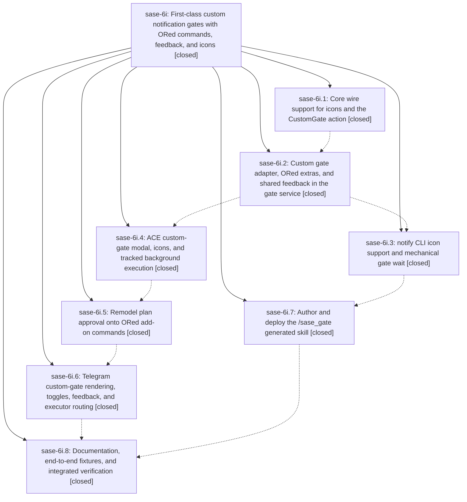

# Bead: sase-6i — First-class custom notification gates with ORed commands, feedback, and icons

[Bead Pages](../README.md) / sase-6i

**Status:** ✓ closed · **Resolution:** (unrecorded) · **Type:** plan · **Tier:** epic
**Owner:** `bryanbugyi34@gmail.com`
**Created:** 2026-07-17 03:08:49 UTC · **Closed:** 2026-07-17 06:56:58 UTC
**Plan:** [202607/custom\_notification\_gates.md](https://github.com/sase-org/sase--plans/blob/main/202607/custom_notification_gates.md)

## Description

Agents can mint beautiful, robust custom notification gates on the fly through a new /sase_gate skill. Every gate kind, including ones defined in the future, inherits graceful free-text user feedback, a per-notification icon, and an ORed command model in which the user picks one terminal choice and any subset of proposed add-on commands. Plan approval is remodeled onto that ORed model for its sidecar plan-file commit, all interactive-surface gate commands run as tracked background tasks visible in the ACE tasks tab, and Telegram renders and resolves custom gates completely.

## Notes

COMMIT: fc00fa0

## Phases

| Bead | Title | Status | Size | Agents | Commits |
|---|---|---|---|---:|---:|
| [sase-6i.1](sase-6i.1.md) | Core wire support for icons and the CustomGate action | ✓ closed | small | 0 | 0 |
| [sase-6i.2](sase-6i.2.md) | Custom gate adapter, ORed extras, and shared feedback in the gate service | ✓ closed | small | 1 | 1 |
| [sase-6i.3](sase-6i.3.md) | notify CLI icon support and mechanical gate wait | ✓ closed | small | 1 | 1 |
| [sase-6i.4](sase-6i.4.md) | ACE custom-gate modal, icons, and tracked background execution | ✓ closed | small | 0 | 0 |
| [sase-6i.5](sase-6i.5.md) | Remodel plan approval onto ORed add-on commands | ✓ closed | small | 1 | 1 |
| [sase-6i.6](sase-6i.6.md) | Telegram custom-gate rendering, toggles, feedback, and executor routing | ✓ closed | small | 0 | 0 |
| [sase-6i.7](sase-6i.7.md) | Author and deploy the /sase\_gate generated skill | ✓ closed | small | 1 | 1 |
| [sase-6i.8](sase-6i.8.md) | Documentation, end-to-end fixtures, and integrated verification | ✓ closed | small | 1 | 1 |

## Lineage

## Agents

| Agent | Bead | Commits |
|---|---|---:|
| [bbugyi200.athena.sase-6i.2](https://github.com/sase-org/sase--agents/blob/main/agents/bbugyi200.athena.sase-6i.2/README.md) | [sase-6i.2](sase-6i.2.md) | 1 |
| [bbugyi200.athena.sase-6i.3](https://github.com/sase-org/sase--agents/blob/main/agents/bbugyi200.athena.sase-6i.3/README.md) | [sase-6i.3](sase-6i.3.md) | 1 |
| [bbugyi200.athena.sase-6i.5](https://github.com/sase-org/sase--agents/blob/main/agents/bbugyi200.athena.sase-6i.5/README.md) | [sase-6i.5](sase-6i.5.md) | 1 |
| [bbugyi200.athena.sase-6i.7](https://github.com/sase-org/sase--agents/blob/main/agents/bbugyi200.athena.sase-6i.7/README.md) | [sase-6i.7](sase-6i.7.md) | 1 |
| [bbugyi200.athena.sase-6i.8](https://github.com/sase-org/sase--agents/blob/main/agents/bbugyi200.athena.sase-6i.8/README.md) | [sase-6i.8](sase-6i.8.md) | 1 |

## Commits

| Commit | Subject | Bead | Committed (UTC) |
|---|---|---|---|
| [`158e9a2`](https://github.com/sase-org/sase/commit/158e9a293c8e679728ef94f8989e895f6126f4a2) | feat(gates): add custom notification gate execution (sase-6i.2) | [sase-6i.2](sase-6i.2.md) | 2026-07-17 03:58:38 |
| [`c5d7e77`](https://github.com/sase-org/sase/commit/c5d7e771ed7abb1960515086150739116936ff5f) | feat(notify): add mechanical gate wait command (sase-6i.3) | [sase-6i.3](sase-6i.3.md) | 2026-07-17 04:22:55 |
| [`d468f87`](https://github.com/sase-org/sase/commit/d468f873849798025cfdb679228bc1041b17a837) | feat: add custom notification gate skill (sase-6i.7) | [sase-6i.7](sase-6i.7.md) | 2026-07-17 04:44:28 |
| [`9ab0c0c`](https://github.com/sase-org/sase/commit/9ab0c0c58eb589ac70b7e05f2f469614b4201395) | feat(ace): support composable notification gates (sase-6i.5) | [sase-6i.5](sase-6i.5.md) | 2026-07-17 05:31:44 |
| [`3bbcfda`](https://github.com/sase-org/sase/commit/3bbcfda69c507fea23339bcb1a5ea3ecce4f3d80) | docs: document custom notification gates (sase-6i.8) | [sase-6i.8](sase-6i.8.md) | 2026-07-17 06:27:50 |
