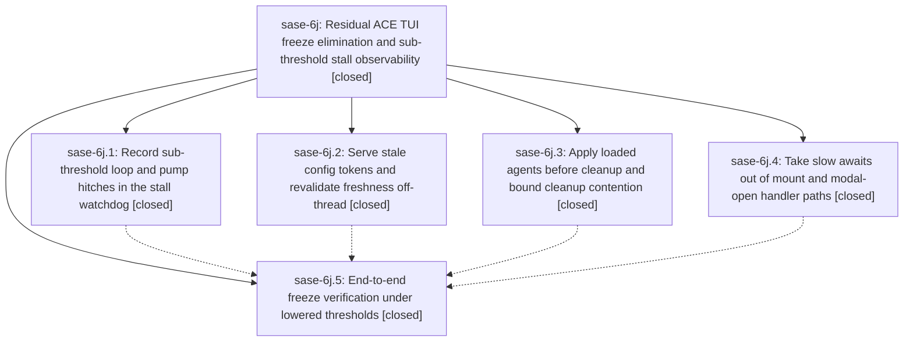

# Bead: sase-6j — Residual ACE TUI freeze elimination and sub-threshold stall observability

[Bead Pages](../README.md) / sase-6j

**Status:** ✓ closed · **Resolution:** (unrecorded) · **Type:** plan · **Tier:** epic
**Owner:** `bryanbugyi34@gmail.com`
**Created:** 2026-07-17 11:49:20 UTC · **Closed:** 2026-07-17 13:46:03 UTC
**Plan:** [202607/tui\_residual\_freeze\_elimination.md](https://github.com/sase-org/sase--plans/blob/main/202607/tui_residual_freeze_elimination.md)

## Description

The ACE TUI never blocks from the user's perspective: the remaining UI-thread I/O hazard (config-token freshness scans) is moved off latency paths, agent-list refreshes can no longer wedge behind artifact-index / SQLite contention, and the stall watchdog records sub-threshold hitches so any future perceived freeze leaves an attributable forensic record instead of vanishing below the 5-second floor.

## Notes

COMMIT: cf1aead

## Phases

| Bead | Title | Status | Size | Agents | Commits |
|---|---|---|---|---:|---:|
| [sase-6j.1](sase-6j.1.md) | Record sub-threshold loop and pump hitches in the stall watchdog | ✓ closed | small | 1 | 1 |
| [sase-6j.2](sase-6j.2.md) | Serve stale config tokens and revalidate freshness off-thread | ✓ closed | small | 1 | 1 |
| [sase-6j.3](sase-6j.3.md) | Apply loaded agents before cleanup and bound cleanup contention | ✓ closed | small | 1 | 1 |
| [sase-6j.4](sase-6j.4.md) | Take slow awaits out of mount and modal-open handler paths | ✓ closed | small | 1 | 1 |
| [sase-6j.5](sase-6j.5.md) | End-to-end freeze verification under lowered thresholds | ✓ closed | small | 1 | 1 |

## Lineage

## Agents

| Agent | Bead | Commits |
|---|---|---:|
| [bbugyi200.athena.sase-6j](https://github.com/sase-org/sase--agents/blob/main/agents/bbugyi200.athena.sase-6j/README.md) | [sase-6j](README.md) | 1 |
| [bbugyi200.athena.sase-6j--code](https://github.com/sase-org/sase--agents/blob/main/families/bbugyi200.athena.sase-6j.md#member-code) | [sase-6j](README.md) | 0 |
| [bbugyi200.athena.sase-6j.1](https://github.com/sase-org/sase--agents/blob/main/agents/bbugyi200.athena.sase-6j.1/README.md) | [sase-6j.1](sase-6j.1.md) | 1 |
| [bbugyi200.athena.sase-6j.2](https://github.com/sase-org/sase--agents/blob/main/agents/bbugyi200.athena.sase-6j.2/README.md) | [sase-6j.2](sase-6j.2.md) | 1 |
| [bbugyi200.athena.sase-6j.3](https://github.com/sase-org/sase--agents/blob/main/agents/bbugyi200.athena.sase-6j.3/README.md) | [sase-6j.3](sase-6j.3.md) | 1 |
| [bbugyi200.athena.sase-6j.4](https://github.com/sase-org/sase--agents/blob/main/agents/bbugyi200.athena.sase-6j.4/README.md) | [sase-6j.4](sase-6j.4.md) | 1 |
| [bbugyi200.athena.sase-6j.5](https://github.com/sase-org/sase--agents/blob/main/agents/bbugyi200.athena.sase-6j.5/README.md) | [sase-6j.5](sase-6j.5.md) | 1 |

## Commits

| Commit | Subject | Bead | Committed (UTC) |
|---|---|---|---|
| [`fbf6213`](https://github.com/sase-org/sase/commit/fbf62139df84a7fd6f66612c549d196aaf2157eb) | perf(config): refresh config tokens off-thread (sase-6j.2) | [sase-6j.2](sase-6j.2.md) | 2026-07-17 12:14:20 |
| [`e73d140`](https://github.com/sase-org/sase/commit/e73d1400c4097432461316e3a2fca827ab9c8f75) | feat(tui): record sub-threshold watchdog hitches (sase-6j.1) | [sase-6j.1](sase-6j.1.md) | 2026-07-17 12:24:29 |
| [`af95760`](https://github.com/sase-org/sase/commit/af95760dfa3c3ee31ed8e1202b7a4c3eb35daeff) | fix(ace): keep startup and modal handlers responsive (sase-6j.4) | [sase-6j.4](sase-6j.4.md) | 2026-07-17 12:39:44 |
| [`6ade59e`](https://github.com/sase-org/sase/commit/6ade59edcd93d25cc6fbb438dba51d36508bcb06) | fix(ace): keep agent refresh responsive during cleanup (sase-6j.3) | [sase-6j.3](sase-6j.3.md) | 2026-07-17 12:41:23 |
| [`e5eef71`](https://github.com/sase-org/sase/commit/e5eef716c705c6745d69bef8e6b2a4dcaa412056) | fix(tui): complete residual freeze verification (sase-6j.5) | [sase-6j.5](sase-6j.5.md) | 2026-07-17 13:08:21 |
| [`be5967a`](https://github.com/sase-org/sase/commit/be5967a70a49b63bef291b03b8ea2927c76dc265) | test(tui): stabilize residual freeze soak (sase-6j.5) (sase-6j) | [sase-6j](README.md) | 2026-07-17 13:46:57 |
