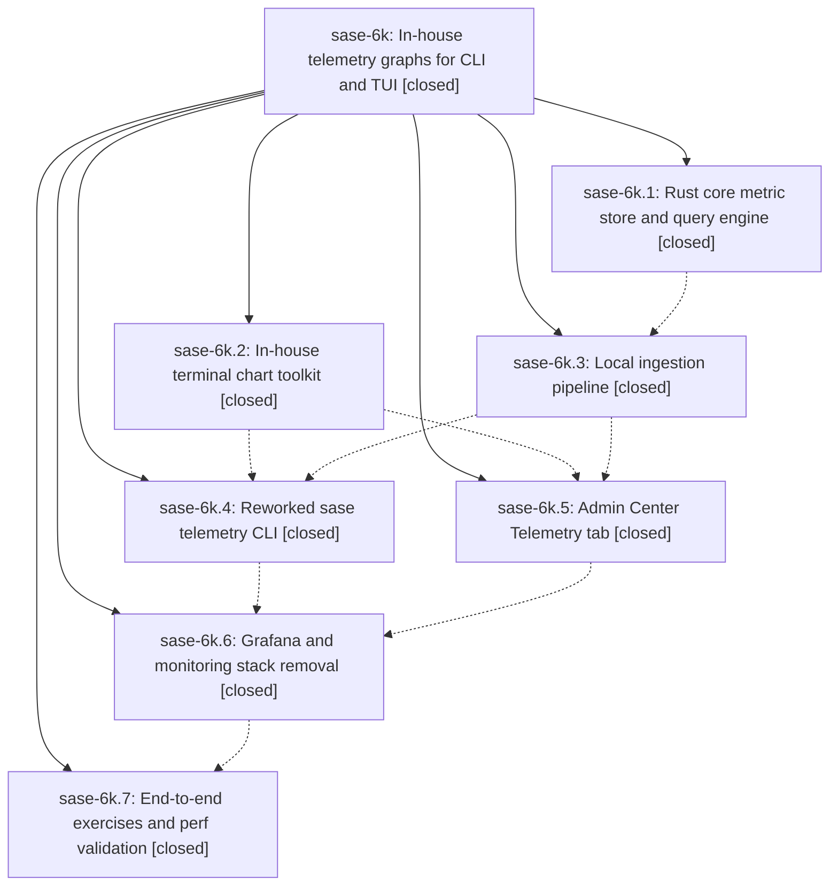

# Bead: sase-6k — In-house telemetry graphs for CLI and TUI

[Bead Pages](../README.md) / sase-6k

**Status:** ✓ closed · **Resolution:** (unrecorded) · **Type:** plan · **Tier:** epic
**Owner:** `bryanbugyi34@gmail.com`
**Created:** 2026-07-17 15:25:32 UTC · **Closed:** 2026-07-18 10:55:31 UTC
**Plan:** [202607/telemetry\_inhouse\_graphs.md](https://github.com/sase-org/sase--plans/blob/main/202607/telemetry_inhouse_graphs.md)

## Description

SASE telemetry graphs work out of the box with no external services: metric history is persisted locally through a new Rust core store, rendered by an in-house terminal chart toolkit in both the reworked `sase telemetry` CLI and a new Admin Center Telemetry tab, and all Grafana/Prometheus/Pushgateway support is removed.

## Phases

| Bead | Title | Status | Size | Agents | Commits |
|---|---|---|---|---:|---:|
| [sase-6k.1](sase-6k.1.md) | Rust core metric store and query engine | ✓ closed | small | 0 | 0 |
| [sase-6k.2](sase-6k.2.md) | In-house terminal chart toolkit | ✓ closed | small | 1 | 1 |
| [sase-6k.3](sase-6k.3.md) | Local ingestion pipeline | ✓ closed | small | 1 | 1 |
| [sase-6k.4](sase-6k.4.md) | Reworked sase telemetry CLI | ✓ closed | small | 1 | 1 |
| [sase-6k.5](sase-6k.5.md) | Admin Center Telemetry tab | ✓ closed | small | 1 | 1 |
| [sase-6k.6](sase-6k.6.md) | Grafana and monitoring stack removal | ✓ closed | small | 1 | 1 |
| [sase-6k.7](sase-6k.7.md) | End-to-end exercises and perf validation | ✓ closed | small | 1 | 1 |

## Lineage

## Agents

| Agent | Bead | Commits |
|---|---|---:|
| [bbugyi200.athena.sase-6k--code](https://github.com/sase-org/sase--agents/blob/main/families/bbugyi200.athena.sase-6k.md#member-code) | [sase-6k](README.md) | 0 |
| [bbugyi200.athena.sase-6k.2](https://github.com/sase-org/sase--agents/blob/main/agents/bbugyi200.athena.sase-6k.2/README.md) | [sase-6k.2](sase-6k.2.md) | 1 |
| [bbugyi200.athena.sase-6k.3](https://github.com/sase-org/sase--agents/blob/main/agents/bbugyi200.athena.sase-6k.3/README.md) | [sase-6k.3](sase-6k.3.md) | 1 |
| [bbugyi200.athena.sase-6k.4](https://github.com/sase-org/sase--agents/blob/main/agents/bbugyi200.athena.sase-6k.4/README.md) | [sase-6k.4](sase-6k.4.md) | 1 |
| [bbugyi200.athena.sase-6k.5](https://github.com/sase-org/sase--agents/blob/main/agents/bbugyi200.athena.sase-6k.5/README.md) | [sase-6k.5](sase-6k.5.md) | 1 |
| [bbugyi200.athena.sase-6k.6](https://github.com/sase-org/sase--agents/blob/main/agents/bbugyi200.athena.sase-6k.6/README.md) | [sase-6k.6](sase-6k.6.md) | 1 |
| [bbugyi200.athena.sase-6k.7](https://github.com/sase-org/sase--agents/blob/main/agents/bbugyi200.athena.sase-6k.7/README.md) | [sase-6k.7](sase-6k.7.md) | 1 |

## Commits

| Commit | Subject | Bead | Committed (UTC) |
|---|---|---|---|
| [`171bf04`](https://github.com/sase-org/sase/commit/171bf04e2d59a26972a9b2ec448d9e5d7d433ea6) | feat(telemetry): add deterministic terminal chart toolkit (sase-6k.2) | [sase-6k.2](sase-6k.2.md) | 2026-07-17 16:12:48 |
| [`7ccc468`](https://github.com/sase-org/sase/commit/7ccc4688c393478423072db4d7d045ed0f869b19) | feat(telemetry)!: replace Prometheus ingestion with local storage (sase-6k.3) | [sase-6k.3](sase-6k.3.md) | 2026-07-17 16:53:13 |
| [`04f7be6`](https://github.com/sase-org/sase/commit/04f7be663fd601b5289514bcf9dcc1f2f9986ac3) | feat(telemetry)!: query the local store from the CLI (sase-6k.4) | [sase-6k.4](sase-6k.4.md) | 2026-07-17 17:47:08 |
| [`79f0a1b`](https://github.com/sase-org/sase/commit/79f0a1b4730c5d2b0d5ce04748abbfe9f63c4d8a) | feat(tui): add Admin Center telemetry dashboard (sase-6k.5) | [sase-6k.5](sase-6k.5.md) | 2026-07-17 18:08:30 |
| [`55df5a7`](https://github.com/sase-org/sase/commit/55df5a75baa7004e4c04902b4256b3e08d4c4f2e) | feat(telemetry)!: remove bundled monitoring stack (sase-6k.6) | [sase-6k.6](sase-6k.6.md) | 2026-07-17 18:55:05 |
| [`87d7a88`](https://github.com/sase-org/sase/commit/87d7a88e8f80c4b2b46e4effb70f845916769500) | test: cover telemetry auto-refresh responsiveness (sase-6k.7) | [sase-6k.7](sase-6k.7.md) | 2026-07-17 19:23:19 |
