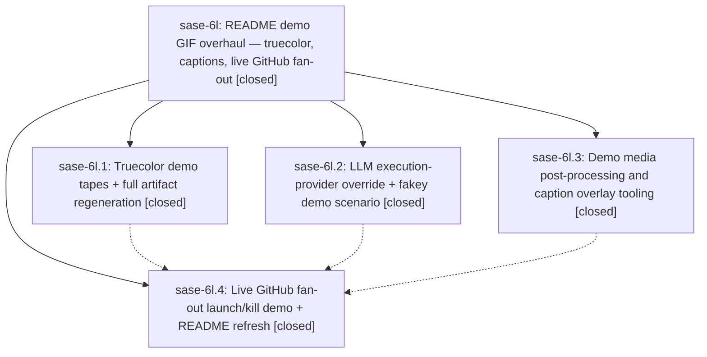

# Bead: sase-6l — README demo GIF overhaul — truecolor, captions, live GitHub fan-out

[Bead Pages](../README.md) / sase-6l

**Status:** ✓ closed · **Resolution:** (unrecorded) · **Type:** plan · **Tier:** epic
**Owner:** `bryanbugyi34@gmail.com`
**Created:** 2026-07-17 15:29:23 UTC · **Closed:** 2026-07-17 19:17:39 UTC
**Plan:** [202607/readme\_demo\_gif\_overhaul.md](https://github.com/sase-org/sase--plans/blob/main/202607/readme_demo_gif_overhaul.md)

## Description

The README's flagship demo GIF shows a truecolor ACE session in which one alternation-shorthand prompt on the GitHub VCS workflow fans out to three models, actually launches three hermetic agents, and kills them live — with explanatory text overlays produced by new, reusable demo-captioning tooling that all five demo tapes can adopt.

## Notes

COMMIT: de65e66

## Phases

| Bead | Title | Status | Size | Agents | Commits |
|---|---|---|---|---:|---:|
| [sase-6l.1](sase-6l.1.md) | Truecolor demo tapes + full artifact regeneration | ✓ closed | small | 1 | 1 |
| [sase-6l.2](sase-6l.2.md) | LLM execution-provider override + fakey demo scenario | ✓ closed | small | 1 | 1 |
| [sase-6l.3](sase-6l.3.md) | Demo media post-processing and caption overlay tooling | ✓ closed | small | 1 | 1 |
| [sase-6l.4](sase-6l.4.md) | Live GitHub fan-out launch/kill demo + README refresh | ✓ closed | small | 1 | 1 |

## Lineage

## Agents

| Agent | Bead | Commits |
|---|---|---:|
| [bbugyi200.athena.sase-6l.1](https://github.com/sase-org/sase--agents/blob/main/agents/bbugyi200.athena.sase-6l.1/README.md) | [sase-6l.1](sase-6l.1.md) | 1 |
| [bbugyi200.athena.sase-6l.2](https://github.com/sase-org/sase--agents/blob/main/agents/bbugyi200.athena.sase-6l.2/README.md) | [sase-6l.2](sase-6l.2.md) | 1 |
| [bbugyi200.athena.sase-6l.3](https://github.com/sase-org/sase--agents/blob/main/agents/bbugyi200.athena.sase-6l.3/README.md) | [sase-6l.3](sase-6l.3.md) | 1 |
| [bbugyi200.athena.sase-6l.4](https://github.com/sase-org/sase--agents/blob/main/agents/bbugyi200.athena.sase-6l.4/README.md) | [sase-6l.4](sase-6l.4.md) | 1 |

## Commits

| Commit | Subject | Bead | Committed (UTC) |
|---|---|---|---|
| [`a26d4d2`](https://github.com/sase-org/sase/commit/a26d4d24453e6bab373852a93efcbf083f85790d) | feat(demos): add captioned media post-processing (sase-6l.3) | [sase-6l.3](sase-6l.3.md) | 2026-07-17 15:55:13 |
| [`f8a8922`](https://github.com/sase-org/sase/commit/f8a892234fa7192492c9c7b3bf1247f49950ed3f) | feat(llm): support execution provider overrides (sase-6l.2) | [sase-6l.2](sase-6l.2.md) | 2026-07-17 16:21:15 |
| [`7a65aeb`](https://github.com/sase-org/sase/commit/7a65aeb8cc171d83a92766fb8185752f455901e8) | fix(demos): preserve truecolor in generated media (sase-6l.1) | [sase-6l.1](sase-6l.1.md) | 2026-07-17 17:36:58 |
| [`ed23598`](https://github.com/sase-org/sase/commit/ed235980f058eabe99970b62777a4aec887e3c55) | feat(demos): showcase live multi-model fan-out (sase-6l.4) | [sase-6l.4](sase-6l.4.md) | 2026-07-17 19:04:35 |
