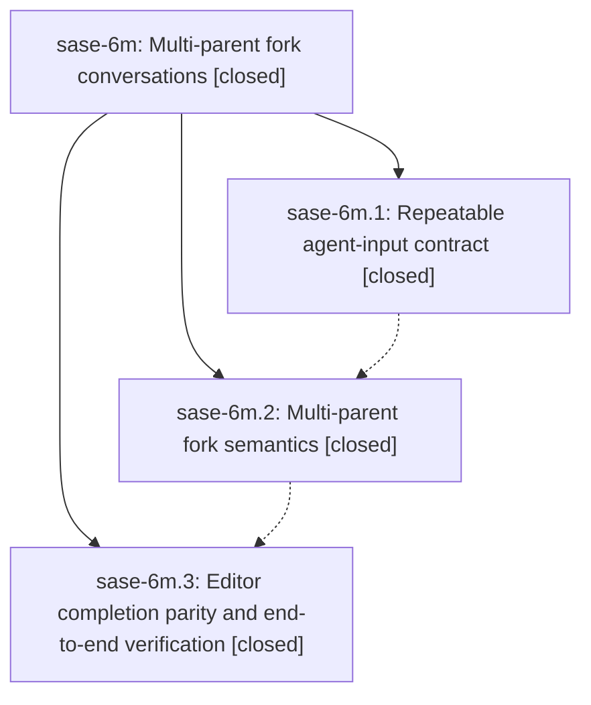

# Bead: sase-6m — Multi-parent fork conversations

[Bead Pages](../README.md) / sase-6m

**Status:** ✓ closed · **Resolution:** (unrecorded) · **Type:** plan · **Tier:** epic
**Owner:** `bryanbugyi34@gmail.com`
**Created:** 2026-07-17 19:09:34 UTC · **Closed:** 2026-07-17 21:07:10 UTC
**Plan:** [202607/multi\_parent\_fork.md](https://github.com/sase-org/sase--plans/blob/main/202607/multi_parent_fork.md)

## Description

The fork xprompt accepts an ordered set of agent parents, preserves every parent conversation with clear provenance, waits for all parents, uses neutral auto-naming for merged children, and offers consistent completion and diagnostics in ACE and the xprompt LSP.

## Notes

COMMIT: 463fed9

## Phases

| Bead | Title | Status | Size | Agents | Commits |
|---|---|---|---|---:|---:|
| [sase-6m.1](sase-6m.1.md) | Repeatable agent-input contract | ✓ closed | small | 1 | 1 |
| [sase-6m.2](sase-6m.2.md) | Multi-parent fork semantics | ✓ closed | small | 1 | 1 |
| [sase-6m.3](sase-6m.3.md) | Editor completion parity and end-to-end verification | ✓ closed | small | 1 | 1 |

## Lineage

## Agents

| Agent | Bead | Commits |
|---|---|---:|
| [bbugyi200.athena.sase-6m.1](https://github.com/sase-org/sase--agents/blob/main/agents/bbugyi200.athena.sase-6m.1/README.md) | [sase-6m.1](sase-6m.1.md) | 1 |
| [bbugyi200.athena.sase-6m.2](https://github.com/sase-org/sase--agents/blob/main/agents/bbugyi200.athena.sase-6m.2/README.md) | [sase-6m.2](sase-6m.2.md) | 1 |
| [bbugyi200.athena.sase-6m.3](https://github.com/sase-org/sase--agents/blob/main/agents/bbugyi200.athena.sase-6m.3/README.md) | [sase-6m.3](sase-6m.3.md) | 1 |

## Commits

| Commit | Subject | Bead | Committed (UTC) |
|---|---|---|---|
| [`762736f`](https://github.com/sase-org/sase/commit/762736fd680d566c4961dcd838c621d0e3c272cc) | feat(xprompt)!: support repeatable input binding (sase-6m.1) | [sase-6m.1](sase-6m.1.md) | 2026-07-17 19:55:33 |
| [`900c75f`](https://github.com/sase-org/sase/commit/900c75f5b1ef2e28d42b4bd593708b5228d3cf41) | feat: support multi-parent fork conversations (sase-6m.2) | [sase-6m.2](sase-6m.2.md) | 2026-07-17 20:18:21 |
| [`0de3c14`](https://github.com/sase-org/sase/commit/0de3c14e23925147089050adcfd9940e95054a2a) | feat(editor): complete repeatable agent arguments (sase-6m.3) | [sase-6m.3](sase-6m.3.md) | 2026-07-17 20:53:33 |
