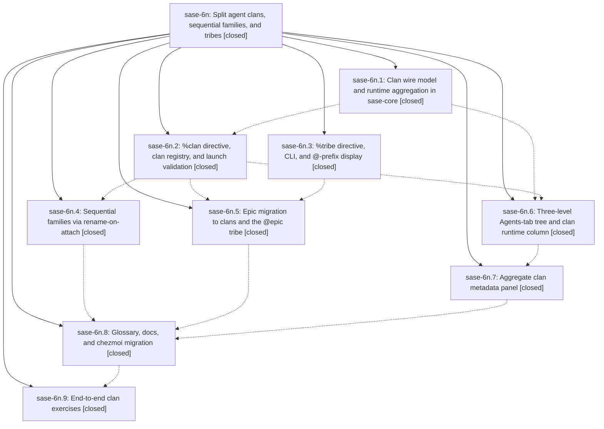

# Bead: sase-6n — Split agent clans, sequential families, and tribes

[Bead Pages](../README.md) / sase-6n

**Status:** ✓ closed · **Resolution:** (unrecorded) · **Type:** plan · **Tier:** epic
**Owner:** `bryanbugyi34@gmail.com`
**Created:** 2026-07-17 21:34:42 UTC · **Closed:** 2026-07-18 13:42:01 UTC
**Plan:** [202607/agent\_clans\_families\_tribes.md](https://github.com/sase-org/sase--plans/blob/main/202607/agent_clans_families_tribes.md)

## Description

Parallel agent groups become named "clans" (never agents themselves, with reserved names, hood-scoped members, correct wall-clock runtimes, and a three-level Agents-tab tree), sequential plan-chain groups remain "families" (created by rename-on-attach, never single-member), and groups/tags become "tribes" (%tribe, @-prefixed). Epics and the research_swarm xprompt migrate to the new model.

## Phases

| Bead | Title | Status | Size | Agents | Commits |
|---|---|---|---|---:|---:|
| [sase-6n.1](sase-6n.1.md) | Clan wire model and runtime aggregation in sase-core | ✓ closed | small | 1 | 2 |
| [sase-6n.2](sase-6n.2.md) | %clan directive, clan registry, and launch validation | ✓ closed | small | 1 | 1 |
| [sase-6n.3](sase-6n.3.md) | %tribe directive, CLI, and @-prefix display | ✓ closed | small | 1 | 1 |
| [sase-6n.4](sase-6n.4.md) | Sequential families via rename-on-attach | ✓ closed | small | 1 | 1 |
| [sase-6n.5](sase-6n.5.md) | Epic migration to clans and the @epic tribe | ✓ closed | small | 1 | 2 |
| [sase-6n.6](sase-6n.6.md) | Three-level Agents-tab tree and clan runtime column | ✓ closed | small | 1 | 1 |
| [sase-6n.7](sase-6n.7.md) | Aggregate clan metadata panel | ✓ closed | small | 1 | 1 |
| [sase-6n.8](sase-6n.8.md) | Glossary, docs, and chezmoi migration | ✓ closed | small | 1 | 1 |
| [sase-6n.9](sase-6n.9.md) | End-to-end clan exercises | ✓ closed | small | 1 | 1 |

## Lineage

## Agents

| Agent | Bead | Commits |
|---|---|---:|
| [bbugyi200.athena.sase-6n.1](https://github.com/sase-org/sase--agents/blob/main/agents/bbugyi200.athena.sase-6n.1/README.md) | [sase-6n.1](sase-6n.1.md) | 2 |
| [bbugyi200.athena.sase-6n.2](https://github.com/sase-org/sase--agents/blob/main/agents/bbugyi200.athena.sase-6n.2/README.md) | [sase-6n.2](sase-6n.2.md) | 1 |
| [bbugyi200.athena.sase-6n.3](https://github.com/sase-org/sase--agents/blob/main/agents/bbugyi200.athena.sase-6n.3/README.md) | [sase-6n.3](sase-6n.3.md) | 1 |
| [bbugyi200.athena.sase-6n.4](https://github.com/sase-org/sase--agents/blob/main/agents/bbugyi200.athena.sase-6n.4/README.md) | [sase-6n.4](sase-6n.4.md) | 1 |
| [bbugyi200.athena.sase-6n.5](https://github.com/sase-org/sase--agents/blob/main/agents/bbugyi200.athena.sase-6n.5/README.md) | [sase-6n.5](sase-6n.5.md) | 2 |
| [bbugyi200.athena.sase-6n.6](https://github.com/sase-org/sase--agents/blob/main/agents/bbugyi200.athena.sase-6n.6/README.md) | [sase-6n.6](sase-6n.6.md) | 1 |
| [bbugyi200.athena.sase-6n.7](https://github.com/sase-org/sase--agents/blob/main/agents/bbugyi200.athena.sase-6n.7/README.md) | [sase-6n.7](sase-6n.7.md) | 1 |
| [bbugyi200.athena.sase-6n.8](https://github.com/sase-org/sase--agents/blob/main/agents/bbugyi200.athena.sase-6n.8/README.md) | [sase-6n.8](sase-6n.8.md) | 1 |
| [bbugyi200.athena.sase-6n.9](https://github.com/sase-org/sase--agents/blob/main/agents/bbugyi200.athena.sase-6n.9/README.md) | [sase-6n.9](sase-6n.9.md) | 1 |

## Commits

| Commit | Subject | Bead | Committed (UTC) |
|---|---|---|---|
| [`sase-core@b317a43`](https://github.com/sase-org/sase-core/commit/b317a431d6c4e24bb76917a4b51aec5a7501ef74) | feat(runtime): aggregate clan wall-clock runtime (sase-6n.1) | [sase-6n.1](sase-6n.1.md) | 2026-07-17 22:01:35 |
| [`35c44d8`](https://github.com/sase-org/sase/commit/35c44d8221717b7c70c9e1552402f2d51901f33c) | feat(runtime): expose clan wall-clock aggregation (sase-6n.1) | [sase-6n.1](sase-6n.1.md) | 2026-07-17 22:02:23 |
| [`01661d3`](https://github.com/sase-org/sase/commit/01661d3c9b965e3fb86afd4000b2c43122f2e42f) | feat(agent)!: replace group terminology with tribes (sase-6n.3) | [sase-6n.3](sase-6n.3.md) | 2026-07-17 22:06:06 |
| [`f3bc42c`](https://github.com/sase-org/sase/commit/f3bc42caaee2d60fdfa1fee6e49d9c8ed7631fc5) | feat(xprompt)!: replace parallel family launches with clans (sase-6n.2) | [sase-6n.2](sase-6n.2.md) | 2026-07-17 22:42:43 |
| [`sase-core@e9edd17`](https://github.com/sase-org/sase-core/commit/e9edd179ad62e32f9dc84076d792b1e23533f80b) | feat(bead)!: suffix epic land agent names (sase-6n.5) | [sase-6n.5](sase-6n.5.md) | 2026-07-17 23:17:54 |
| [`d1e772f`](https://github.com/sase-org/sase/commit/d1e772f646e2d421ba087569b330252d9edfabb5) | feat(bead)!: migrate epic launches to clans (sase-6n.5) | [sase-6n.5](sase-6n.5.md) | 2026-07-17 23:19:35 |
| [`21d995c`](https://github.com/sase-org/sase/commit/21d995ce59c5b684e06ee947288e95dd07bec0b8) | feat(ace): add clan hierarchy to agents tab (sase-6n.6) | [sase-6n.6](sase-6n.6.md) | 2026-07-17 23:41:18 |
| [`01da419`](https://github.com/sase-org/sase/commit/01da41927a323008f378f2a377d76405a4731135) | feat(agent)!: persist sequential family promotion (sase-6n.4) | [sase-6n.4](sase-6n.4.md) | 2026-07-17 23:44:01 |
| [`8119612`](https://github.com/sase-org/sase/commit/8119612f48bf8fe0b68075993db2e8bdce75d3d5) | feat(tui): add aggregate clan detail panel (sase-6n.7) | [sase-6n.7](sase-6n.7.md) | 2026-07-18 00:08:57 |
| [`325efd1`](https://github.com/sase-org/sase/commit/325efd1529b9f55f91f21c121a99f603d5e3c157) | docs: document agent clans, families, and tribes (sase-6n.8) | [sase-6n.8](sase-6n.8.md) | 2026-07-18 00:44:21 |
| [`c98fd78`](https://github.com/sase-org/sase/commit/c98fd786744734fe7aee6ffeff247c250b5c0e56) | perf(ace): defer runtime ticks during navigation (sase-6n.9) | [sase-6n.9](sase-6n.9.md) | 2026-07-18 02:04:48 |
