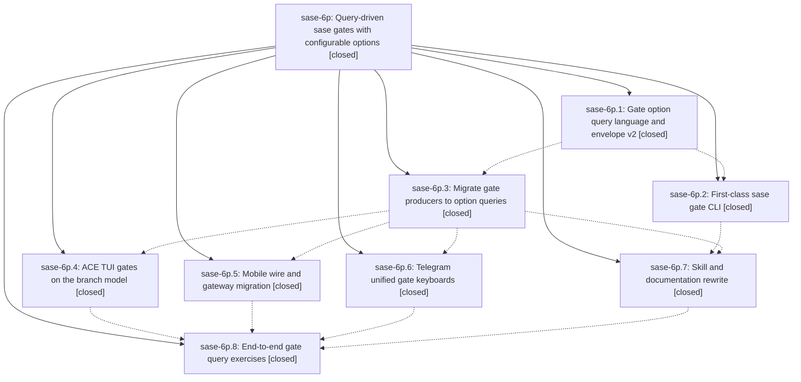

# Bead: sase-6p — Query-driven sase gates with configurable options

[Bead Pages](../README.md) / sase-6p

**Status:** ✓ closed · **Resolution:** (unrecorded) · **Type:** plan · **Tier:** epic
**Owner:** `bryanbugyi34@gmail.com`
**Created:** 2026-07-17 23:40:28 UTC · **Closed:** 2026-07-18 11:08:04 UTC
**Plan:** [202607/gate\_option\_queries.md](https://github.com/sase-org/sase--plans/blob/main/202607/gate_option_queries.md)

## Description

Every sase gate is declared by a single boolean option query whose branches become the buttons and toggles on every surface (Telegram, ACE TUI, mobile), every button and submit control is configurable (label + icon), the tale-tier plan review shrinks from seven ambiguous Telegram buttons to five unambiguous ones, and all per-kind gate special cases (preset keyboards, choice enums, extras-vs-choices duality) are deleted.

## Phases

| Bead | Title | Status | Size | Agents | Commits |
|---|---|---|---|---:|---:|
| [sase-6p.1](sase-6p.1.md) | Gate option query language and envelope v2 | ✓ closed | small | 1 | 1 |
| [sase-6p.2](sase-6p.2.md) | First-class sase gate CLI | ✓ closed | small | 1 | 1 |
| [sase-6p.3](sase-6p.3.md) | Migrate gate producers to option queries | ✓ closed | small | 1 | 1 |
| [sase-6p.4](sase-6p.4.md) | ACE TUI gates on the branch model | ✓ closed | small | 1 | 2 |
| [sase-6p.5](sase-6p.5.md) | Mobile wire and gateway migration | ✓ closed | small | 1 | 2 |
| [sase-6p.6](sase-6p.6.md) | Telegram unified gate keyboards | ✓ closed | small | 0 | 0 |
| [sase-6p.7](sase-6p.7.md) | Skill and documentation rewrite | ✓ closed | small | 1 | 1 |
| [sase-6p.8](sase-6p.8.md) | End-to-end gate query exercises | ✓ closed | small | 1 | 1 |

## Lineage

## Agents

| Agent | Bead | Commits |
|---|---|---:|
| [bbugyi200.athena.d2](https://github.com/sase-org/sase--agents/blob/main/agents/bbugyi200.athena.d2/README.md) | [sase-6p](README.md) | 2 |
| [bbugyi200.athena.sase-6p.1](https://github.com/sase-org/sase--agents/blob/main/agents/bbugyi200.athena.sase-6p.1/README.md) | [sase-6p.1](sase-6p.1.md) | 1 |
| [bbugyi200.athena.sase-6p.2](https://github.com/sase-org/sase--agents/blob/main/agents/bbugyi200.athena.sase-6p.2/README.md) | [sase-6p.2](sase-6p.2.md) | 1 |
| [bbugyi200.athena.sase-6p.3](https://github.com/sase-org/sase--agents/blob/main/agents/bbugyi200.athena.sase-6p.3/README.md) | [sase-6p.3](sase-6p.3.md) | 1 |
| [bbugyi200.athena.sase-6p.4](https://github.com/sase-org/sase--agents/blob/main/agents/bbugyi200.athena.sase-6p.4/README.md) | [sase-6p.4](sase-6p.4.md) | 2 |
| [bbugyi200.athena.sase-6p.5](https://github.com/sase-org/sase--agents/blob/main/agents/bbugyi200.athena.sase-6p.5/README.md) | [sase-6p.5](sase-6p.5.md) | 2 |
| [bbugyi200.athena.sase-6p.7](https://github.com/sase-org/sase--agents/blob/main/agents/bbugyi200.athena.sase-6p.7/README.md) | [sase-6p.7](sase-6p.7.md) | 1 |
| [bbugyi200.athena.sase-6p.8](https://github.com/sase-org/sase--agents/blob/main/agents/bbugyi200.athena.sase-6p.8/README.md) | [sase-6p.8](sase-6p.8.md) | 1 |

## Commits

| Commit | Subject | Bead | Committed (UTC) |
|---|---|---|---|
| [`789cbfe`](https://github.com/sase-org/sase/commit/789cbfe5d7974b601ba87eaef6c428c0c73bd3e5) | feat(notification-gates)!: add option-query gate contract (sase-6p.1) | [sase-6p.1](sase-6p.1.md) | 2026-07-18 00:06:35 |
| [`fe87a8f`](https://github.com/sase-org/sase/commit/fe87a8fcef91529c72845762493cdac6c00ac624) | feat(cli)!: add first-class gate commands (sase-6p.2) | [sase-6p.2](sase-6p.2.md) | 2026-07-18 00:18:51 |
| [`f072f8a`](https://github.com/sase-org/sase/commit/f072f8a824f6310f2b3db57e3d6baeca6a0bf109) | feat(notification-gates)!: migrate producers to option queries (sase-6p.3) | [sase-6p.3](sase-6p.3.md) | 2026-07-18 00:41:19 |
| [`e3a1b4a`](https://github.com/sase-org/sase/commit/e3a1b4a8a5c97218f13c92c9241364ca7ed3337f) | docs(gates): migrate guidance to option queries (sase-6p.7) | [sase-6p.7](sase-6p.7.md) | 2026-07-18 00:56:42 |
| [`sase-core@df32b81`](https://github.com/sase-org/sase-core/commit/df32b81860200fd59587420d26d3e4c06cac294c) | feat(mobile)!: expose generic gate branches (sase-6p.5) | [sase-6p.5](sase-6p.5.md) | 2026-07-18 01:26:02 |
| [`d667014`](https://github.com/sase-org/sase/commit/d667014aeae56b3b8c1710f27ce8dacfaaf8269b) | feat(mobile)!: unify gate action bridge (sase-6p.5) | [sase-6p.5](sase-6p.5.md) | 2026-07-18 01:28:59 |
| [`dc183a7`](https://github.com/sase-org/sase/commit/dc183a727b7cad626cbc27cb78fe30293bd3bcef) | feat(ace): render gates from option branches (sase-6p.4) | [sase-6p.4](sase-6p.4.md) | 2026-07-18 01:32:17 |
| [`6ff0f17`](https://github.com/sase-org/sase/commit/6ff0f17a0e24cd1843ad193567d878999981e61d) | fix(ace): preserve programmatic plan choices (sase-6p.4) | [sase-6p.4](sase-6p.4.md) | 2026-07-18 01:39:58 |
| [`a3cca8c`](https://github.com/sase-org/sase/commit/a3cca8c70c6c9fe54741561f6c91754c4896cb4a) | test(gate): add end-to-end smoke tests for gate query exercises (sase-6p.8) | [sase-6p.8](sase-6p.8.md) | 2026-07-18 02:00:59 |
| [`2a68cbb`](https://github.com/sase-org/sase/commit/2a68cbb13e5e9ed19c8be568320624594ad48c7a) | refactor: remove expired sase-6p symvision whitelist entries (sase-6p) | [sase-6p](README.md) | 2026-07-18 11:13:36 |
| [`sase--plans@d61cf65`](https://github.com/sase-org/sase--plans/commit/d61cf65972cab66f79081b6ad795f821ab733c71) | chore: mark gate\_option\_queries plan done (sase-6p) | [sase-6p](README.md) | 2026-07-18 11:13:56 |
