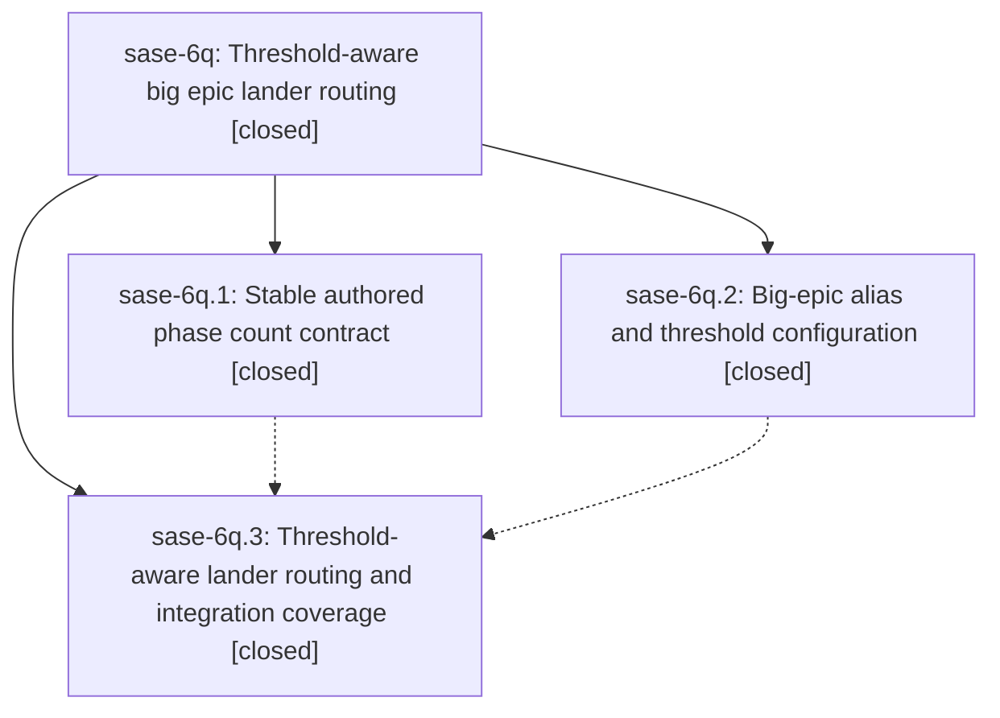

# Bead: sase-6q — Threshold-aware big epic lander routing

[Bead Pages](../README.md) / sase-6q

**Status:** ✓ closed · **Resolution:** (unrecorded) · **Type:** plan · **Tier:** epic
**Owner:** `bryanbugyi34@gmail.com`
**Created:** 2026-07-18 10:08:50 UTC · **Closed:** 2026-07-18 11:00:03 UTC
**Plan:** [202607/big\_epic\_lander.md](https://github.com/sase-org/sase--plans/blob/main/202607/big_epic_lander.md)

## Description

Epic land agents automatically use the configurable @big_epic_lander role alias for plans at or above a phase-count threshold, while smaller epics and explicit land models retain their existing behavior.

## Notes

COMMIT: bb9a59e

## Phases

| Bead | Title | Status | Size | Agents | Commits |
|---|---|---|---|---:|---:|
| [sase-6q.1](sase-6q.1.md) | Stable authored phase count contract | ✓ closed | small | 1 | 2 |
| [sase-6q.2](sase-6q.2.md) | Big-epic alias and threshold configuration | ✓ closed | small | 1 | 1 |
| [sase-6q.3](sase-6q.3.md) | Threshold-aware lander routing and integration coverage | ✓ closed | small | 1 | 1 |

## Lineage

## Agents

| Agent | Bead | Commits |
|---|---|---:|
| [bbugyi200.athena.sase-6q.1](https://github.com/sase-org/sase--agents/blob/main/agents/bbugyi200.athena.sase-6q.1/README.md) | [sase-6q.1](sase-6q.1.md) | 2 |
| [bbugyi200.athena.sase-6q.2](https://github.com/sase-org/sase--agents/blob/main/agents/bbugyi200.athena.sase-6q.2/README.md) | [sase-6q.2](sase-6q.2.md) | 1 |
| [bbugyi200.athena.sase-6q.3](https://github.com/sase-org/sase--agents/blob/main/agents/bbugyi200.athena.sase-6q.3/README.md) | [sase-6q.3](sase-6q.3.md) | 1 |
| [bbugyi200.athena.sase-6q.land](https://github.com/sase-org/sase--agents/blob/main/agents/bbugyi200.athena.sase-6q.land/README.md) | [sase-6q](README.md) | 2 |

## Commits

| Commit | Subject | Bead | Committed (UTC) |
|---|---|---|---|
| [`sase-core@73784ca`](https://github.com/sase-org/sase-core/commit/73784caa6dabd830589fc9ef5c3579b2ea0d4c4a) | feat(bead): expose total authored phase count (sase-6q.1) | [sase-6q.1](sase-6q.1.md) | 2026-07-18 10:25:41 |
| [`be14464`](https://github.com/sase-org/sase/commit/be1446457e88914a3325d3db0201554a8d0475cb) | feat(bead): carry total authored phase count (sase-6q.1) | [sase-6q.1](sase-6q.1.md) | 2026-07-18 10:26:52 |
| [`02bb467`](https://github.com/sase-org/sase/commit/02bb4670b5feb48992717f1b59f7410a68a952d5) | feat: add big epic lander alias configuration (sase-6q.2) | [sase-6q.2](sase-6q.2.md) | 2026-07-18 10:34:25 |
| [`1497022`](https://github.com/sase-org/sase/commit/1497022522ede983e002f8bd358f4b7d131d4914) | feat(bead): route big epics to dedicated lander (sase-6q.3) | [sase-6q.3](sase-6q.3.md) | 2026-07-18 10:52:49 |
| [`dea08e6`](https://github.com/sase-org/sase/commit/dea08e6ef5d0f44ad0251c5ce7e40033b130448d) | style: compact plan approval docstring (sase-6q) | [sase-6q](README.md) | 2026-07-18 11:22:51 |
| [`sase--plans@bb9a59e`](https://github.com/sase-org/sase--plans/commit/bb9a59e338f476040d7e6914d962c449e2a4e474) | docs: mark big epic lander plan done (sase-6q) | [sase-6q](README.md) | 2026-07-18 11:24:05 |
