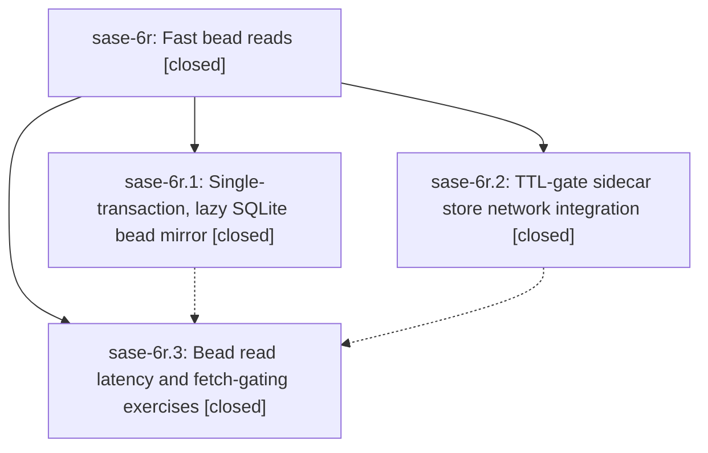

# Bead: sase-6r — Fast bead reads

[Bead Pages](../README.md) / sase-6r

**Status:** ✓ closed · **Resolution:** (unrecorded) · **Type:** plan · **Tier:** epic
**Owner:** `bryanbugyi34@gmail.com`
**Created:** 2026-07-18 11:25:56 UTC · **Closed:** 2026-07-18 12:11:22 UTC
**Plan:** [202607/fast\_bead\_reads.md](https://github.com/sase-org/sase--plans/blob/main/202607/fast_bead_reads.md)

## Description

Reading beads is consistently sub-second: bead CLI reads never pay a multi-second SQLite mirror rebuild, and sidecar store syncs stop issuing redundant network fetches on hot read paths.

## Notes

COMMIT: fd35944

## Phases

| Bead | Title | Status | Size | Agents | Commits |
|---|---|---|---|---:|---:|
| [sase-6r.1](sase-6r.1.md) | Single-transaction, lazy SQLite bead mirror | ✓ closed | small | 1 | 1 |
| [sase-6r.2](sase-6r.2.md) | TTL-gate sidecar store network integration | ✓ closed | small | 1 | 1 |
| [sase-6r.3](sase-6r.3.md) | Bead read latency and fetch-gating exercises | ✓ closed | small | 1 | 1 |

## Lineage

## Agents

| Agent | Bead | Commits |
|---|---|---:|
| [bbugyi200.athena.sase-6r.1](https://github.com/sase-org/sase--agents/blob/main/agents/bbugyi200.athena.sase-6r.1/README.md) | [sase-6r.1](sase-6r.1.md) | 1 |
| [bbugyi200.athena.sase-6r.2](https://github.com/sase-org/sase--agents/blob/main/agents/bbugyi200.athena.sase-6r.2/README.md) | [sase-6r.2](sase-6r.2.md) | 1 |
| [bbugyi200.athena.sase-6r.3](https://github.com/sase-org/sase--agents/blob/main/agents/bbugyi200.athena.sase-6r.3/README.md) | [sase-6r.3](sase-6r.3.md) | 1 |
| [bbugyi200.athena.sase-6r.land](https://github.com/sase-org/sase--agents/blob/main/agents/bbugyi200.athena.sase-6r.land/README.md) | [sase-6r](README.md) | 1 |

## Commits

| Commit | Subject | Bead | Committed (UTC) |
|---|---|---|---|
| [`c5f48a2`](https://github.com/sase-org/sase/commit/c5f48a2643f0614e93b445de0c3273a3ddaddcae) | perf(bead): make SQLite mirror lazy and transactional (sase-6r.1) | [sase-6r.1](sase-6r.1.md) | 2026-07-18 11:40:01 |
| [`0c1c875`](https://github.com/sase-org/sase/commit/0c1c875d4179c9d1a4dd5293336c8561b81677ea) | perf: gate sidecar integration with freshness TTL (sase-6r.2) | [sase-6r.2](sase-6r.2.md) | 2026-07-18 11:48:58 |
| [`ddeaac2`](https://github.com/sase-org/sase/commit/ddeaac297dc79ba69f9bf5d3db3503c29b269f18) | test: add bead read and fetch-gating regressions (sase-6r.3) | [sase-6r.3](sase-6r.3.md) | 2026-07-18 12:01:55 |
| [`sase--plans@fd35944`](https://github.com/sase-org/sase--plans/commit/fd35944b3082c001c71df6e6136f09457e72fa25) | docs: mark fast bead reads plan done (sase-6r) | [sase-6r](README.md) | 2026-07-18 12:14:46 |
