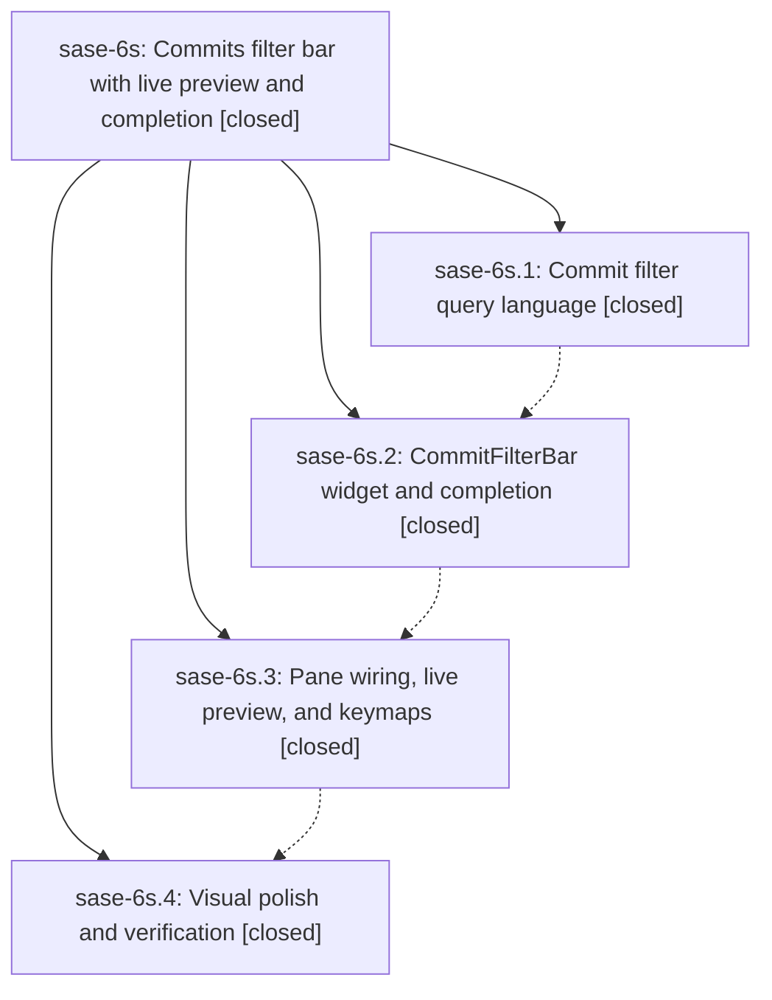

# Bead: sase-6s — Commits filter bar with live preview and completion

[Bead Pages](../README.md) / sase-6s

**Status:** ✓ closed · **Resolution:** (unrecorded) · **Type:** plan · **Tier:** epic
**Owner:** `bryanbugyi34@gmail.com`
**Created:** 2026-07-18 12:18:53 UTC · **Closed:** 2026-07-18 14:21:22 UTC
**Plan:** [202607/commits\_filter\_bar.md](https://github.com/sase-org/sase--plans/blob/main/202607/commits_filter_bar.md)

## Description

The Artifacts Commits sub-tab is filtered through a slash-triggered, completion-assisted inline filter bar that updates the timeline live without ever blocking the TUI, replacing the broken modal-based `f` flow.

## Notes

COMMIT: 53d88a5

## Phases

| Bead | Title | Status | Size | Agents | Commits |
|---|---|---|---|---:|---:|
| [sase-6s.1](sase-6s.1.md) | Commit filter query language | ✓ closed | small | 1 | 1 |
| [sase-6s.2](sase-6s.2.md) | CommitFilterBar widget and completion | ✓ closed | small | 1 | 1 |
| [sase-6s.3](sase-6s.3.md) | Pane wiring, live preview, and keymaps | ✓ closed | small | 1 | 1 |
| [sase-6s.4](sase-6s.4.md) | Visual polish and verification | ✓ closed | small | 1 | 1 |

## Lineage

## Agents

| Agent | Bead | Commits |
|---|---|---:|
| [bbugyi200.athena.sase-6s.1](https://github.com/sase-org/sase--agents/blob/main/agents/bbugyi200.athena.sase-6s.1/README.md) | [sase-6s.1](sase-6s.1.md) | 1 |
| [bbugyi200.athena.sase-6s.2](https://github.com/sase-org/sase--agents/blob/main/agents/bbugyi200.athena.sase-6s.2/README.md) | [sase-6s.2](sase-6s.2.md) | 1 |
| [bbugyi200.athena.sase-6s.3](https://github.com/sase-org/sase--agents/blob/main/agents/bbugyi200.athena.sase-6s.3/README.md) | [sase-6s.3](sase-6s.3.md) | 1 |
| [bbugyi200.athena.sase-6s.4](https://github.com/sase-org/sase--agents/blob/main/agents/bbugyi200.athena.sase-6s.4/README.md) | [sase-6s.4](sase-6s.4.md) | 1 |
| [bbugyi200.athena.sase-6s.land](https://github.com/sase-org/sase--agents/blob/main/agents/bbugyi200.athena.sase-6s.land/README.md) | [sase-6s](README.md) | 1 |

## Commits

| Commit | Subject | Bead | Committed (UTC) |
|---|---|---|---|
| [`d857fc7`](https://github.com/sase-org/sase/commit/d857fc7c62feafc37e8be5678b5aab8f602efda4) | feat: add commit filter query language (sase-6s.1) | [sase-6s.1](sase-6s.1.md) | 2026-07-18 12:46:43 |
| [`6f8a97a`](https://github.com/sase-org/sase/commit/6f8a97a6f1ea79c9f55a53f6dca660a62c6547b8) | feat(tui): add commit filter bar completion widget (sase-6s.2) | [sase-6s.2](sase-6s.2.md) | 2026-07-18 13:12:54 |
| [`a18747f`](https://github.com/sase-org/sase/commit/a18747fccf77f5e36b75428a741e82cd3b090685) | feat(tui): integrate live commit filter bar (sase-6s.3) | [sase-6s.3](sase-6s.3.md) | 2026-07-18 13:44:21 |
| [`fd1f865`](https://github.com/sase-org/sase/commit/fd1f865eddaf25511758e83c1893597b4e8559eb) | test(tui): cover commits filter bar visual states (sase-6s.4) | [sase-6s.4](sase-6s.4.md) | 2026-07-18 14:06:44 |
| [`6bd3617`](https://github.com/sase-org/sase/commit/6bd3617f73d9aecfe8f69f853074cc7c8696d23a) | refactor: remove expired filter epic scaffolding (sase-6s) | [sase-6s](README.md) | 2026-07-18 14:30:37 |
