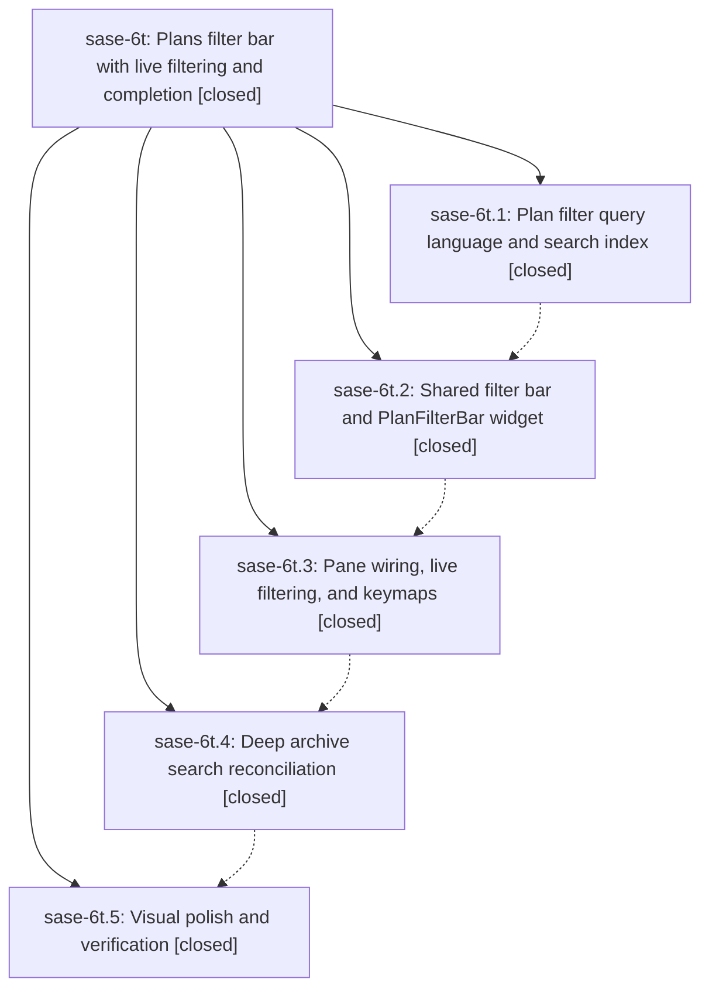

# Bead: sase-6t — Plans filter bar with live filtering and completion

[Bead Pages](../README.md) / sase-6t

**Status:** ✓ closed · **Resolution:** (unrecorded) · **Type:** plan · **Tier:** epic
**Owner:** `bryanbugyi34@gmail.com`
**Created:** 2026-07-18 14:09:08 UTC · **Closed:** 2026-07-18 19:06:36 UTC
**Plan:** [202607/plans\_filter\_bar.md](https://github.com/sase-org/sase--plans/blob/main/202607/plans_filter_bar.md)

## Description

The Artifacts Plans sub-tab is filtered through a slash-triggered, completion-assisted inline filter bar that narrows proposals, epic phase trees, and the plan archive instantly from in-memory data — with a debounced deep-archive search that makes truncated archive results authoritative — matching the Commits filter bar in interaction, power, and polish.

## Phases

| Bead | Title | Status | Size | Agents | Commits |
|---|---|---|---|---:|---:|
| [sase-6t.1](sase-6t.1.md) | Plan filter query language and search index | ✓ closed | small | 1 | 1 |
| [sase-6t.2](sase-6t.2.md) | Shared filter bar and PlanFilterBar widget | ✓ closed | small | 1 | 1 |
| [sase-6t.3](sase-6t.3.md) | Pane wiring, live filtering, and keymaps | ✓ closed | small | 1 | 1 |
| [sase-6t.4](sase-6t.4.md) | Deep archive search reconciliation | ✓ closed | small | 0 | 0 |
| [sase-6t.5](sase-6t.5.md) | Visual polish and verification | ✓ closed | small | 0 | 0 |

## Lineage

## Agents

| Agent | Bead | Commits |
|---|---|---:|
| [bbugyi200.athena.sase-6t.1](https://github.com/sase-org/sase--agents/blob/main/agents/bbugyi200.athena.sase-6t.1/README.md) | [sase-6t.1](sase-6t.1.md) | 1 |
| [bbugyi200.athena.sase-6t.2](https://github.com/sase-org/sase--agents/blob/main/agents/bbugyi200.athena.sase-6t.2/README.md) | [sase-6t.2](sase-6t.2.md) | 1 |
| [bbugyi200.athena.sase-6t.3](https://github.com/sase-org/sase--agents/blob/main/agents/bbugyi200.athena.sase-6t.3/README.md) | [sase-6t.3](sase-6t.3.md) | 1 |

## Commits

| Commit | Subject | Bead | Committed (UTC) |
|---|---|---|---|
| [`ef982d8`](https://github.com/sase-org/sase/commit/ef982d84ac1450ae9132eb8cd38567ca778261bd) | feat(plans): add filter query and search index (sase-6t.1) | [sase-6t.1](sase-6t.1.md) | 2026-07-18 14:32:45 |
| [`1e9bfc9`](https://github.com/sase-org/sase/commit/1e9bfc9c50b6d9e6ceb40d7e0fff7150ec36ed3f) | feat(plans): add shared plan filter bar (sase-6t.2) | [sase-6t.2](sase-6t.2.md) | 2026-07-18 15:02:09 |
| [`bef0744`](https://github.com/sase-org/sase/commit/bef07444d52a2263ebc050f5136cf8df37a2b7aa) | feat(tui): add live Plans filtering (sase-6t.3) | [sase-6t.3](sase-6t.3.md) | 2026-07-18 18:04:03 |
