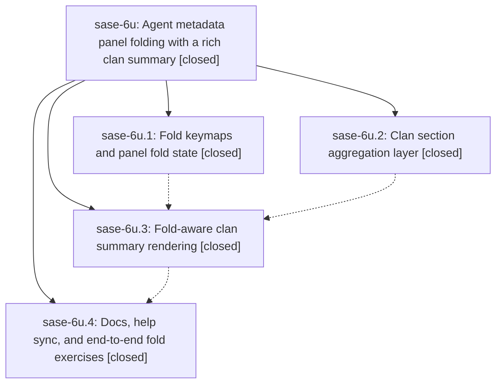

# Bead: sase-6u — Agent metadata panel folding with a rich clan summary

[Bead Pages](../README.md) / sase-6u

**Status:** ✓ closed · **Resolution:** (unrecorded) · **Type:** plan · **Tier:** epic
**Owner:** `bryanbugyi34@gmail.com`
**Created:** 2026-07-18 17:46:17 UTC · **Closed:** 2026-07-18 21:46:32 UTC
**Plan:** [202607/agent\_panel\_folding\_clan\_summary.md](https://github.com/sase-org/sase--plans/blob/main/202607/agent_panel_folding_clan_summary.md)

## Description

The agent metadata panel supports three-level section folding driven by a `z` fold keymap group (zoom migrates to `Z`), and the clan summary page becomes its first use-case: a beautiful, fold-aware aggregate of every section represented across the clan's members.

## Phases

| Bead | Title | Status | Size | Agents | Commits |
|---|---|---|---|---:|---:|
| [sase-6u.1](sase-6u.1.md) | Fold keymaps and panel fold state | ✓ closed | small | 1 | 1 |
| [sase-6u.2](sase-6u.2.md) | Clan section aggregation layer | ✓ closed | small | 1 | 1 |
| [sase-6u.3](sase-6u.3.md) | Fold-aware clan summary rendering | ✓ closed | small | 1 | 1 |
| [sase-6u.4](sase-6u.4.md) | Docs, help sync, and end-to-end fold exercises | ✓ closed | small | 1 | 1 |

## Lineage

## Agents

| Agent | Bead | Commits |
|---|---|---:|
| [bbugyi200.athena.sase-6u.1](https://github.com/sase-org/sase--agents/blob/main/agents/bbugyi200.athena.sase-6u.1/README.md) | [sase-6u.1](sase-6u.1.md) | 1 |
| [bbugyi200.athena.sase-6u.2](https://github.com/sase-org/sase--agents/blob/main/agents/bbugyi200.athena.sase-6u.2/README.md) | [sase-6u.2](sase-6u.2.md) | 1 |
| [bbugyi200.athena.sase-6u.3](https://github.com/sase-org/sase--agents/blob/main/agents/bbugyi200.athena.sase-6u.3/README.md) | [sase-6u.3](sase-6u.3.md) | 1 |
| [bbugyi200.athena.sase-6u.4](https://github.com/sase-org/sase--agents/blob/main/agents/bbugyi200.athena.sase-6u.4/README.md) | [sase-6u.4](sase-6u.4.md) | 1 |
| [bbugyi200.athena.sase-6u.land--code](https://github.com/sase-org/sase--agents/blob/main/families/bbugyi200.athena.sase-6u.land.md#member-code) | [sase-6u](README.md) | 0 |

## Commits

| Commit | Subject | Bead | Committed (UTC) |
|---|---|---|---|
| [`65f6884`](https://github.com/sase-org/sase/commit/65f68843c8885e0adeebad6ccda3d04f10e09693) | feat(tui): add clan section aggregation layer (sase-6u.2) | [sase-6u.2](sase-6u.2.md) | 2026-07-18 18:22:32 |
| [`d8b1969`](https://github.com/sase-org/sase/commit/d8b196967dfc0699d9c15f59b0ff6dce960c5eca) | feat(tui)!: add agent metadata panel fold controls (sase-6u.1) | [sase-6u.1](sase-6u.1.md) | 2026-07-18 18:26:43 |
| [`958569b`](https://github.com/sase-org/sase/commit/958569b92c4e637d440468b2aad434dafc36f6ed) | feat(tui): render fold-aware clan summary sections (sase-6u.3) | [sase-6u.3](sase-6u.3.md) | 2026-07-18 19:03:40 |
| [`bf61e8a`](https://github.com/sase-org/sase/commit/bf61e8acc5403fd3b418606eb368793d9228bd7b) | docs: document clan summary folding (sase-6u.4) | [sase-6u.4](sase-6u.4.md) | 2026-07-18 20:34:58 |
