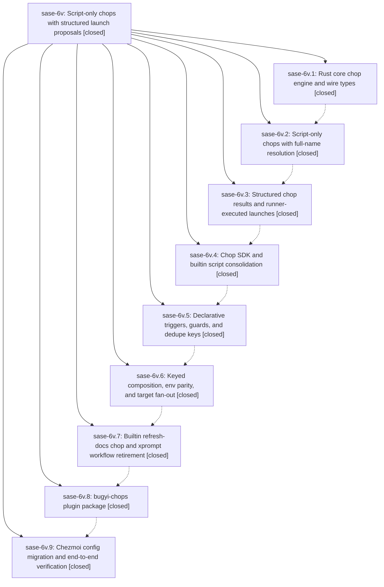

# Bead: sase-6v — Script-only chops with structured launch proposals

[Bead Pages](../README.md) / sase-6v

**Status:** ✓ closed · **Resolution:** (unrecorded) · **Type:** plan · **Tier:** epic
**Owner:** `bryanbugyi34@gmail.com`
**Created:** 2026-07-18 19:41:27 UTC · **Closed:** 2026-07-19 03:01:37 UTC
**Plan:** [202607/chops\_redesign.md](https://github.com/sase-org/sase--plans/blob/main/202607/chops_redesign.md)

## Description

Chops become script-only, are referenced by full script name, emit a versioned structured JSON result that the axe runner turns into supervised sase agent launches, and gain declarative triggers/guards, fail-closed validation, keyed composition, and generic multi-target fan-out. Personal chop scripts move to the bbugyi200/bugyi-chops PyPI plugin, and the chop-owned xprompt workflows are retired in favor of shared sase functionality.

## Notes

COMMIT: 5114a69ef

## Phases

| Bead | Title | Status | Size | Agents | Commits |
|---|---|---|---|---:|---:|
| [sase-6v.1](sase-6v.1.md) | Rust core chop engine and wire types | ✓ closed | small | 1 | 1 |
| [sase-6v.2](sase-6v.2.md) | Script-only chops with full-name resolution | ✓ closed | small | 1 | 1 |
| [sase-6v.3](sase-6v.3.md) | Structured chop results and runner-executed launches | ✓ closed | small | 0 | 0 |
| [sase-6v.4](sase-6v.4.md) | Chop SDK and builtin script consolidation | ✓ closed | small | 0 | 0 |
| [sase-6v.5](sase-6v.5.md) | Declarative triggers, guards, and dedupe keys | ✓ closed | small | 0 | 0 |
| [sase-6v.6](sase-6v.6.md) | Keyed composition, env parity, and target fan-out | ✓ closed | small | 0 | 0 |
| [sase-6v.7](sase-6v.7.md) | Builtin refresh-docs chop and xprompt workflow retirement | ✓ closed | small | 0 | 0 |
| [sase-6v.8](sase-6v.8.md) | bugyi-chops plugin package | ✓ closed | small | 0 | 0 |
| [sase-6v.9](sase-6v.9.md) | Chezmoi config migration and end-to-end verification | ✓ closed | small | 2 | 2 |

## Lineage

## Agents

| Agent | Bead | Commits |
|---|---|---:|
| [bbugyi200.athena.chop.refresh\_docs.sase.1](https://github.com/sase-org/sase--agents/blob/main/agents/bbugyi200.athena.chop.refresh_docs.sase.1/README.md) | [sase-6v.9](sase-6v.9.md) | 1 |
| [bbugyi200.athena.chop.refresh\_docs.sase.2](https://github.com/sase-org/sase--agents/blob/main/agents/bbugyi200.athena.chop.refresh_docs.sase.2/README.md) | [sase-6v.9](sase-6v.9.md) | 1 |
| [bbugyi200.athena.sase-6v.1](https://github.com/sase-org/sase--agents/blob/main/agents/bbugyi200.athena.sase-6v.1/README.md) | [sase-6v.1](sase-6v.1.md) | 1 |
| [bbugyi200.athena.sase-6v.2](https://github.com/sase-org/sase--agents/blob/main/agents/bbugyi200.athena.sase-6v.2/README.md) | [sase-6v.2](sase-6v.2.md) | 1 |
| [bbugyi200.athena.sase-6v.land](https://github.com/sase-org/sase--agents/blob/main/agents/bbugyi200.athena.sase-6v.land/README.md) | [sase-6v](README.md) | 2 |

## Commits

| Commit | Subject | Bead | Committed (UTC) |
|---|---|---|---|
| [`59a7b71`](https://github.com/sase-org/sase/commit/59a7b717289bed998b56a0ff19f38a2565228f90) | feat: expose axe chop core facade (sase-6v.1) | [sase-6v.1](sase-6v.1.md) | 2026-07-18 20:21:39 |
| [`8e4002b`](https://github.com/sase-org/sase/commit/8e4002bb4dd62d15bf8bf604c510fc517eeb0b90) | feat(axe)!: make chops script-only (sase-6v.2) | [sase-6v.2](sase-6v.2.md) | 2026-07-18 21:08:56 |
| [`da61f9a`](https://github.com/sase-org/sase/commit/da61f9ad4922602e57537e71289e6c83396fee6b) | docs: refresh agent grouping and ACE guides (sase-6v.9) | [sase-6v.9](sase-6v.9.md) | 2026-07-19 02:14:09 |
| [`fe9e8f3`](https://github.com/sase-org/sase/commit/fe9e8f301c46e5f85ac65f5dbaa9b1a3e3e75199) | docs: clarify clan navigation and fork behavior (sase-6v.9) | [sase-6v.9](sase-6v.9.md) | 2026-07-19 02:40:09 |
| [`de315ca`](https://github.com/sase-org/sase/commit/de315ca0f4263f4cefe50d1d66aa281addc6c9f5) | docs: fix stale chop reference in AXE daemon post (sase-6v) | [sase-6v](README.md) | 2026-07-19 03:02:10 |
| [`f6dc6d7`](https://github.com/sase-org/sase/commit/f6dc6d7c3469de29bf0acb7baa3b74b1211e7a1d) | refactor: drop unused chop symbols after epic close (sase-6v) | [sase-6v](README.md) | 2026-07-19 03:11:33 |
