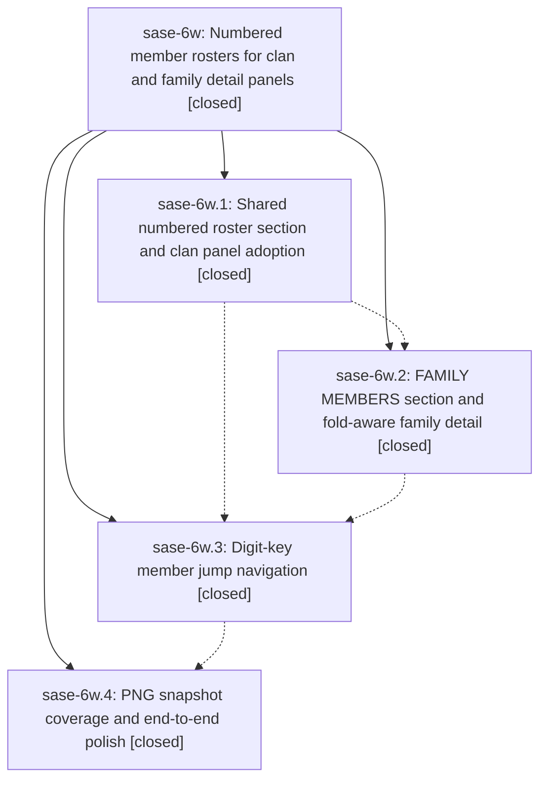

# Bead: sase-6w — Numbered member rosters for clan and family detail panels

[Bead Pages](../README.md) / sase-6w

**Status:** ✓ closed · **Resolution:** (unrecorded) · **Type:** plan · **Tier:** epic
**Owner:** `bryanbugyi34@gmail.com`
**Created:** 2026-07-18 21:47:19 UTC · **Closed:** 2026-07-19 01:34:58 UTC
**Plan:** [202607/member\_roster\_sections.md](https://github.com/sase-org/sase--plans/blob/main/202607/member_roster_sections.md)

## Description

Clan and family container rows open with a visually distinct, numbered CLAN MEMBERS / FAMILY MEMBERS roster whose numbers double as one-keystroke jump keys, whose entries fold individually through the panel fold keymaps, and every section of the family detail panel responds to all three fold levels.

## Notes

COMMIT: 66ed9d1

## Phases

| Bead | Title | Status | Size | Agents | Commits |
|---|---|---|---|---:|---:|
| [sase-6w.1](sase-6w.1.md) | Shared numbered roster section and clan panel adoption | ✓ closed | small | 1 | 1 |
| [sase-6w.2](sase-6w.2.md) | FAMILY MEMBERS section and fold-aware family detail | ✓ closed | small | 1 | 1 |
| [sase-6w.3](sase-6w.3.md) | Digit-key member jump navigation | ✓ closed | small | 1 | 1 |
| [sase-6w.4](sase-6w.4.md) | PNG snapshot coverage and end-to-end polish | ✓ closed | small | 1 | 1 |

## Lineage

## Agents

| Agent | Bead | Commits |
|---|---|---:|
| [bbugyi200.athena.sase-6w.1](https://github.com/sase-org/sase--agents/blob/main/agents/bbugyi200.athena.sase-6w.1/README.md) | [sase-6w.1](sase-6w.1.md) | 1 |
| [bbugyi200.athena.sase-6w.2](https://github.com/sase-org/sase--agents/blob/main/agents/bbugyi200.athena.sase-6w.2/README.md) | [sase-6w.2](sase-6w.2.md) | 1 |
| [bbugyi200.athena.sase-6w.3](https://github.com/sase-org/sase--agents/blob/main/agents/bbugyi200.athena.sase-6w.3/README.md) | [sase-6w.3](sase-6w.3.md) | 1 |
| [bbugyi200.athena.sase-6w.4](https://github.com/sase-org/sase--agents/blob/main/agents/bbugyi200.athena.sase-6w.4/README.md) | [sase-6w.4](sase-6w.4.md) | 1 |
| [bbugyi200.athena.sase-6w.land](https://github.com/sase-org/sase--agents/blob/main/agents/bbugyi200.athena.sase-6w.land/README.md) | [sase-6w](README.md) | 2 |
| [bbugyi200.athena.sase-6w.land--code](https://github.com/sase-org/sase--agents/blob/main/families/bbugyi200.athena.sase-6w.land.md#member-code) | [sase-6w](README.md) | 0 |

## Commits

| Commit | Subject | Bead | Committed (UTC) |
|---|---|---|---|
| [`657ebce`](https://github.com/sase-org/sase/commit/657ebce13e0242f5586a00ade616bf279278e2fa) | feat(ace): add shared numbered clan roster (sase-6w.1) | [sase-6w.1](sase-6w.1.md) | 2026-07-18 22:12:33 |
| [`e6d49ae`](https://github.com/sase-org/sase/commit/e6d49ae6a291fa0b8ebbe23e1f1e579f9ddde9f6) | feat(tui): add fold-aware family detail panels (sase-6w.2) | [sase-6w.2](sase-6w.2.md) | 2026-07-18 22:49:42 |
| [`3877dce`](https://github.com/sase-org/sase/commit/3877dcedee60955cbef1467f925a4018828d2114) | feat(tui): add numbered member jump navigation (sase-6w.3) | [sase-6w.3](sase-6w.3.md) | 2026-07-18 23:58:14 |
| [`4283f40`](https://github.com/sase-org/sase/commit/4283f4092d9e77939efc867e452359494fb5843d) | test(tui): cover numbered member roster flows (sase-6w.4) | [sase-6w.4](sase-6w.4.md) | 2026-07-19 00:47:36 |
| [`8ebf710`](https://github.com/sase-org/sase/commit/8ebf710f4a1a0c13dd23585212c77506eb7881ce) | test: align statistics fixtures and agent snapshots (sase-6w) | [sase-6w](README.md) | 2026-07-19 01:38:14 |
| [`sase--plans@66ed9d1`](https://github.com/sase-org/sase--plans/commit/66ed9d1dfd4663d37e2273333bd97b2015aae9f5) | docs: mark member roster plan done (sase-6w) | [sase-6w](README.md) | 2026-07-19 01:38:47 |
