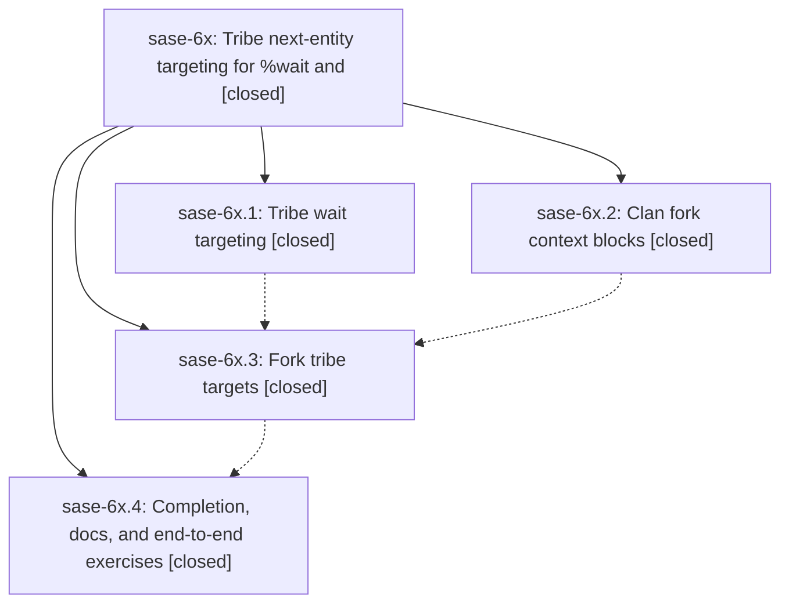

# Bead: sase-6x — Tribe next-entity targeting for %wait and

[Bead Pages](../README.md) / sase-6x

**Status:** ✓ closed · **Resolution:** (unrecorded) · **Type:** plan · **Tier:** epic
**Owner:** `bryanbugyi34@gmail.com`
**Created:** 2026-07-18 22:08:26 UTC · **Closed:** 2026-07-22 10:23:40 UTC
**Plan:** [202607/tribe\_wait\_fork\_targets.md](https://github.com/sase-org/sase--plans/blob/main/202607/tribe_wait_fork_targets.md)

## Description

%wait and #fork accept @<tribe> targets that bind to the very next agent or agent clan that joins that tribe, and forking an agent clan injects a lean context block (every member's prompt plus reply statistics and metadata) instead of full member transcripts.

## Notes

COMMIT: a27bf53

## Phases

| Bead | Title | Status | Size | Agents | Commits |
|---|---|---|---|---:|---:|
| [sase-6x.1](sase-6x.1.md) | Tribe wait targeting | ✓ closed | small | 1 | 1 |
| [sase-6x.2](sase-6x.2.md) | Clan fork context blocks | ✓ closed | small | 1 | 1 |
| [sase-6x.3](sase-6x.3.md) | Fork tribe targets | ✓ closed | small | 1 | 1 |
| [sase-6x.4](sase-6x.4.md) | Completion, docs, and end-to-end exercises | ✓ closed | small | 1 | 1 |

## Lineage

## Agents

| Agent | Bead | Commits |
|---|---|---:|
| [bbugyi200.athena.sase-6x.1](https://github.com/sase-org/sase--agents/blob/main/agents/bbugyi200.athena.sase-6x.1/README.md) | [sase-6x.1](sase-6x.1.md) | 1 |
| [bbugyi200.athena.sase-6x.2](https://github.com/sase-org/sase--agents/blob/main/agents/bbugyi200.athena.sase-6x.2/README.md) | [sase-6x.2](sase-6x.2.md) | 1 |
| [bbugyi200.athena.sase-6x.3](https://github.com/sase-org/sase--agents/blob/main/agents/bbugyi200.athena.sase-6x.3/README.md) | [sase-6x.3](sase-6x.3.md) | 1 |
| [bbugyi200.athena.sase-6x.4](https://github.com/sase-org/sase--agents/blob/main/agents/bbugyi200.athena.sase-6x.4/README.md) | [sase-6x.4](sase-6x.4.md) | 1 |
| [bbugyi200.athena.sase-6x.land--code](https://github.com/sase-org/sase--agents/blob/main/families/bbugyi200.athena.sase-6x.land.md#member-code) | [sase-6x](README.md) | 0 |
| [bbugyi200.athena.sase-6x.land--code-0](https://github.com/sase-org/sase--agents/blob/main/families/bbugyi200.athena.sase-6x.land.md#member-code-0) | [sase-6x](README.md) | 0 |

## Commits

| Commit | Subject | Bead | Committed (UTC) |
|---|---|---|---|
| [`7495f70`](https://github.com/sase-org/sase/commit/7495f70331ed21ec1a8cfcca31ef228e430ad23a) | feat: add clan context to fork prompts (sase-6x.2) | [sase-6x.2](sase-6x.2.md) | 2026-07-18 22:36:04 |
| [`cee14d4`](https://github.com/sase-org/sase/commit/cee14d43807b0c0491a89f83d99254aebefe4fac) | feat!: support tribe wait targeting (sase-6x.1) | [sase-6x.1](sase-6x.1.md) | 2026-07-18 22:45:53 |
| [`1759721`](https://github.com/sase-org/sase/commit/175972194b41fc4e5c468968c9a41c5ee4140359) | feat: support tribe targets in fork workflows (sase-6x.3) | [sase-6x.3](sase-6x.3.md) | 2026-07-18 23:05:15 |
| [`bebd7cf`](https://github.com/sase-org/sase/commit/bebd7cf85c9d0f19bf97100e7a2225e067e9f7ea) | feat(tui): complete tribe targets in wait and fork (sase-6x.4) | [sase-6x.4](sase-6x.4.md) | 2026-07-18 23:23:07 |
