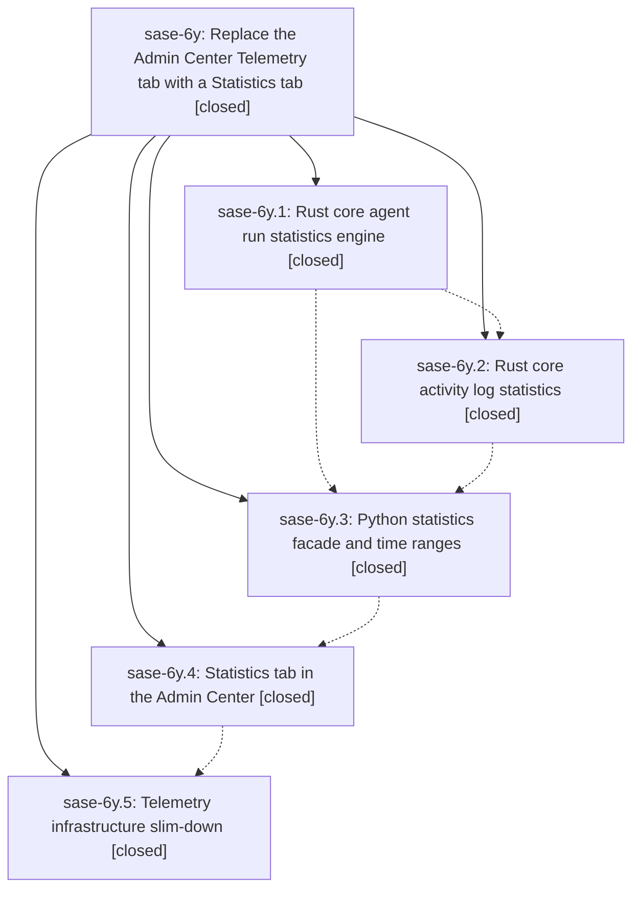

# Bead: sase-6y — Replace the Admin Center Telemetry tab with a Statistics tab

[Bead Pages](../README.md) / sase-6y

**Status:** ✓ closed · **Resolution:** (unrecorded) · **Type:** plan · **Tier:** epic
**Owner:** `bryanbugyi34@gmail.com`
**Created:** 2026-07-18 22:31:59 UTC · **Closed:** 2026-07-19 01:03:22 UTC
**Plan:** [202607/statistics\_tab.md](https://github.com/sase-org/sase--plans/blob/main/202607/statistics_tab.md)

## Description

The Admin Center's Telemetry tab becomes a Statistics tab that answers concrete questions about historical SASE agent activity (runs, outcomes, commits, providers/models/efforts, skills, memories, workspaces, plans, runtime by tribe/clan/family/agent, and questions) over preset and custom time ranges, across multiple numeric views; telemetry infrastructure that is not useful for later debugging is removed.

## Notes

COMMIT: 70d565f

## Phases

| Bead | Title | Status | Size | Agents | Commits |
|---|---|---|---|---:|---:|
| [sase-6y.1](sase-6y.1.md) | Rust core agent run statistics engine | ✓ closed | small | 1 | 1 |
| [sase-6y.2](sase-6y.2.md) | Rust core activity log statistics | ✓ closed | small | 1 | 1 |
| [sase-6y.3](sase-6y.3.md) | Python statistics facade and time ranges | ✓ closed | small | 1 | 1 |
| [sase-6y.4](sase-6y.4.md) | Statistics tab in the Admin Center | ✓ closed | small | 1 | 1 |
| [sase-6y.5](sase-6y.5.md) | Telemetry infrastructure slim-down | ✓ closed | small | 1 | 1 |

## Lineage

## Agents

| Agent | Bead | Commits |
|---|---|---:|
| [bbugyi200.athena.sase-6y.1](https://github.com/sase-org/sase--agents/blob/main/agents/bbugyi200.athena.sase-6y.1/README.md) | [sase-6y.1](sase-6y.1.md) | 1 |
| [bbugyi200.athena.sase-6y.2](https://github.com/sase-org/sase--agents/blob/main/agents/bbugyi200.athena.sase-6y.2/README.md) | [sase-6y.2](sase-6y.2.md) | 1 |
| [bbugyi200.athena.sase-6y.3](https://github.com/sase-org/sase--agents/blob/main/agents/bbugyi200.athena.sase-6y.3/README.md) | [sase-6y.3](sase-6y.3.md) | 1 |
| [bbugyi200.athena.sase-6y.4](https://github.com/sase-org/sase--agents/blob/main/agents/bbugyi200.athena.sase-6y.4/README.md) | [sase-6y.4](sase-6y.4.md) | 1 |
| [bbugyi200.athena.sase-6y.5](https://github.com/sase-org/sase--agents/blob/main/agents/bbugyi200.athena.sase-6y.5/README.md) | [sase-6y.5](sase-6y.5.md) | 1 |
| [bbugyi200.athena.sase-6y.land](https://github.com/sase-org/sase--agents/blob/main/agents/bbugyi200.athena.sase-6y.land/README.md) | [sase-6y](README.md) | 1 |

## Commits

| Commit | Subject | Bead | Committed (UTC) |
|---|---|---|---|
| [`sase-core@d17be7b`](https://github.com/sase-org/sase-core/commit/d17be7bbdd9a62769d36d2420c8eb73948c8464b) | feat(agent-stats): add run statistics aggregation (sase-6y.1) | [sase-6y.1](sase-6y.1.md) | 2026-07-18 22:51:12 |
| [`sase-core@b818b1d`](https://github.com/sase-org/sase-core/commit/b818b1d7ef71de230b85e7c0e4de2095890d80ad) | feat(agent-stats): aggregate durable activity logs (sase-6y.2) | [sase-6y.2](sase-6y.2.md) | 2026-07-18 23:05:23 |
| [`5a4c0ae`](https://github.com/sase-org/sase/commit/5a4c0aeb0fd90cb944f236547ba49aa0d6229d13) | feat(stats): add Python statistics facade (sase-6y.3) | [sase-6y.3](sase-6y.3.md) | 2026-07-18 23:29:14 |
| [`b85ca32`](https://github.com/sase-org/sase/commit/b85ca326a07248e82ad8bdf5fa5b4b837814b48b) | feat(ace)!: replace telemetry tab with statistics (sase-6y.4) | [sase-6y.4](sase-6y.4.md) | 2026-07-19 00:22:37 |
| [`81b946f`](https://github.com/sase-org/sase/commit/81b946fcc1805516a2da00ebc7366e0a3f96889c) | feat(telemetry)!: slim diagnostics infrastructure (sase-6y.5) | [sase-6y.5](sase-6y.5.md) | 2026-07-19 00:57:21 |
| [`sase--plans@70d565f`](https://github.com/sase-org/sase--plans/commit/70d565f31f61eb2248aec51325e3804608e2427f) | chore(plans): mark statistics\_tab plan done (sase-6y) | [sase-6y](README.md) | 2026-07-19 01:05:17 |
