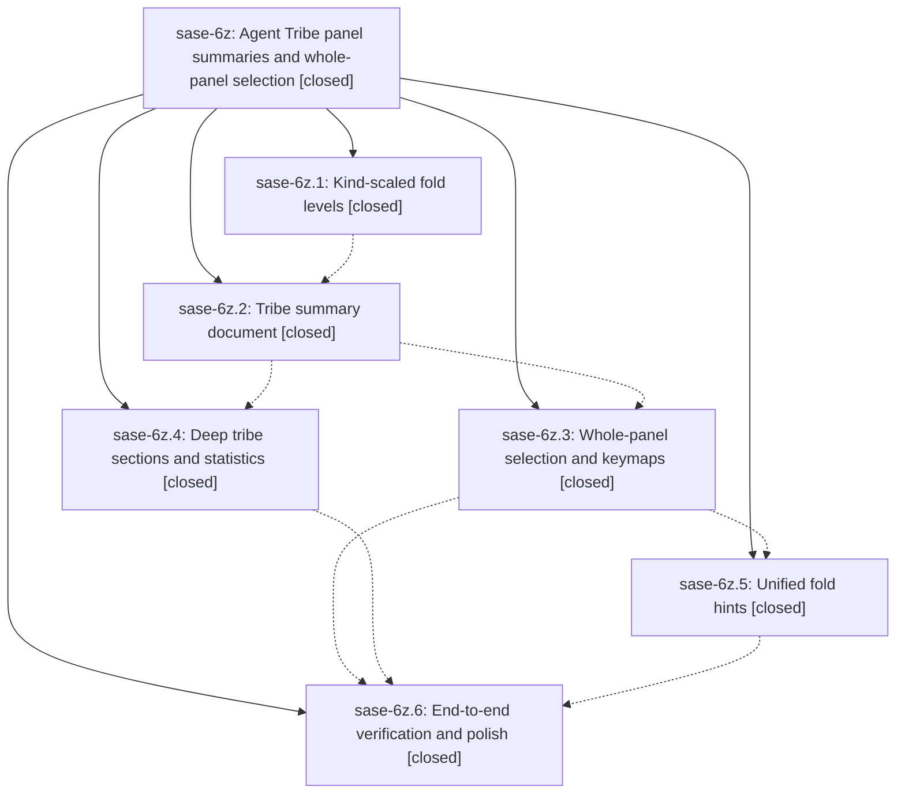

# Bead: sase-6z — Agent Tribe panel summaries and whole-panel selection

[Bead Pages](../README.md) / sase-6z

**Status:** ✓ closed · **Resolution:** (unrecorded) · **Type:** plan · **Tier:** epic
**Owner:** `bryanbugyi34@gmail.com`
**Created:** 2026-07-19 01:55:52 UTC · **Closed:** 2026-07-19 06:11:31 UTC
**Plan:** [202607/agent\_tribe\_panel.md](https://github.com/sase-org/sase--plans/blob/main/202607/agent_tribe_panel.md)

## Description

Selecting an Agent Tribe panel — collapsed or expanded — shows a rich, fold-aware tribe summary in the metadata panel with full clan/family-panel parity (numbered member jumps, per-section folding), tribe panels become first-class selectable and foldable elements with intuitive h/H/j/k/l semantics and a visually distinct selected state, and fold hints cover every visible collapsible element.

## Notes

COMMIT: 3e862e2

## Phases

| Bead | Title | Status | Size | Agents | Commits |
|---|---|---|---|---:|---:|
| [sase-6z.1](sase-6z.1.md) | Kind-scaled fold levels | ✓ closed | small | 1 | 1 |
| [sase-6z.2](sase-6z.2.md) | Tribe summary document | ✓ closed | small | 1 | 1 |
| [sase-6z.3](sase-6z.3.md) | Whole-panel selection and keymaps | ✓ closed | small | 1 | 1 |
| [sase-6z.4](sase-6z.4.md) | Deep tribe sections and statistics | ✓ closed | small | 1 | 1 |
| [sase-6z.5](sase-6z.5.md) | Unified fold hints | ✓ closed | small | 1 | 1 |
| [sase-6z.6](sase-6z.6.md) | End-to-end verification and polish | ✓ closed | small | 1 | 1 |

## Lineage

## Agents

| Agent | Bead | Commits |
|---|---|---:|
| [bbugyi200.athena.sase-6z.1](https://github.com/sase-org/sase--agents/blob/main/agents/bbugyi200.athena.sase-6z.1/README.md) | [sase-6z.1](sase-6z.1.md) | 1 |
| [bbugyi200.athena.sase-6z.2](https://github.com/sase-org/sase--agents/blob/main/agents/bbugyi200.athena.sase-6z.2/README.md) | [sase-6z.2](sase-6z.2.md) | 1 |
| [bbugyi200.athena.sase-6z.3](https://github.com/sase-org/sase--agents/blob/main/agents/bbugyi200.athena.sase-6z.3/README.md) | [sase-6z.3](sase-6z.3.md) | 1 |
| [bbugyi200.athena.sase-6z.4](https://github.com/sase-org/sase--agents/blob/main/agents/bbugyi200.athena.sase-6z.4/README.md) | [sase-6z.4](sase-6z.4.md) | 1 |
| [bbugyi200.athena.sase-6z.5](https://github.com/sase-org/sase--agents/blob/main/agents/bbugyi200.athena.sase-6z.5/README.md) | [sase-6z.5](sase-6z.5.md) | 1 |
| [bbugyi200.athena.sase-6z.6](https://github.com/sase-org/sase--agents/blob/main/agents/bbugyi200.athena.sase-6z.6/README.md) | [sase-6z.6](sase-6z.6.md) | 1 |

## Commits

| Commit | Subject | Bead | Committed (UTC) |
|---|---|---|---|
| [`766469d`](https://github.com/sase-org/sase/commit/766469d7e5c1e7f4d2db9f4bc488a390e1248f7d) | feat(tui): add kind-scaled fold levels (sase-6z.1) | [sase-6z.1](sase-6z.1.md) | 2026-07-19 02:29:23 |
| [`cc45fdf`](https://github.com/sase-org/sase/commit/cc45fdf1eca59f33d3d4625164f515f21445e03f) | feat(ace): add fold-aware tribe summary documents (sase-6z.2) | [sase-6z.2](sase-6z.2.md) | 2026-07-19 03:33:55 |
| [`3ae2008`](https://github.com/sase-org/sase/commit/3ae2008ee12a6b1875f71590a98eabcd464261c2) | feat(tui): add deep tribe detail enrichment (sase-6z.4) | [sase-6z.4](sase-6z.4.md) | 2026-07-19 04:13:48 |
| [`80bd97a`](https://github.com/sase-org/sase/commit/80bd97ace7d8b14b721a930d6a125f006dd2a7a3) | feat(ace)!: add whole-panel selection (sase-6z.3) | [sase-6z.3](sase-6z.3.md) | 2026-07-19 04:20:23 |
| [`29fdfed`](https://github.com/sase-org/sase/commit/29fdfedfa5f0cc94108f8714811a958cba9e673e) | feat(ace): unify fold hints across Agents views (sase-6z.5) | [sase-6z.5](sase-6z.5.md) | 2026-07-19 04:54:58 |
| [`d3cf623`](https://github.com/sase-org/sase/commit/d3cf6236e866b5f27b7f342a68b257692e97cf62) | perf(tui): streamline selected tribe navigation (sase-6z.6) | [sase-6z.6](sase-6z.6.md) | 2026-07-19 06:03:35 |
