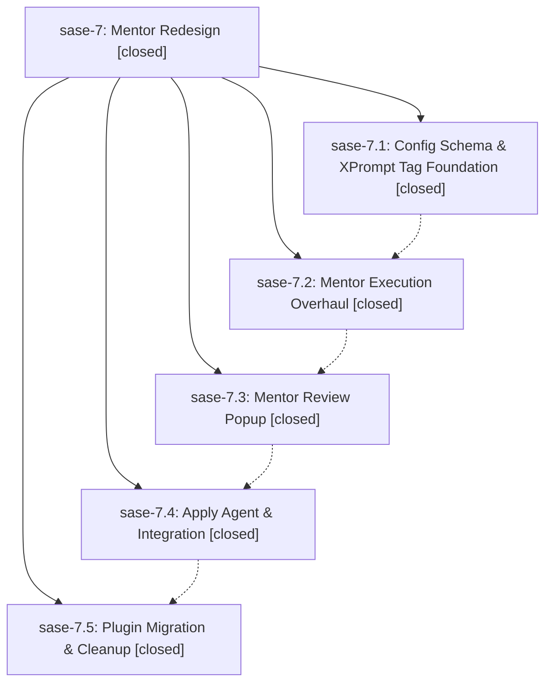

# Bead: sase-7 — Mentor Redesign

[Bead Pages](../README.md) / sase-7

**Status:** ✓ closed · **Resolution:** (unrecorded) · **Type:** plan · **Tier:** epic
**Owner:** `bryanbugyi34@gmail.com`
**Created:** 2026-03-21 17:53:57 UTC · **Closed:** 2026-03-21 18:57:14 UTC
**Plan:** [202603/mentor\_redesign.md](https://github.com/sase-org/sase--plans/blob/main/202603/mentor_redesign.md)

## Phases

| Bead | Title | Status | Size | Agents | Commits |
|---|---|---|---|---:|---:|
| [sase-7.1](sase-7.1.md) | Config Schema & XPrompt Tag Foundation | ✓ closed | small | 0 | 1 |
| [sase-7.2](sase-7.2.md) | Mentor Execution Overhaul | ✓ closed | small | 0 | 1 |
| [sase-7.3](sase-7.3.md) | Mentor Review Popup | ✓ closed | small | 0 | 1 |
| [sase-7.4](sase-7.4.md) | Apply Agent & Integration | ✓ closed | small | 0 | 1 |
| [sase-7.5](sase-7.5.md) | Plugin Migration & Cleanup | ✓ closed | small | 0 | 1 |

## Lineage

## Commits

| Commit | Subject | Bead | Committed (UTC) |
|---|---|---|---|
| [`d1f561a`](https://github.com/sase-org/sase/commit/d1f561a8e525f280bf45893033f800b6e6916258) | feat: Add config schema and xprompt tag foundation for mentor redesign (sase-7.1) | [sase-7.1](sase-7.1.md) | 2026-03-21 18:05:40 |
| [`cb15257`](https://github.com/sase-org/sase/commit/cb152576d85495ecca82a49f0a621deb5d05969c) | feat: Overhaul mentor execution pipeline with structured JSON output (sase-7.2) | [sase-7.2](sase-7.2.md) | 2026-03-21 18:22:31 |
| [`4fe7bc3`](https://github.com/sase-org/sase/commit/4fe7bc337a4393dcbd90af2651285c3108c6dabc) | feat: Add Mentor Review popup modal with ,m leader key binding (sase-7.3) | [sase-7.3](sase-7.3.md) | 2026-03-21 18:34:23 |
| [`d2af299`](https://github.com/sase-org/sase/commit/d2af299fe4f3fd3f5ee14726d019ea31114699a1) | feat: Implement mentor apply agent flow with \<enter\> from review popup (sase-7.4) | [sase-7.4](sase-7.4.md) | 2026-03-21 18:43:41 |
| [`fd72590`](https://github.com/sase-org/sase/commit/fd72590eb5f195f658b75fdce8c2dfb3cd0a3344) | feat: Add deprecation error for old mentor prompt config format (sase-7.5) | [sase-7.5](sase-7.5.md) | 2026-03-21 18:53:07 |
