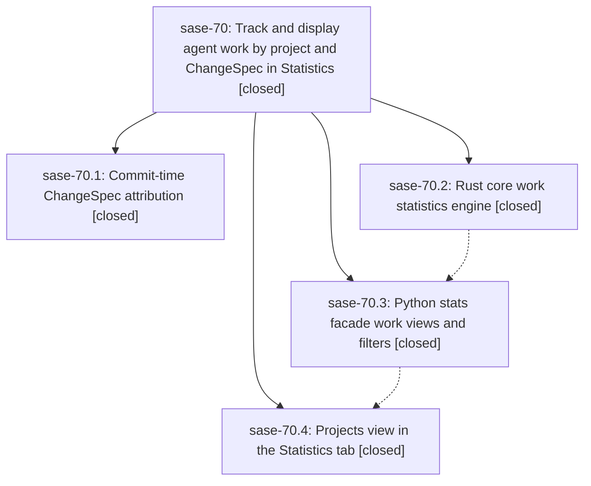

# Bead: sase-70 — Track and display agent work by project and ChangeSpec in Statistics

[Bead Pages](../README.md) / sase-70

**Status:** ✓ closed · **Resolution:** (unrecorded) · **Type:** plan · **Tier:** epic
**Owner:** `bryanbugyi34@gmail.com`
**Created:** 2026-07-19 02:19:28 UTC · **Closed:** 2026-07-19 05:39:49 UTC
**Plan:** [202607/statistics\_project\_changespec\_views.md](https://github.com/sase-org/sase--plans/blob/main/202607/statistics_project_changespec_views.md)

## Description

The Admin Center Statistics tab shows which projects and ChangeSpecs SASE agents ran on, through a dedicated Projects view with three grouping strategies (by project, by ChangeSpec, and a project-to-ChangeSpec drill-down), new project/changespec runtime group-by dimensions, a Top Projects overview table, and a global project filter; ChangeSpec attribution becomes durable and reliable by propagating commit-time spec names into the indexed run records and normalizing the historical launch-name fallback.

## Phases

| Bead | Title | Status | Size | Agents | Commits |
|---|---|---|---|---:|---:|
| [sase-70.1](sase-70.1.md) | Commit-time ChangeSpec attribution | ✓ closed | small | 1 | 1 |
| [sase-70.2](sase-70.2.md) | Rust core work statistics engine | ✓ closed | small | 1 | 1 |
| [sase-70.3](sase-70.3.md) | Python stats facade work views and filters | ✓ closed | small | 1 | 1 |
| [sase-70.4](sase-70.4.md) | Projects view in the Statistics tab | ✓ closed | small | 1 | 1 |

## Lineage

## Agents

| Agent | Bead | Commits |
|---|---|---:|
| [bbugyi200.athena.sase-70.1](https://github.com/sase-org/sase--agents/blob/main/agents/bbugyi200.athena.sase-70.1/README.md) | [sase-70.1](sase-70.1.md) | 1 |
| [bbugyi200.athena.sase-70.2](https://github.com/sase-org/sase--agents/blob/main/agents/bbugyi200.athena.sase-70.2/README.md) | [sase-70.2](sase-70.2.md) | 1 |
| [bbugyi200.athena.sase-70.3](https://github.com/sase-org/sase--agents/blob/main/agents/bbugyi200.athena.sase-70.3/README.md) | [sase-70.3](sase-70.3.md) | 1 |
| [bbugyi200.athena.sase-70.4](https://github.com/sase-org/sase--agents/blob/main/agents/bbugyi200.athena.sase-70.4/README.md) | [sase-70.4](sase-70.4.md) | 1 |

## Commits

| Commit | Subject | Bead | Committed (UTC) |
|---|---|---|---|
| [`sase-core@4238206`](https://github.com/sase-org/sase-core/commit/4238206d67eb6e02663453343ef8f32a715c2312) | feat(agent-stats): add project and ChangeSpec work rollups (sase-70.2) | [sase-70.2](sase-70.2.md) | 2026-07-19 02:38:23 |
| [`8f6d3a2`](https://github.com/sase-org/sase/commit/8f6d3a2d4c410815ef79059442315b2322751a75) | fix: preserve commit ChangeSpec attribution (sase-70.1) | [sase-70.1](sase-70.1.md) | 2026-07-19 02:39:13 |
| [`fcdf263`](https://github.com/sase-org/sase/commit/fcdf2638ed58420ce37d7ac2b1c4c9778050070f) | feat(stats): expose project and changespec work data (sase-70.3) | [sase-70.3](sase-70.3.md) | 2026-07-19 03:08:41 |
| [`74b3fc7`](https://github.com/sase-org/sase/commit/74b3fc7328c25ade56ce503fb5a0c1c36b7a38ab) | feat(stats): add project and ChangeSpec views (sase-70.4) | [sase-70.4](sase-70.4.md) | 2026-07-19 03:52:55 |
