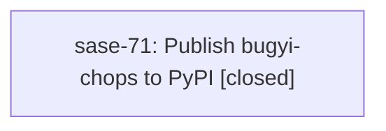

# Bead: sase-71 — Publish bugyi-chops to PyPI

[Bead Pages](../README.md) / sase-71

**Status:** ✓ closed · **Resolution:** (unrecorded) · **Type:** plan · **Tier:** plan
**Owner:** `bryanbugyi34@gmail.com`
**Created:** 2026-07-19 03:10:25 UTC · **Closed:** 2026-07-22 10:24:09 UTC
**Plan:** [202607/bugyi\_chops\_pypi\_publication.md](https://github.com/sase-org/sase--plans/blob/main/202607/bugyi_chops_pypi_publication.md)

## Description

First PyPI publication of the bugyi-chops plugin package created by epic sase-6v. Blocked on sase 0.12.0 reaching PyPI and on one-time manual setup: a 'pypi' GitHub environment on bbugyi200/bugyi-chops plus the PyPI trusted-publisher registration. Then push the first release tag and verify the Publish workflow uploads the package.

## Lineage

