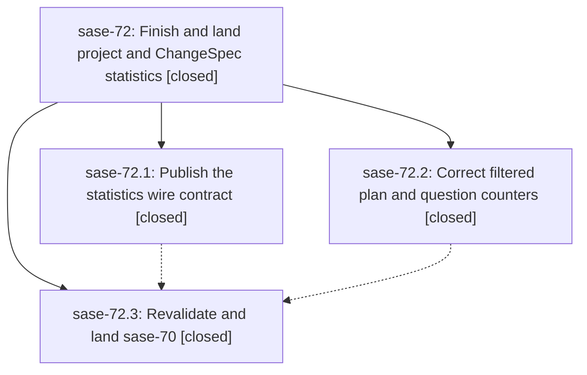

# Bead: sase-72 — Finish and land project and ChangeSpec statistics

[Bead Pages](../README.md) / sase-72

**Status:** ✓ closed · **Resolution:** (unrecorded) · **Type:** plan · **Tier:** epic
**Owner:** `bryanbugyi34@gmail.com`
**Created:** 2026-07-19 04:08:17 UTC · **Closed:** 2026-07-19 06:06:02 UTC
**Plan:** [202607/finish\_statistics\_project\_changespec\_epic.md](https://github.com/sase-org/sase--plans/blob/main/202607/finish_statistics_project_changespec_epic.md)

## Description

The project and ChangeSpec statistics epic is installable against a released Rust core, project-filtered plan and question summaries are truthful, and sase-70 is closed only after current-main integration and full validation.

## Notes

COMMIT: ca94a31

## Phases

| Bead | Title | Status | Size | Agents | Commits |
|---|---|---|---|---:|---:|
| [sase-72.1](sase-72.1.md) | Publish the statistics wire contract | ✓ closed | small | 0 | 0 |
| [sase-72.2](sase-72.2.md) | Correct filtered plan and question counters | ✓ closed | small | 1 | 1 |
| [sase-72.3](sase-72.3.md) | Revalidate and land sase-70 | ✓ closed | small | 2 | 1 |

## Lineage

## Agents

| Agent | Bead | Commits |
|---|---|---:|
| [bbugyi200.athena.sase-72.2](https://github.com/sase-org/sase--agents/blob/main/agents/bbugyi200.athena.sase-72.2/README.md) | [sase-72.2](sase-72.2.md) | 1 |
| [bbugyi200.athena.sase-72.3](https://github.com/sase-org/sase--agents/blob/main/agents/bbugyi200.athena.sase-72.3/README.md) | [sase-72.3](sase-72.3.md) | 1 |
| [bbugyi200.athena.sase-72.3--1](https://github.com/sase-org/sase--agents/blob/main/families/bbugyi200.athena.sase-72.3.md#member-1) | [sase-72.3](sase-72.3.md) | 0 |

## Commits

| Commit | Subject | Bead | Committed (UTC) |
|---|---|---|---|
| [`81dcef9`](https://github.com/sase-org/sase/commit/81dcef937c8481425d7ba119d56831a1a31aeb15) | fix(stats): scope plan and question counters by project (sase-72.2) | [sase-72.2](sase-72.2.md) | 2026-07-19 04:24:49 |
| [`fae9dbb`](https://github.com/sase-org/sase/commit/fae9dbb340d7ca69ae61ffe610b29f2ed9e8dc21) | test(chop): isolate result-file contract tests (sase-72.3) | [sase-72.3](sase-72.3.md) | 2026-07-19 05:44:57 |
