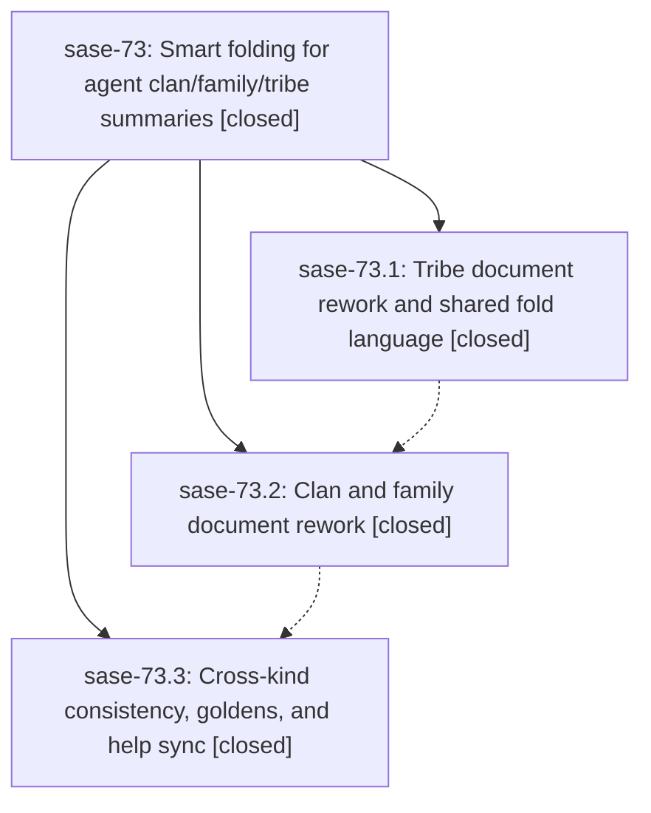

# Bead: sase-73 — Smart folding for agent clan/family/tribe summaries

[Bead Pages](../README.md) / sase-73

**Status:** ✓ closed · **Resolution:** (unrecorded) · **Type:** plan · **Tier:** epic
**Owner:** `bryanbugyi34@gmail.com`
**Created:** 2026-07-19 12:02:44 UTC · **Closed:** 2026-07-19 17:31:20 UTC
**Plan:** [202607/smart\_summary\_folding.md](https://github.com/sase-org/sase--plans/blob/main/202607/smart_summary_folding.md)

## Description

Agent clan, family, and tribe summary documents in the Agents-tab metadata panel hide empty sections at every fold level, always show their numbered member rosters with working digit jump triggers, and give each fold level a distinct, useful answer — rendered with one consistent, beautiful fold language across all three kinds.

## Phases

| Bead | Title | Status | Size | Agents | Commits |
|---|---|---|---|---:|---:|
| [sase-73.1](sase-73.1.md) | Tribe document rework and shared fold language | ✓ closed | small | 1 | 1 |
| [sase-73.2](sase-73.2.md) | Clan and family document rework | ✓ closed | small | 1 | 1 |
| [sase-73.3](sase-73.3.md) | Cross-kind consistency, goldens, and help sync | ✓ closed | small | 1 | 1 |

## Lineage

## Agents

| Agent | Bead | Commits |
|---|---|---:|
| [bbugyi200.athena.sase-73.1](https://github.com/sase-org/sase--agents/blob/main/agents/bbugyi200.athena.sase-73.1/README.md) | [sase-73.1](sase-73.1.md) | 1 |
| [bbugyi200.athena.sase-73.2](https://github.com/sase-org/sase--agents/blob/main/agents/bbugyi200.athena.sase-73.2/README.md) | [sase-73.2](sase-73.2.md) | 1 |
| [bbugyi200.athena.sase-73.3](https://github.com/sase-org/sase--agents/blob/main/agents/bbugyi200.athena.sase-73.3/README.md) | [sase-73.3](sase-73.3.md) | 1 |

## Commits

| Commit | Subject | Bead | Committed (UTC) |
|---|---|---|---|
| [`c433dc7`](https://github.com/sase-org/sase/commit/c433dc7590a64bfa186f311c89b4b75482d63683) | feat(tui): rework tribe summary fold documents (sase-73.1) | [sase-73.1](sase-73.1.md) | 2026-07-19 12:36:08 |
| [`c85cdd7`](https://github.com/sase-org/sase/commit/c85cdd7a369c9c79aa0be9e7a9044f7597ac41c3) | feat(tui): refine clan and family summaries (sase-73.2) | [sase-73.2](sase-73.2.md) | 2026-07-19 14:28:25 |
| [`4665110`](https://github.com/sase-org/sase/commit/4665110c7e86f301d45c5288039afa150b39dd32) | test(tui): cover cross-kind summary fold contracts (sase-73.3) | [sase-73.3](sase-73.3.md) | 2026-07-19 15:25:56 |
