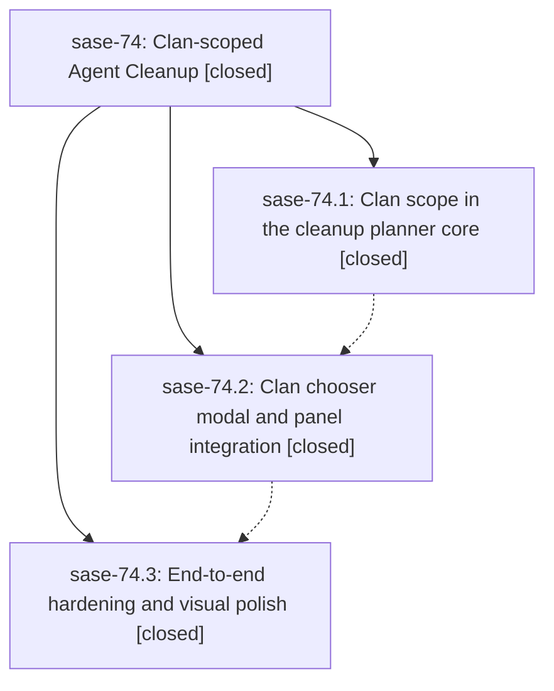

# Bead: sase-74 — Clan-scoped Agent Cleanup

[Bead Pages](../README.md) / sase-74

**Status:** ✓ closed · **Resolution:** (unrecorded) · **Type:** plan · **Tier:** epic
**Owner:** `bryanbugyi34@gmail.com`
**Created:** 2026-07-19 12:16:32 UTC · **Closed:** 2026-07-19 14:13:39 UTC
**Plan:** [202607/agent\_cleanup\_clan\_scope.md](https://github.com/sase-org/sase--plans/blob/main/202607/agent_cleanup_clan_scope.md)

## Description

The Agent Cleanup panel can target whole clans or individual clan members within the current tribe, with planner-backed previews, a beautiful clan chooser modal, and the same confirm/execute funnel that every other cleanup scope already uses.

## Notes

COMMIT: d38f2e4

## Phases

| Bead | Title | Status | Size | Agents | Commits |
|---|---|---|---|---:|---:|
| [sase-74.1](sase-74.1.md) | Clan scope in the cleanup planner core | ✓ closed | small | 1 | 1 |
| [sase-74.2](sase-74.2.md) | Clan chooser modal and panel integration | ✓ closed | small | 1 | 1 |
| [sase-74.3](sase-74.3.md) | End-to-end hardening and visual polish | ✓ closed | small | 1 | 1 |

## Lineage

## Agents

| Agent | Bead | Commits |
|---|---|---:|
| [bbugyi200.athena.sase-74.1](https://github.com/sase-org/sase--agents/blob/main/agents/bbugyi200.athena.sase-74.1/README.md) | [sase-74.1](sase-74.1.md) | 1 |
| [bbugyi200.athena.sase-74.2](https://github.com/sase-org/sase--agents/blob/main/agents/bbugyi200.athena.sase-74.2/README.md) | [sase-74.2](sase-74.2.md) | 1 |
| [bbugyi200.athena.sase-74.3](https://github.com/sase-org/sase--agents/blob/main/agents/bbugyi200.athena.sase-74.3/README.md) | [sase-74.3](sase-74.3.md) | 1 |
| [bbugyi200.athena.sase-74.land](https://github.com/sase-org/sase--agents/blob/main/agents/bbugyi200.athena.sase-74.land/README.md) | [sase-74](README.md) | 1 |
| [bbugyi200.athena.sase-74.land--code](https://github.com/sase-org/sase--agents/blob/main/families/bbugyi200.athena.sase-74.land.md#member-code) | [sase-74](README.md) | 0 |

## Commits

| Commit | Subject | Bead | Committed (UTC) |
|---|---|---|---|
| [`dc0fa09`](https://github.com/sase-org/sase/commit/dc0fa09f9bb986d88ad22c67f91ab020ce1a63fd) | feat(agent-cleanup): mirror clan planning scope (sase-74.1) | [sase-74.1](sase-74.1.md) | 2026-07-19 12:45:17 |
| [`b14df54`](https://github.com/sase-org/sase/commit/b14df5461b865919395e07ca5639c6b2e25d5fe0) | feat(agent-cleanup): add clan cleanup chooser (sase-74.2) | [sase-74.2](sase-74.2.md) | 2026-07-19 13:33:10 |
| [`d4087b0`](https://github.com/sase-org/sase/commit/d4087b08e15cb52eb5a20650adf1e319d1224685) | fix(ace): polish clan cleanup guidance (sase-74.3) | [sase-74.3](sase-74.3.md) | 2026-07-19 13:54:10 |
| [`a9065c2`](https://github.com/sase-org/sase/commit/a9065c25eaaf49de3ad5f5b45bc46237e9db11d7) | docs: document clan-scoped agent cleanup (sase-74) | [sase-74](README.md) | 2026-07-19 14:17:05 |
