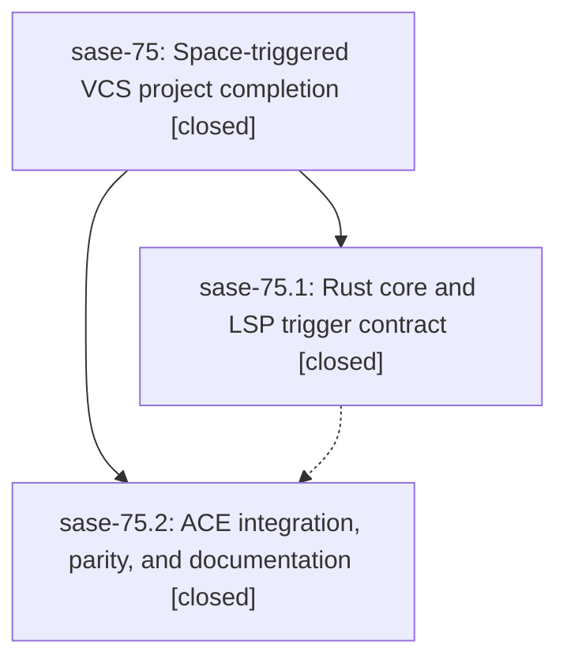

# Bead: sase-75 — Space-triggered VCS project completion

[Bead Pages](../README.md) / sase-75

**Status:** ✓ closed · **Resolution:** (unrecorded) · **Type:** plan · **Tier:** epic
**Owner:** `bryanbugyi34@gmail.com`
**Created:** 2026-07-19 12:38:34 UTC · **Closed:** 2026-07-19 13:53:57 UTC
**Plan:** [202607/space\_plus\_vcs\_completion.md](https://github.com/sase-org/sase--plans/blob/main/202607/space_plus_vcs_completion.md)

## Description

Project and active ChangeSpec completion opens from a bare plus token at the start of a prompt or immediately after a literal space, with hash-plus removed as a trigger and ACE kept in parity with the Rust editor and LSP.

## Notes

COMMIT: 2540746

## Phases

| Bead | Title | Status | Size | Agents | Commits |
|---|---|---|---|---:|---:|
| [sase-75.1](sase-75.1.md) | Rust core and LSP trigger contract | ✓ closed | small | 0 | 0 |
| [sase-75.2](sase-75.2.md) | ACE integration, parity, and documentation | ✓ closed | small | 1 | 1 |

## Lineage

## Agents

| Agent | Bead | Commits |
|---|---|---:|
| [bbugyi200.athena.sase-75.2](https://github.com/sase-org/sase--agents/blob/main/agents/bbugyi200.athena.sase-75.2/README.md) | [sase-75.2](sase-75.2.md) | 1 |

## Commits

| Commit | Subject | Bead | Committed (UTC) |
|---|---|---|---|
| [`e3b36d6`](https://github.com/sase-org/sase/commit/e3b36d6dcfa138e0aff189a42ce95d3aae4f46a4) | feat!: use space-plus project completion triggers (sase-75.2) | [sase-75.2](sase-75.2.md) | 2026-07-19 13:40:33 |
